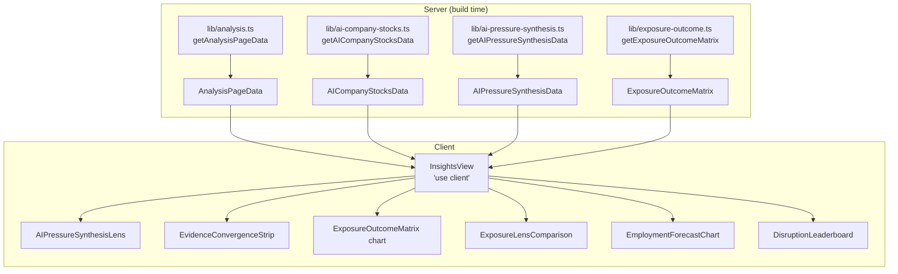

# Analysis (Insights Lab)

**Status:** Live — origin/main
**Owner:** Neo (Frontend Dev)
**Route:** `/analysis`

---

## Purpose

The Insights Lab is a deep-dive analytics view that aggregates seven distinct lenses on AI's labour-market impact into a single scrollable page. It goes beyond the headline numbers on the [dashboard](./dashboard.md) to surface methodology comparisons, market signals, employment forecasts, AI company stock trends, evidence convergence ratings, and a ranked disruption index.

Sections (in page order):
1. **AI Pressure Synthesis** — cross-domain pressure signals (global AI ecosystem, talent bottleneck, market sensitivity)
2. **Evidence Convergence Strip** — per-claim agreement/conflict status across data source families
3. **Evidence Stack** — detailed evidence table with confidence ratings
4. **Exposure → Outcome Reality Matrix** *(recently merged, PR #108)* — D3 bubble scatter: capability vs. employment/wage growth, coloured by Disruption Index
5. **Exposure Lenses Comparison** — side-by-side AEI usage / AIOE ability / LLM capability / Frey-Osborne automation with gap leaders
6. **Market AI-Sensitivity** — sector-level market signal scores
7. **AI Company Stock Signals** — stock-price history for AI-sector benchmark companies
8. **Employment Forecast to 2030** — occupation-level trend extrapolation with AI-adjusted scenario
9. **AI Forces Timeline** — chronological AI capability milestones
10. **AI Disruption Leaderboard** — ranked occupation/sector disruption composite scores

**Non-goals:** This page does not provide actionable advice, job recommendations, or real-time financial data. It is explicitly a descriptive/exploratory analytics view. All statistics are historical associations; correlation ≠ causation (stated in the framing note rendered at the top of the page).

---

## Route / Component Boundary

```
app/analysis/page.tsx              ← RSC: resolves all datasets at build time
  └─ components/insights/InsightsView.tsx   ← "use client"
       ├─ components/insights/AIPressureSynthesisLens.tsx
       ├─ components/insights/EvidenceConvergenceStrip.tsx
       ├─ components/insights/EvidenceStack.tsx
       ├─ components/insights/ExposureOutcomeMatrix.tsx    ← D3 bubble chart
       ├─ components/insights/ExposureLensComparison.tsx
       ├─ components/insights/MarketSignalLens.tsx
       ├─ components/insights/AICompanyStockLens.tsx
       ├─ components/insights/EmploymentForecastChart.tsx
       ├─ components/insights/AIForcesTimeline.tsx
       └─ components/insights/DisruptionLeaderboard.tsx
```

`InsightsView` wraps each section in a `<Section>` layout component (local to the file) which provides the `Reveal` scroll-animation wrapper and consistent glass-panel styling.

---

## Architecture & Server/Client Split

| Layer | Runs where | Responsibility |
|---|---|---|
| `app/analysis/page.tsx` | Server | Resolves `AnalysisPageData`, `AICompanyStocksData`, `AIPressureSynthesisData`, `ExposureOutcomeMatrix` |
| `InsightsView` | Client (`"use client"`) | Renders sections, passes props to each island, applies i18n |
| Individual insight components | Client | Interactive charts; may have own local state (filters, toggles, tooltips) |

**Bundle boundary:** `lib/exposure-outcome.ts` is guarded by `import "server-only"`. The full `occupation-snapshot.json` (large) is only imported server-side; the client only receives the resolved matrix/forecast objects as props.

### Data flow



---

## Primary Types / Contracts

### `AnalysisPageData` (from `lib/analysis.ts`)

```ts
interface AnalysisPageData {
  aiSignal: AISignalData;           // regression of exposure vs. employment/wage growth
  nationalForecast: NationalForecast;
  forecasts: OccupationForecast[];
  disruptionIndex: DisruptionIndex;
  exposureComparison: ExposureComparison;
  exposureGapLeaders: OccExposure[];
}
```

### `ExposureOutcomeMatrix` (from `lib/exposure-outcome.ts`)

```ts
interface ExposureOutcomeMatrix {
  points: ExposureOutcomePoint[];     // one per SOC, sorted by code
  summary: ExposureOutcomeSummary;
  capabilityVsEmpGrowthR: number;    // Pearson r
  capabilityVsWageGrowthR: number;
  gapVsEmpGrowthR: number;
  gapVsWageGrowthR: number;
  methodology: ExposureOutcomeMethodology;
}

interface ExposureOutcomePoint {
  code: string;
  title: string;
  sector: string;
  capability: number | null;   // LLM-benchmark, 0–100
  usage: number | null;        // AEI usage proxy, 0–100
  ability: number | null;      // AIOE ability-weighted, 0–100
  automation: number | null;   // Frey-Osborne, 0–100
  consensus: number | null;    // mean(capability, usage, ability) where available
  gap: number | null;          // capability − usage (pp)
  empGrowth: number | null;    // annualised CAGR %
  wageGrowth: number | null;   // annualised CAGR %
  employment: number;          // latest BLS headcount (bubble size)
  disruptionScore: number | null;  // 0–100 composite
  disruptionRank: number | null;
}
```

### `AIPressureSynthesisData` (from `lib/ai-pressure-synthesis.ts`)

```ts
interface AIPressureSynthesisData {
  global: {
    href: string;                             // typed DEEP_LINK_HREFS constant
    modelCount: number;
    endpointProviderCount: number;
    rankableCountries: number;
    topReadinessGapCountry: ReadinessGapSummaryCountry | null;
    provenance: LaneProvenance;              // per-lane registry-derived freshness
  };
  talent: {
    href: string;
    occupationsTracked: number;
    latestH1bFiscalYear: number | null;
    latestJobPostingYear: number | null;
    topOccupation: { socCode; title; score } | null;
    provenance: LaneProvenance;
  };
  market: {
    href: string;                             // typed DEEP_LINK_HREFS.analysisMarketAISensitivity
    stockHref: string;                        // typed DEEP_LINK_HREFS.analysisAICompanyStockSignals
    sectorProxyCount: number;
    companyCount: number;
    positiveBreadth1Y: number | null;
    latestStockDate: string | null;
    benchmarkTickers: string[];
    topSector: { name; ticker; score; excessReturn; employmentWeightedAIExposure } | null;
    provenance: LaneProvenance;
  };
  guardrailIds: string[];  // "openrouterCatalogProxy" | "h1bLcaFilings" | "stockDescriptiveHistory" | "jobPostingsProxy"
}

interface LaneProvenance {
  datasetIds: string[];          // canonical provenance.json IDs for this lane
  latestAsOf: string | null;     // latest asOf selected via calendar-aware chronological ordering
  sources: LaneProvenanceSource[];
}

interface LaneProvenanceSource {
  id: string;
  asOf: string | null;
  name: string | null;
}
```

#### Lane dataset IDs

| Lane   | datasetIds                                              | GuardrailBadge kind |
|--------|----------------------------------------------------------|---------------------|
| global | `openrouter-models`, `country-exposure`, `global-ai-metrics` | `proxy`          |
| talent | `h1b-trends`, `job-postings`                             | `proxy`             |
| market | `ai-company-stocks`, `market-ai-signals`                 | `descriptive`       |

`AIPressureSynthesisLens` renders exactly **one `DataAsOfBadge`** per lane using `provenance.datasetIds`,
one lane-appropriate `GuardrailBadge`, and compact localized source attribution from the `analysis` i18n
namespace keys `aiPressureGlobalSource`, `aiPressureTalentSource`, `aiPressureMarketSource`.

---

## Algorithms / Derived Metrics

### AI Signal (Section 5 — Exposure Lenses / Forecast backing)

- **Linear regression:** `lib/analysis.ts#linearRegression(xs, ys)` — OLS: slope = Σ(dx·dy) / Σ(dx²); intercept = ȳ − slope·x̄.
- **Pearson r:** `lib/analysis.ts#pearson(xs, ys)` — standard cross-product / geometric mean formula; clamped to [−1, 1].
- **Quartile growth averages:** Bottom 25% / top 25% of occupations by exposure; average employment/wage CAGR within each quartile.

### Disruption Index (Section 10)

```
score = 0.40 × normalize(exposure)
      + 0.25 × normalize(−empGrowth)     // employment decline component
      + 0.20 × normalize(−wageGrowth)    // wage stagnation component
      + 0.15 × (brightOutlook ? 0 : 1)   // lack of Bright Outlook
```

`normalize(v, values)` min-max normalises `v` over the vector of all occupation values for that component. Scores are rank-ordered; ties broken by occupation name (alphabetical).

### Employment Forecast to 2030

- **Baseline:** Extrapolates from historical CAGR using compound growth from the last known year to 2030.
- **AI-adjusted:** Applies a sensitivity discount to the baseline CAGR proportional to the occupation's AI exposure score and a configurable sensitivity parameter (default 0.5).
- Forecasts are descriptive extrapolations, not BLS projections.

### Exposure → Outcome Reality Matrix

- Joins `getExposureComparison()` (multi-lens per-SOC) + `getAISignalData()` (employment/wage CAGR) + `getDisruptionIndex()` by SOC code.
- Pearson r computed over the intersecting non-null subset for each lens/outcome pair.
- Bubble colour: D3 `interpolateRgbBasis(["#22d3ee","#8b5cf6","#f97316"])(score/100)` — teal → violet → amber.
- Bubble size: employment headcount.
- Y-axis toggle: employment CAGR or wage CAGR.

> **All metrics are descriptive.** Correlation statistics and forecasts do not establish causal relationships between AI exposure and labour-market outcomes.

---

## Data Sources & Provenance

| Dataset | File | Role in this page |
|---|---|---|
| Occupation snapshot (full) | `data/occupation-snapshot.json` | Employment/wage history for signal & forecast |
| Occupation snapshot (slim) | `data/occupation-snapshot-slim.json` | Disruption index backing |
| LLM exposure | `data/llm-exposure.json` | `capability` lens (GPT-4-class task scores) |
| AIOE exposure | `data/aioe-exposure.json` | `ability` lens (Acemoglu-style task weights) |
| Automation baseline | `data/automation-baseline.json` | `automation` lens (Frey & Osborne) |
| AI company stocks | `data/ai-company-stocks.json` | Section 7 stock lens |
| Market AI signals | `data/market-ai-signals.json` | Section 6 sector signals |
| H-1B LCA | `data/h1b-trends.json` | Talent bottleneck component of AI Pressure Synthesis |
| Job postings | `data/job-postings.json` | Talent bottleneck component |
| OpenRouter models | `data/openrouter-models.json` | Global AI ecosystem component |
| Global AI metrics | `data/global-ai-metrics.json` | Readiness gap |
| Sources | `data/sources.json` | Evidence stack source families |
| Provenance | `data/provenance.json` | Dataset freshness |

**Caveats (from `ExposureOutcomeMethodology.caveats`, surfaced in UI):**
- `capability` = what GPT-4-class models *could* do, not current deployment.
- `usage` = modelled adoption proxy (AEI 2025), not directly observed.
- Negative cross-lens correlation between AIOE/LLM and Frey-Osborne is a methodology artefact, not a contradiction.
- `empGrowth`/`wageGrowth` cover the available BLS history window; occupations with < 2 data points are null.
- The Disruption Index is a composite descriptive ranking, not a job-loss prediction.
- Stock history is descriptive; AI company stock performance does not directly measure labour displacement.

---

## State & Interaction Model

`InsightsView` itself is stateless — it only passes server-resolved props to child components. Interactive state lives within each island:

| Component | Local state |
|---|---|
| `ExposureOutcomeMatrix` | `metric` ("employment"/"wage"), `tooltip` position/visibility, `svgRef`, chart dimensions |
| `AICompanyStockLens` | Selected company, date range |
| `EmploymentForecastChart` | Selected occupation code, sensitivity slider |
| `DisruptionLeaderboard` | Pagination / search filter |
| `ExposureLensComparison` | Selected lens, gap filter |
| `AIPressureSynthesisLens` | Purely presentational; no local state |
| `EvidenceConvergenceStrip` | `useMemo` for `getEvidenceConvergence()` |

All charts use `Reveal` for scroll-gated fade-in animation.

---

## i18n

All strings routed through `useT("analysis")` or `useT("common")`:

| Namespace | Files |
|---|---|
| `analysis` | `lib/i18n/messages/en/analysis.ts`, `lib/i18n/messages/zh/analysis.ts` |
| `common` | `lib/i18n/messages/en/common.ts`, `lib/i18n/messages/zh/common.ts` |

Notable keys: `pageTitle`, `pageSubhead`, `framingNote`, `matrixTitle`, `matrixExplainer`, `exposureLensesTitle`, `marketSignalTitle`, `forecastTitle`, `disruptionTitle`, evidence status labels (`evidenceStatusAgreement`, `evidenceStatusMixed`, etc.), `evidenceConfidenceHigh/Medium/Low`.

**AIPressureSynthesisLens lane provenance keys (analysis namespace):**
- `aiPressureGlobalSource` — compact EN/ZH attribution for the global lane (OpenRouter, Anthropic, Microsoft)
- `aiPressureTalentSource` — compact EN/ZH attribution for the talent lane (DOL OFLC, job-posting seeds)
- `aiPressureMarketSource` — compact EN/ZH attribution for the market lane (Yahoo Finance, BLS market-signal proxies)

**GuardrailBadge keys (common namespace):**
- `guardrailLabel_{kind}` / `guardrailDesc_{kind}` for each of `observed`, `proxy`, `restricted`, `descriptive`
- Both EN and ZH translations are present; the component uses `useT("common")` with English fallback

`AIPressureSynthesisLens` formats numbers via `Intl.NumberFormat` using the active locale (`zh-CN` for Chinese, `en-US` otherwise).

**Capability-usage gap units:** `ExposureLensComparison` displays the capability-minus-usage gap in **percentage-point (pp)** units (e.g., "+42.7pp") in both the tooltip and the gap-leaderboard list. Individual lens values (usage, capability, ability, automation) remain in `%`.

---

## Accessibility

- Framing note at page top: `role="note"` (corrects the common misconception that correlation = causation).
- Each section wrapped in `<section>` with heading; headings follow h1 → h2 → h3 hierarchy.
- `Reveal` wrapper defers animation only — content is always in the DOM.
- `Section` helper adds `scroll-mt-24` when an `id` is provided, so deep links clear the fixed navigation header without truncating section headings.
- `ExposureOutcomeMatrix` chart: `<svg>` with `aria-label`; tooltip is a positioned `<div>` with role/aria-live on update (implemented in the component).
- `AccessibleChart` wrapper used where applicable; provides screen-reader-accessible data tables as fallback.
- All interactive controls carry keyboard-accessible focus rings.
- Colour-only information avoided: disruption score is shown numerically alongside colour.
- Language-localised number formatting via `Intl.NumberFormat` ensures correct decimal/grouping separators for both locales.
- `GuardrailBadge` labels and descriptions are fully localised in EN/ZH via the `common` i18n namespace; the `aria-label` carries both the localized label and the localized description for screen-reader users.

---

## Performance / Bundle Strategy

- `lib/exposure-outcome.ts` is `import "server-only"` — the full snapshot JSON never enters the browser bundle.
- `lib/analysis.ts` imports `data/occupation-snapshot.json` (large); it is only imported server-side via `app/analysis/page.tsx`.
- The four resolved prop objects (serialisable JSON) are the only cross-boundary payload.
- D3 is imported client-side in `ExposureOutcomeMatrix`; it is a large dependency. Future optimisation: lazy-import D3 or replace with a lighter scale library.
- `Reveal` uses `IntersectionObserver` — no chart renders off-screen, avoiding unnecessary layout/paint work.
- Evidence components (`EvidenceConvergenceStrip`, `EvidenceStack`) call `getEvidenceConvergence()` client-side via `useMemo`; these helpers operate on `data/sources.json` which is bundled as a small JSON file.

---

## Error / Empty / Loading Behaviour

| Scenario | Behaviour |
|---|---|
| `exposureOutcomeMatrix` null/undefined | `InsightsView` conditionally renders the matrix section only when `exposureOutcomeMatrix` is truthy (see `{exposureOutcomeMatrix && (…)}`) |
| Missing exposure lens for an occupation | The field is `null` in `ExposureOutcomePoint`; the chart skips that point or renders a muted colour |
| Insufficient history for growth CAGR | `empGrowth`/`wageGrowth` is `null`; the component renders `"—"` |
| Build-time data error | Next.js build fails; no runtime exposure |
| Route error | `app/error.tsx` boundary |

No skeleton/loading UI — page is SSG.

---

## Security / Privacy

- No PII collected or rendered.
- Stock data is historical (from `data/ai-company-stocks.json`); no live financial API calls at runtime.
- Guardrail badge IDs (`guardrailIds` on `AIPressureSynthesisData`) surface methodological caveats inline to prevent misinterpretation of proxy data.

---

## Testing / Quality Gates

- `npm run build`: TypeScript validates all four prop types passed from RSC to `InsightsView`.
- Vitest: `tests/` covers `lib/analysis.ts` helpers (`linearRegression`, `pearson`, `getAISignalData`, `getDisruptionIndex`, `getExposureComparison`).
- `lib/exposure-outcome.ts` is tested in `tests/` (Mouse's domain); tests verify null handling, Pearson r computation, and methodology caveats.
- `lib/wage-tier-polarization.ts` has dedicated tests for tier assignment and band cross-tabulation (relevant to the `/sectors` page, not directly to `/analysis`).
- `tests/components/AIPressureSynthesisLens.test.tsx`: renders exactly three `DataAsOfBadge` elements (one per lane), two `Proxy` and one `Descriptive-only` guardrail badges, EN source attribution, ZH locale render parity.
- `tests/components/ExposureLensComparison.test.tsx`: asserts that capability-usage gap values render with `pp` unit in the leaderboard list (visible DOM), not raw `%`.
- `tests/components/DataAsOfBadge.test.tsx`: exercises the canonical `employment-projections` dataset (asOf=`2024-2034`) and proves the badge does not corrupt the projection window into a 1970 epoch or a far-future year.
- `tests/components/GuardrailBadge.test.tsx`: verifies EN and ZH labels and descriptions are present in both locales; all four kinds have i18n parity.

---

## Extension Points

- **New section:** Add a new `<Section>` block in `InsightsView` and resolve additional data in `app/analysis/page.tsx`. Increment section eyebrow numbers.
- **New exposure lens:** Add a new key to `ExposureLens` union in `lib/analysis.ts`; update `getExposureComparison()` and the `ExposureLensComparison` component.
- **Disruption Index weights:** Adjust the `weights` object in `lib/analysis.ts#getDisruptionIndex()`.
- **Forecast sensitivity:** Expose a user-adjustable slider in `EmploymentForecastChart`; the AI-adjusted scenario already accepts a configurable sensitivity parameter.
- **Additional i18n locale:** Add a new messages directory alongside `en/` and `zh/`; wire into `lib/i18n/LanguageProvider`.

---

## Key File References

| File | Purpose |
|---|---|
| `app/analysis/page.tsx` | RSC entry; all data resolution |
| `components/insights/InsightsView.tsx` | Client orchestrator |
| `components/insights/AIPressureSynthesisLens.tsx` | Pressure synthesis section |
| `components/insights/EvidenceConvergenceStrip.tsx` | Per-claim evidence status |
| `components/insights/EvidenceStack.tsx` | Detailed evidence table |
| `components/insights/ExposureOutcomeMatrix.tsx` | D3 bubble scatter (new PR #108) |
| `components/insights/ExposureLensComparison.tsx` | Multi-methodology lens comparison |
| `components/insights/MarketSignalLens.tsx` | Sector market signals |
| `components/insights/AICompanyStockLens.tsx` | AI company stock signals |
| `components/insights/EmploymentForecastChart.tsx` | 2030 forecast chart |
| `components/insights/DisruptionLeaderboard.tsx` | Ranked disruption scores |
| `lib/analysis.ts` | Core analytics engine (signal, forecast, disruption, exposure comparison) |
| `lib/exposure-outcome.ts` | Exposure→Outcome Matrix join (server-only) |
| `lib/ai-pressure-synthesis.ts` | Pressure synthesis aggregator |
| `lib/ai-company-stocks.ts` | Stock data loader |
| `lib/evidence.ts` | Evidence convergence model |
| `lib/wage-tier-polarization.ts` | Wage-tier data (used on /sectors; referenced here for context) |
| `lib/i18n/messages/en/analysis.ts` | English strings |
| `lib/i18n/messages/zh/analysis.ts` | Chinese strings |
| `data/occupation-snapshot.json` | Full snapshot with history |
| `data/llm-exposure.json` | LLM capability lens |
| `data/aioe-exposure.json` | AIOE ability lens |
| `data/automation-baseline.json` | Frey-Osborne automation lens |

---

**Cross-links:** See [dashboard.md](./dashboard.md) for headline KPIs, [careers.md](./careers.md) for per-occupation detail, [report.md](./report.md) for the scrollytelling narrative.
