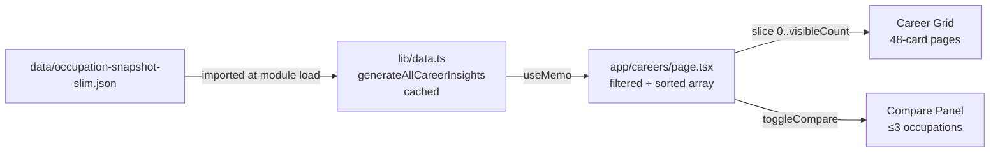

# Careers

**Status:** Live — origin/main
**Owner:** Neo (Frontend Dev)
**Routes:** `/careers` (grid list), `/careers/[code]` (detail)
**Last audited:** 2026-07-18

---

## Purpose

The careers section lets users browse, search, filter, and compare hundreds of U.S. occupations ranked by AI-exposure risk. The list view (`/careers`) is a fully client-side interactive grid. The detail view (`/careers/[code]`) is a server-rendered page that enriches an individual occupation with O*NET data, multi-lens exposure scores, H-1B signals, a career evidence passport, and reskilling pathway suggestions.

**Non-goals:** The careers section does not provide career counselling, personalised recommendations, or real-time labour-market feeds. All data is pre-computed at build time. Comparison is limited to up to 3 occupations simultaneously.

---

## Route / Component Boundary

```
app/careers/layout.tsx            ← Static metadata only (RSC shell)
app/careers/page.tsx              ← "use client" (entire page is a client component)

app/careers/[code]/layout.tsx     ← Static metadata (RSC shell)
app/careers/[code]/page.tsx       ← RSC: resolves detail data at build time
  └─ components/careers/CareerDetailClient.tsx   ← "use client"
       ├─ components/charts/OccupationTrendChart.tsx
       └─ components/charts/PredictiveChart.tsx
```

**Unusual pattern:** `app/careers/page.tsx` carries `"use client"` at the top — all filtering, sorting, pagination, and comparison state lives in the same file. This keeps all interactive state in one component without additional islands.

---

## Architecture & Server/Client Split

| Layer | Runs where | Responsibility |
|---|---|---|
| `app/careers/layout.tsx` | Server | SEO metadata |
| `app/careers/page.tsx` | Client | Data generation, filtering, sorting, pagination, compare |
| `app/careers/[code]/page.tsx` | Server | Fetch career detail, O*NET, exposure lenses, H-1B, evidence passport |
| `CareerDetailClient` | Client | Render detail card, charts, reskilling table |

### Data flow — list page



Because `page.tsx` is `"use client"`, `generateAllCareerInsights()` runs in the browser. The slim snapshot JSON is therefore bundled into the client chunk. This is a known trade-off (see Extension Points).

### Data flow — detail page

```mermaid
flowchart TD
    A[app/careers/[code]/page.tsx RSC] --> B[lib/data.ts\ngenerateAllCareerInsights → find]
    A --> C[lib/onet.ts\ngetOnetEnrichment]
    A --> D[lib/exposure.ts\ngetOccupationExposureLenses]
    A --> E[lib/h1b.ts\ngetOccupationSignalBySoc + getCoverage]
    A --> F[lib/career-evidence-passport.ts\ngetCareerEvidencePassport]
    A --> G[lib/snapshot.ts\ngetOccupationTrend]
    A --> H[lib/data.ts\ngetReskillingPaths]
    A -->|props| I[CareerDetailClient\n'use client']
```

---

## Primary Types / Contracts

```ts
// lib/data.ts
interface CareerInsight {
  occupationCode: string;           // SOC-2018 code e.g. "15-1252"
  occupationName: string;
  automationRisk: "Low" | "Medium" | "High" | "Very High";
  automationProbability: number;    // 0–1
  growthRate: number | null;        // annualised CAGR %
  growthWindow?: { fromYear: number; toYear: number } | null;
  medianSalary: number;             // USD (annual)
  totalEmployment: number | null;   // headcount
  projectedOpenings: number | null; // BLS projected annual openings
  outlook: "Bright" | "Average";
  sectorName: string;
  skills: string[];
  employmentHistory: Record<string, number> | null;  // always null in slim snapshot
  wageHistory: Record<string, number> | null;        // always null in slim snapshot
}
```

The detail page additionally receives:

```ts
// components/careers/CareerDetailClient.tsx
interface CareerDetailClientProps {
  code: string;
  career: CareerInsight | null;
  allInsightCodes: string[];
  onet: OnetEnrichmentOccupation | null;
  sectorAgg: SectorAggregate | null;
  trend: TrendPoint[];
  transitions: ReskillingTarget[];
  exposureLenses: OccExposureLenses | null;
  h1bSignal: H1bOccupationSignal | null;
  evidencePassport: CareerEvidencePassport | null;
  h1bFirst: number;
  h1bLatest: number;
}
```

---

## Algorithms / Derived Metrics

### List page

| Metric | Algorithm |
|---|---|
| **Filter** | Case-insensitive substring match on `occupationName` + `sectorName` |
| **Sort by risk** | `b.automationProbability − a.automationProbability` (descending) |
| **Sort by openings** | `b.projectedOpenings − a.projectedOpenings` (null → −Infinity) |
| **Sort by salary** | `b.medianSalary − a.medianSalary` |
| **Sort by employment** | `b.totalEmployment − a.totalEmployment` (null → −Infinity) |
| **Pagination** | Slices to `visibleCount` (starts at 48, +48 per "Load more" click) |
| **Compare panel** | Array of ≤ `MAX_COMPARE = 3` selected `CareerInsight` objects |

### Detail page

| Metric | Algorithm | Source |
|---|---|---|
| **Resiliency score** | `Math.round((1 − automationProbability) × 100)` | `lib/data.ts#computeResiliencyScore` |
| **Reskilling targets** | O*NET skill-overlap model; scored by overlap, exposure reduction, salary delta, outlook | `lib/data.ts#getReskillingPaths` |

> **Descriptive only.** Risk levels and probability scores are modelled proxies; resiliency score is purely derived from the probability value.

---

## Data Sources & Provenance

| Source | Dataset file | Scope |
|---|---|---|
| Occupation snapshot (slim) | `data/occupation-snapshot-slim.json` | OEWS + AEI 2025 + O*NET — 756 occupations |
| O*NET enrichment | `data/onet-enrichment.json` | Tasks, work activities, education requirements |
| Multi-lens exposure | `data/aioe-exposure.json`, `data/llm-exposure.json`, `data/automation-baseline.json` | Ability-weighted, LLM-benchmark, Frey-Osborne |
| H-1B LCA filings | `data/h1b-trends.json` | DOL OFLC certified LCA filings by SOC |
| Employment projections | `data/employment-projections.json` | BLS Occupational Outlook projected openings |

**Caveats:**
- `automationProbability` / `automationRisk` are from the Anthropic Economic Index 2025 task-level model — not observed displacement rates.
- H-1B figures are LCA certifications (filings), not visa approvals.
- O*NET reskilling paths are based on task-skill cosine similarity, not observed career transitions.

---

## State & Interaction Model

### List page (`app/careers/page.tsx`, `"use client"`)

| State | Type | Initial | Updates on |
|---|---|---|---|
| `searchQuery` | `string` | `""` | text input `onChange` |
| `riskFilter` | `string` | `"all"` | select `onChange` |
| `sortBy` | `"risk" \| "openings" \| "salary" \| "employment"` | `"risk"` | select `onChange` |
| `compareList` | `CareerInsight[]` | `[]` | `+`/`✓` button `onClick` |
| `showComparePanel` | `boolean` | `false` | "Compare side-by-side" button |
| `visibleCount` | `number` | `48` | "Load more" button; resets when filter changes |
| `prevFilterSig` | `string` | current sig | render-time comparison (not an effect) |

Filter reset is handled via a render-time comparison of `filterSig = \`${searchQuery}|${riskFilter}|${sortBy}\`` — if the signature changes, `visibleCount` is reset synchronously during render (no `useEffect`).

### Compare panel

- Appears as a fixed bottom bar when ≥ 1 occupation is selected.
- Side-by-side table renders when ≥ 2 are selected and "Compare side-by-side" is clicked.
- Compares: AI exposure %, outlook, projected openings, median salary, estimated employment, resiliency score, and top 3 skills.
- Toggling removes from list; disabled when `compareList.length === MAX_COMPARE` and occupation is not already selected.

---

## i18n

All strings go through `useT("careers")`:

| Namespace | Files |
|---|---|
| `careers` | `lib/i18n/messages/en/careers.ts`, `lib/i18n/messages/zh/careers.ts` |

Notable keys: `pageTitle`, `searchPlaceholder`, `filterAriaLabel`, `sortAriaLabel`, `resultCount`, `compareBarLabel`, `colResiliency`, `labelAIExposure`, `outlookBright`, `noResults`.

---

## Accessibility

- Search input: `aria-label` from i18n key.
- Filter/sort selects: `aria-label` from i18n keys.
- Compare button on each card: `aria-pressed` (selected/unselected), `aria-label` with occupation name.
- Compare bar: `role="region"` with `aria-label`.
- Risk colour bars: colour is supplemented by explicit text chip (`Low`, `Medium`, `High`, `Very High`) — not colour-only.
- "Load more" button: visible text; no ARIA needed.
- Empty state: visible text + "Clear filters" action.
- All buttons carry `focus:outline-none focus:ring-2 focus:ring-violet-500` (custom focus ring).
- Career grid cards: `<Link>` wraps the body; `<button>` is separate for compare toggle — no nested interactive elements inside `<a>`.

---

## Performance / Bundle Strategy

- `generateAllCareerInsights()` is called inside `useMemo([], [])` — runs once per client mount and is module-level cached.
- The slim snapshot JSON (`occupation-snapshot-slim.json`) is included in the client bundle because `page.tsx` is `"use client"`. This is a deliberate trade-off for immediate filtering without a server round-trip.
- Pagination via `visibleCount` avoids rendering the entire (756-card) grid at once; each "Load more" adds 48 items.
- `colorForRisk` and `formatCurrency` are imported from `lib/utils.ts` — no tree-shaking concern.
- `PredictiveChart` and `OccupationTrendChart` on the detail page are Chart.js islands; they are not lazy-loaded.

---

## Error / Empty / Loading Behaviour

| Scenario | Behaviour |
|---|---|
| No search results | Empty state with magnifying-glass emoji, "No results" text, "Clear filters" action button |
| Career code not found (detail page) | `CareerDetailClient` renders "Career not found" with a back link to `/careers` |
| `onet`, `exposureLenses`, `h1bSignal`, `evidencePassport` null | Detail page renders without those sections; graceful degradation |
| Build-time data error | Next.js build fails; no runtime exposure |

There is no loading skeleton: the list page renders synchronously from the cached insight array; the detail page is SSR/SSG.

---

## Security / Privacy

- No user data is collected on this page.
- Comparison state is ephemeral (in-memory React state); never persisted.
- SOC codes in URL parameters (`/careers/[code]`) are matched against the static insight list; unknown codes render the "not found" state without further processing.

---

## Testing / Quality Gates

- Vitest: `tests/` covers `generateAllCareerInsights`, `computeResiliencyScore`, `getReskillingPaths` in `lib/data.ts`.
- `npm run build` validates TypeScript prop types and SSG output for all `[code]` routes (static params generation).
- Manual keyboard navigation and compare-panel interaction tested in dev.

---

## Extension Points

- **New sort column:** Add a value to the `sortBy` union type and a corresponding comparator in the `useMemo` sort block.
- **Increase compare limit:** Change `MAX_COMPARE = 3` and add table rows in the compare panel.
- **Move to RSC + island pattern:** Extract data generation to `app/careers/page.tsx` as an RSC and pass props to a `CareersClient` island to reduce client bundle size.
- **Career detail enrichment:** Add new prop to `CareerDetailClientProps` and resolve it server-side in `app/careers/[code]/page.tsx`.

---

## Key File References

| File | Purpose |
|---|---|
| `app/careers/page.tsx` | Full client page: filtering, sorting, compare |
| `app/careers/layout.tsx` | SEO metadata |
| `app/careers/[code]/page.tsx` | RSC detail: data resolution |
| `app/careers/[code]/layout.tsx` | Detail page metadata |
| `components/careers/CareerDetailClient.tsx` | Client detail island |
| `components/charts/OccupationTrendChart.tsx` | Employment/wage history chart |
| `lib/data.ts` | `generateAllCareerInsights`, `computeResiliencyScore`, `getReskillingPaths` |
| `lib/utils.ts` | `colorForRisk`, `formatCurrency`, `formatNumber` |
| `lib/onet.ts` | O*NET enrichment loader |
| `lib/exposure.ts` | Multi-lens exposure per occupation |
| `lib/h1b.ts` | H-1B LCA signal per SOC |
| `lib/career-evidence-passport.ts` | Evidence passport builder |
| `lib/i18n/messages/en/careers.ts` | English strings |
| `lib/i18n/messages/zh/careers.ts` | Chinese strings |
| `data/occupation-snapshot-slim.json` | Primary occupation dataset |

---

**Cross-links:** See [dashboard.md](./dashboard.md) for the home-page highlights, [analysis.md](./analysis.md) for multi-lens exposure comparisons, [report.md](./report.md) for the narrative on reskilling pathways.
