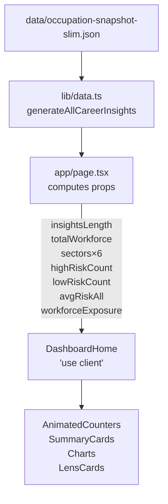

# Dashboard (Home)

**Status:** Live — origin/main
**Owner:** Neo (Frontend Dev)
**Route:** `/` (App Router root segment)

---

## Purpose

The dashboard is the primary entry point to FutureGrid. It synthesises occupation-level AI-exposure data into four animated KPI counters, a sector landscape scatter chart, highlights bento, Job Impact and Predictive charts, and five contextual "lens" navigation cards that route to deeper views (`/global`, `/careers`, `/labor`, `/analysis`, `/sources`).

**Non-goals:** The dashboard does not surface raw data tables, allow filtering, or render long-form narrative — those live on `/careers`, `/analysis`, and `/report` respectively.

---

## Route / Component Boundary

```
app/page.tsx                   ← RSC: computes all props at build time
  └─ components/dashboard/DashboardHome.tsx   ← "use client" (animations, i18n)
       ├─ components/dashboard/HeroRiskChecker.tsx
       ├─ components/dashboard/HighlightsBento.tsx
       ├─ components/dashboard/KeyFindings.tsx
       ├─ components/dashboard/SummaryCard.tsx  (×4)
       ├─ components/charts/SectorScatterChart.tsx
       ├─ components/charts/JobImpactChart.tsx
       ├─ components/charts/PredictiveChart.tsx
       ├─ components/ui/AnimatedCounter.tsx
       ├─ components/ui/Reveal.tsx
       └─ components/ui/DataAsOfBadge.tsx
```

`app/page.tsx` is a React Server Component. All heavy data derivations run at build/request time on the server; only a slim props object crosses the server/client boundary into `DashboardHome`.

---

## Architecture & Server/Client Split

| Layer | Runs where | Responsibility |
|---|---|---|
| `app/page.tsx` | Server | Calls data helpers, filters insights, computes aggregates, passes serialisable props |
| `DashboardHome` | Client (`"use client"`) | Renders animated counters, lens cards, charts; reads locale via `useT` |
| Chart islands | Client | Chart.js / D3 visualisations; no further data fetching |

### Data flow at build time



---

## Primary Types / Contracts

```ts
// Exported from components/dashboard/DashboardHome.tsx
interface DashboardHomeProps {
  insightsLength: number;
  totalWorkforce: number;
  sectors: SectorSummary[];          // top 6 by getSectorAggregatesExtended()
  highRiskCount: number;
  lowRiskCount: number;
  avgRiskAll: number;                // 0–1
  workforceExposure: WorkforceExposureData;
}

interface SectorSummary {
  sector: string;
  avgRisk: number;       // 0–1 employment-weighted mean automation probability
  occupationCount: number;
  brightShare: number;   // 0–1 fraction with outlook === "Bright"
}

interface WorkforceExposureData {
  highExposureShare: number;          // 0–1
  highExposureWorkforce: number;      // headcount
  totalWorkforce: number;
}
```

---

## Algorithms / Derived Metrics

| Metric | Formula | Source |
|---|---|---|
| `avgRiskAll` | `Σ automationProbability / insightsLength` | computed in `app/page.tsx` over `generateAllCareerInsights()` |
| `highRiskCount` | Count where `automationRisk` ∈ `{"High","Very High"}` | `app/page.tsx` |
| `lowRiskCount` | Count where `automationRisk === "Low"` | `app/page.tsx` |
| `highExposureShare` | `(byBand.High + byBand["Very High"]) / totalWorkforce` | `lib/data.ts#getWorkforceExposure` |
| `avgRisk` (per sector) | `Σ automationProbability / occupationCount` | `lib/data.ts#getSectorAggregatesExtended` |
| `brightShare` | `brightCnt / occupationCount` | `lib/data.ts#getSectorAggregatesExtended` |

> **Descriptive only.** All metrics summarise the static occupation-snapshot dataset. They do not imply forward-looking predictions.

---

## Data Sources & Provenance

| Dataset | File | Notes |
|---|---|---|
| Occupation snapshot (slim) | `data/occupation-snapshot-slim.json` | OEWS + Anthropic Economic Index 2025 + O*NET; see `data/COMPLIANCE.md` |
| Provenance registry | `data/provenance.json` | Built by `scripts/build-provenance.mjs` |

**Caveats:**
- `aiExposure` / `automationProbability` are modelled usage proxies (Anthropic Economic Index 2025), not observed automation rates.
- Employment headcounts are OEWS survey figures; Legislators (SOC 11-1031) excluded for null employment.
- The `DataAsOfBadge` component reads `generatedAt` from `lib/data.ts#getDataSources()` to surface the snapshot date inline.

---

## State & Interaction Model

`DashboardHome` is purely presentational client-side:

- **AnimatedCounter** — counts from 0 to target value over 1.4–1.6 s on mount. Respects `prefers-reduced-motion` (instant if reduced).
- **Reveal** — Intersection Observer fade-up on scroll (staggered `delay` props). Falls back to instant render if `prefers-reduced-motion`.
- **HeroRiskChecker** — client widget for typing an occupation name and checking its risk level; uses `searchInsights()` in-browser (no network).
- **Lens cards** — `<Link>` elements; no local state.
- **SectorScatterChart** — Chart.js scatter; D3 scale derivation; no user filters on dashboard.

---

## i18n

All user-visible strings are routed through `useT("dashboard")` and `useT("common")`:

| Namespace | Files |
|---|---|
| `dashboard` | `lib/i18n/messages/en/dashboard.ts`, `lib/i18n/messages/zh/dashboard.ts` |
| `common` | `lib/i18n/messages/en/common.ts`, `lib/i18n/messages/zh/common.ts` |

Locale is managed by `LanguageProvider` (React Context) in `app/layout.tsx`. Language toggle is in the `Sidebar`.

---

## Accessibility

- Skip-to-main link in `app/layout.tsx` (`<a href="#main" className="sr-only focus:not-sr-only …">`).
- `<main id="main">` landmark.
- Animated counters: `aria-hidden` on decorative separators; numeric values rendered as plain text alongside CSS animation.
- "About this data" note: `role="note"` with `aria-label`.
- `<hr className="divider-glow">` is decorative; no ARIA role needed.
- Workforce exposure section: semantic heading hierarchy h1 → h2 → h3.
- All interactive cards carry `focus-visible:outline` styles.
- `prefers-reduced-motion`: `Reveal` skips transitions; `AnimatedCounter` renders the final value immediately.

---

## Performance / Bundle Strategy

- All data is resolved server-side; the **full `occupation-snapshot.json`** (>1 MB) never enters the client bundle.
- Only the serialised props object (small, typed) crosses the RSC → client boundary.
- Chart components are client islands within `DashboardHome`; they are not lazy-loaded by default but are scoped to a single client chunk.
- `SectorScatterChart`, `JobImpactChart`, `PredictiveChart` use Chart.js (already in the shared chunk); no additional per-chart dynamic import overhead.
- `Reveal` uses `IntersectionObserver` for scroll-gated rendering; no layout shifts on first paint.

---

## Error / Empty / Loading Behaviour

| Scenario | Behaviour |
|---|---|
| No occupations in snapshot | `insightsLength === 0` — counters show 0; charts render empty state via Chart.js |
| `getWorkforceExposure()` fails | Build-time error; does not surface as a runtime UI error |
| Route load error | `app/error.tsx` boundary catches RSC errors |
| Not-found | `app/not-found.tsx` |

There is no skeleton/loading state for the dashboard: all data is static/SSG and always present when the page renders.

---

## Security / Privacy

- No user-specific data is collected or rendered on the dashboard.
- Google Analytics (`components/analytics/GoogleAnalytics`) is conditionally loaded; see `GDPR` handling in the GA component.
- No authentication gates.
- All external links to `/sources` open in the same tab (no `target="_blank"` with `rel` omission risk).

---

## Testing / Quality Gates

- `npm run build` — TypeScript checks props types; Next.js static pre-render catches runtime errors.
- Vitest unit tests in `tests/` cover `lib/data.ts` helpers (`generateAllCareerInsights`, `getSectorAggregatesExtended`, `getWorkforceExposure`).
- Visual/a11y checks: manual review with Lighthouse and keyboard navigation.

---

## Extension Points

- To add a new KPI counter: add a field to `DashboardHomeProps`, compute it in `app/page.tsx`, and render it alongside the existing `AnimatedCounter` instances in `DashboardHome`.
- To add a new lens card: push to the `lensCards` array in `DashboardHome`; add i18n keys in both `en/` and `zh/` namespaces.
- Sector grid currently shows `sectors.slice(0, 6)`; increase the slice in `app/page.tsx` to show more sectors.

---

## Key File References

| File | Purpose |
|---|---|
| `app/page.tsx` | RSC entry; data resolution |
| `components/dashboard/DashboardHome.tsx` | Primary client island |
| `components/dashboard/HeroRiskChecker.tsx` | Interactive risk checker |
| `components/dashboard/HighlightsBento.tsx` | Most/least at-risk, highlights |
| `components/dashboard/KeyFindings.tsx` | Static findings cards |
| `components/dashboard/SummaryCard.tsx` | Reusable KPI card |
| `components/charts/SectorScatterChart.tsx` | Sector landscape chart |
| `components/charts/JobImpactChart.tsx` | Top-20 exposure bar chart |
| `components/charts/PredictiveChart.tsx` | 2030 forecast chart |
| `lib/data.ts` | Core data helpers |
| `lib/i18n/messages/en/dashboard.ts` | English strings |
| `lib/i18n/messages/zh/dashboard.ts` | Chinese strings |
| `data/occupation-snapshot-slim.json` | Primary data source |

---

**Cross-links:** See [careers.md](./careers.md) for the occupation grid, [analysis.md](./analysis.md) for the Insights Lab, [report.md](./report.md) for the scrollytelling narrative.
