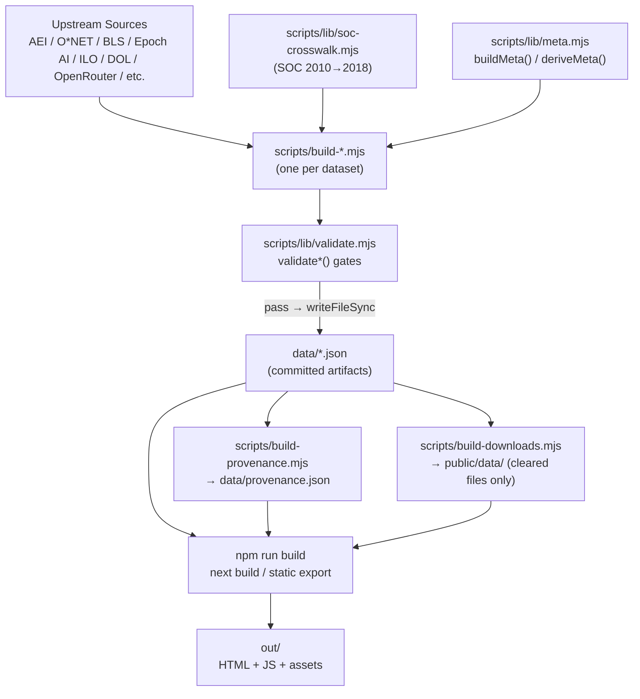

# Data Pipeline

**Status:** Production
**Owner:** Tank (Backend / Data Dev)
**Last audited:** 2026-07-11

---

## Purpose

Documents the FutureGrid data pipeline end-to-end: all build scripts in `scripts/`, the shared infrastructure libraries (`scripts/lib/meta.mjs`, `scripts/lib/validate.mjs`, `scripts/lib/soc-crosswalk.mjs`), the npm build-script catalog, the validate-before-write philosophy, the provenance registry, the static-export + Node 20 constraints, and the public-download compliance gate.

### Non-Goals

- Does not document the UI build (`next build`) — that is the standard Next.js 16 static-export pipeline.
- Does not document CI/CD workflow configuration beyond the recurring data refresh (`refresh-data.yml`).
- Per-dataset schemas and field semantics are in the domain-specific docs:
  - [`docs/occupation-data-model.md`](./occupation-data-model.md)
  - [`docs/labor-market.md`](./labor-market.md)
  - [`docs/global.md`](./global.md)
  - [`docs/frontier.md`](./frontier.md)
  - [`docs/visa.md`](./visa.md)

---

## Boundaries

The pipeline is split into two distinct families:

| Family | Scripts | Output | Trigger |
|---|---|---|---|
| **Data pipeline** | `scripts/build-*.mjs` | `data/*.json`, `public/warn-notices.json` | `npm run build:data` or individual `npm run build:<name>` |
| **Asset pipeline** | `scripts/build-og-image.mjs`, `scripts/build-downloads.mjs`, `scripts/build-world-geo.mjs` | `public/*.png`, `public/data/*.json` | `npm run build:downloads` (prebuild hook) |

The **prebuild hook** (`"prebuild": "npm run build:downloads"`) means `npm run build` (Next.js build) automatically runs `build:downloads` first, ensuring compliance-cleared files are in `public/data/` before the static export.

---

## Architecture

```
[Upstream sources]
  AEI (HuggingFace), O*NET (onetcenter.org), BLS (via Wayback),
  Epoch AI, ILO ILOSTAT, DOL OFLC, OpenRouter API,
  Indeed Hiring Lab, BLS JOLTS/QCEW/LAUS, CA EDD WARN, World Bank/OECD/ITU

         │
         ▼
[scripts/build-*.mjs]                      Node 20 ESM
  • Fetch upstream data (HTTP/HTTPS)
  • Parse (CSV/XLSX/JSON/GeoJSON)
  • Transform + aggregate
  • Apply SOC crosswalk (scripts/lib/soc-crosswalk.mjs)
  • Call buildMeta() / deriveMeta() → canonical meta block
  • Call validate*() → throws on degenerate data
  • writeFileSync → data/*.json
         │
         ▼
[data/*.json]                              Committed build artifacts
         │
         ▼
[scripts/build-provenance.mjs]
  • Scan all data/*.json
  • Extract / derive meta block from each
  • Write data/provenance.json (central registry)
         │
         ▼
[scripts/build-downloads.mjs]              prebuild hook
  • Copy compliance-cleared files to public/data/
         │
         ▼
[npm run build → next build]               Node 20 / static export (output: "export")
  • Statically imports data/*.json at build time
  • Generates out/ directory (HTML + JS bundles + assets)
```

---

## Mermaid Data-Flow Diagram



---

## npm Build Script Catalog

### Recurring Data Refresh (`data:refresh`)

```bash
npm run data:refresh
```

This is the **canonical refresh command** for both local use and CI. It runs `scripts/refresh-data.mjs`, which executes all public, key-free builders in dependency order, validates each output before writing, and updates provenance.

**Cadence:** Weekly via `.github/workflows/refresh-data.yml` (Monday 06:00 UTC). Can be triggered manually with `workflow_dispatch`.

**Included datasets (all key-free, public sources):**

| Step ID | Script | Notes |
|---|---|---|
| `warn` | `build-warn.mjs` | 50 states + DC; WI skipped gracefully without `GOOGLE_SHEETS_API_KEY` |
| `state-labor` | `build-state-labor.mjs` | Depends on `warn` |
| `state-qcew` | `build-state-qcew.mjs` | Depends on `state-labor` |
| `ai-usage-proxies` | `build-ai-usage-proxies.mjs` | OECD SDMX (HTTP/1.1), Eurostat, StackOverflow, HuggingFace, GitHub |
| `occupation-snapshot` | `build-data-snapshot.mjs` | AEI exposure + O*NET; employment requires `BLS_API_KEY` (skipped without it) |
| `snapshot-slim` | `build-snapshot-slim.mjs` | Derived from occupation-snapshot |
| `employment-projections` | `build-employment-projections.mjs` | Derived from occupation-snapshot |
| `job-postings` | `build-job-postings.mjs` | Derived from occupation-snapshot |
| `occupational-requirements` | `build-occupational-requirements.mjs` | Derived from occupation-snapshot |
| `ai-signals` | `build-ai-signals.mjs` | AIOE, Frey-Osborne, LLM exposure, automation-baseline |
| `market-signals` | `build-market-signals.mjs` | Yahoo Finance ETF sectors |
| `ai-company-stocks` | `build-ai-company-stocks.mjs` | Yahoo Finance chart bootstrap (unofficial; set `AI_COMPANY_STOCKS_BOOTSTRAP_YAHOO=1`) |
| `ai-frontier` | `build-ai-frontier.mjs` | Epoch AI Notable AI Models |
| `openrouter-models` | `build-openrouter-models.mjs` | OpenRouter public API |
| `global-ai-metrics` | `build-global-metrics.mjs` | Microsoft AI Diffusion + IMF AIPI + Oxford GAIRI |
| `international-occupation-mix` | `build-international-occupation-mix.mjs` | ILOSTAT 9 countries |
| `warn-public` | `build-warn-public.mjs` | Privacy-filtered public copy (depends on warn) |
| `provenance` | `build-provenance.mjs` | Central registry — **always last** |

**Excluded datasets (credential-gated or not safe for weekly CI):**

| Dataset | Reason |
|---|---|
| `jolts.json` | Requires `BLS_API_KEY` (hard exit) |
| `onet-enrichment.json` | Requires `ONET_API_KEY` (hard exit) |
| `h1b-trends.json` | ~2 GB Internet Archive downloads; not safe for weekly CI |
| `world-countries.geo.json` | Static geography; not time-varying |

**Failure behavior:** Any builder that exits non-zero aborts the refresh immediately with a clear error. The `validate*()` gate in each builder ensures a degenerate fetch (too few rows, missing fields, etc.) throws before `writeFileSync` is called. A failing job is the alert — it indicates a bad upstream fetch, not a code regression.

**No-change behavior:** If no data files changed, the CI job succeeds cleanly without creating an empty commit or PR.

**CI PR target:** `data/scheduled-refresh` branch → PR against `main`. Existing open PRs are updated by force-pushing the branch; a new PR is created only when none is open.

**Manifest test:** `tests/refresh-manifest.test.ts` statically asserts script existence, dependency ordering, excluded credentials, and required dataset coverage without running any builder.

### Full Data Rebuild (`build:data`)

```bash
npm run build:data
```

Executes (in order):
1. `npm run build:proxies` — AI usage proxies
2. `node scripts/build-data-snapshot.mjs` — occupation snapshot (full)
3. `node scripts/build-snapshot-slim.mjs` — slim snapshot
4. `npm run build:job-postings`
5. `npm run build:employment-projections`
6. `npm run build:ors` — occupational requirements
7. `npm run build:openrouter-models`
8. `npm run build:ai-company-stocks`
9. `npm run build:international-occupation-mix`
10. `npm run build:provenance` — provenance registry

### Individual Build Scripts

| npm script | Script file | Output |
|---|---|---|
| `build:proxies` | `build-ai-usage-proxies.mjs` | `data/ai-usage-proxies.json` |
| `build:snapshot-slim` | `build-snapshot-slim.mjs` | `data/occupation-snapshot-slim.json` |
| `build:provenance` | `build-provenance.mjs` | `data/provenance.json` |
| `build:onet` | `build-onet-enrichment.mjs` | `data/onet-enrichment.json` |
| `build:geo` | `build-world-geo.mjs` | `data/world-countries.geo.json` |
| `build:jolts` | `build-jolts.mjs` | `data/jolts.json` |
| `build:warn` | `build-warn.mjs` + `build-warn-public.mjs` | `data/warn-notices.json` + public subset |
| `build:warn-public` | `build-warn-public.mjs` | Public WARN subset |
| `build:state-labor` | `build-state-labor.mjs` | `data/state-labor.json` |
| `build:state-qcew` | `build-state-qcew.mjs` | `data/state-qcew.json` |
| `build:global-metrics` | `build-global-metrics.mjs` | `data/global-ai-metrics.json` |
| `build:og` | `build-og-image.mjs` | `public/og-image.png` |
| `build:ai-signals` | `build-ai-signals.mjs` | `data/market-ai-signals.json` (partial) |
| `build:market-signals` | `build-market-signals.mjs` | `data/market-ai-signals.json` |
| `build:ai-frontier` | `build-ai-frontier.mjs` | `data/ai-frontier.json` |
| `build:downloads` | `build-downloads.mjs` | `public/data/*.json` (cleared) |
| `build:h1b` | `build-h1b.mjs` | `data/h1b-trends.json` |
| `build:job-postings` | `build-job-postings.mjs` | `data/job-postings.json` |
| `build:employment-projections` | `build-employment-projections.mjs` | `data/employment-projections.json` |
| `build:openrouter-models` | `build-openrouter-models.mjs` | `data/openrouter-models.json` |
| `build:ai-company-stocks` | `build-ai-company-stocks.mjs` | `data/ai-company-stocks.json` |
| `build:ors` | `build-occupational-requirements.mjs` | `data/occupational-requirements.json` |
| `build:international-occupation-mix` | `build-international-occupation-mix.mjs` | `data/international-occupation-mix.json` |

### Utility Scripts

| npm script | Script file | Purpose |
|---|---|---|
| `smoke` | `smoke-test.mjs` | Verify data files exist and are non-empty |
| `check:bundle` | `check-bundle-size.mjs` | Warn if JS bundle exceeds threshold |
| `check:a11y` | `a11y-test.mjs` | Run axe-core accessibility checks |

---

## Shared Infrastructure

### `scripts/lib/meta.mjs` — Provenance Stamping

**The canonical `meta` block shape** (version 1.0.0):

```json
{
  "generatedAt": "2026-07-11T00:00:00.000Z",  // ISO-8601; when the file was produced
  "asOf": "2024",                               // period the data describes
  "source": { "name": "...", "publisher": "...", "url": "..." },
  "version": "1.0.0"
}
```

Two patterns:

- **`buildMeta({ generatedAt?, asOf?, source?, version? })`** — used by producers that know their source explicitly (e.g. `build-international-occupation-mix.mjs`).
- **`deriveMeta(obj, fallback?)`** — infers the meta block from an object's own top-level provenance fields (`generatedAt`, `source`/`sources`/`attribution`, `asOf`). Used by `build-provenance.mjs` to annotate datasets that predate the meta contract.

`normalizeSource(source)` collapses any source descriptor (string, array, object) to `{ name?, publisher?, url? } | string | null`. Arrays collapse to the first (primary) entry.

`countRows(value)` returns the primary record count: length of a top-level array, or `value.data.length` for `{ meta, data }` shaped datasets.

### `scripts/lib/validate.mjs` — Validate-Before-Write

**The validate-before-write pattern** is the central quality gate: every build script calls the appropriate validator immediately before `writeFileSync`. Validators throw a descriptive `Error` on failure; the builder exits non-zero and the output file is never written.

Primitive helpers:

| Helper | Purpose |
|---|---|
| `assertMinRows(rows, min, name)` | Array length floor (~80 % of current committed count) |
| `assertFields(obj, requiredKeys, name)` | Required top-level key presence |
| `assertProvenance(obj, name)` | Non-empty `generatedAt` (direct or via `meta.generatedAt`) |
| `assertLiveStates(states, requiredSet, name)` | Required state code coverage |
| `nullableFiniteInRange(value, min, max)` | Nullable finite number in range |

Per-dataset validators:

| Validator | Used by |
|---|---|
| `validateOccupationSnapshot(dataset)` | `build-data-snapshot.mjs` |
| `validateOccupationSnapshotSlim(dataset)` | `build-snapshot-slim.mjs` |
| `validateWarnNotices(data)` | `build-warn-public.mjs` |
| `validateStateLabor(data)` | `build-state-labor.mjs` |
| `validateStateQcew(data)` | `build-state-qcew.mjs` |
| `validateJolts(data)` | `build-jolts.mjs` |
| `validateH1bTrends(data, opts)` | `build-h1b.mjs` |
| `validateInternationalOccupationMix(data)` | `build-international-occupation-mix.mjs` |
| `validateProvenance(data)` | `build-provenance.mjs` |
| `validateOpenRouterModels(data)` | `build-openrouter-models.mjs` |
| `validateEmploymentProjections(data)` | `build-employment-projections.mjs` |

**Threshold philosophy:** Thresholds are set at ≈80 % of the current committed count. This catches degenerate fetches (empty response, structural change) without failing on normal variance.

### `scripts/lib/soc-crosswalk.mjs` — SOC 2010 → 2018

Downloads `soc_2010_to_2018_crosswalk.xlsx` from the BLS (via Wayback Machine identity mirror; `bls.gov` edge 403s non-browser clients). Cache lives in `.cache/soc-crosswalk/` (gitignored). Returns:

```javascript
{
  map:          Map<soc2010, soc2018>,        // primary target (first wins)
  multi:        Map<soc2010, Set<soc2018>>,   // all 2018 targets (split occupations)
  soc2018Title: Map<soc2018, string>,         // canonical 2018 SOC titles
}
```

Used by `build-h1b.mjs` (FY2016–FY2019 have SOC 2010 codes) and `build-employment-projections.mjs`.

---

## Provenance Registry (`data/provenance.json`)

Built by `scripts/build-provenance.mjs`. Scans every `data/*.json` (except `provenance.json` itself), extracts or derives the `meta` block, and writes a central registry:

```json
{
  "generatedAt": "2026-07-11T00:00:00.000Z",
  "datasets": [
    {
      "id": "occupation-snapshot",
      "file": "data/occupation-snapshot.json",
      "generatedAt": "...",
      "asOf": "2025",
      "source": { "name": "...", "publisher": "...", "url": "..." },
      "version": "1.0.0",
      "rows": 756
    },
    ...
  ]
}
```

Consumed by `lib/provenance.ts` → UI provenance badges.

---

## Public Download Gate (`scripts/build-downloads.mjs`)

Copies **only compliance-cleared** files from `data/` to `public/data/`. The cleared list is hard-coded in the script. Files explicitly **excluded** (never copied):

| File | Reason |
|---|---|
| `market-ai-signals.json` | Yahoo Finance ToS — redistribution prohibited |
| `ai-layoffs.json` | Challenger proprietary — no redistribution without license |
| `global-ai-metrics.json` | IMF non-commercial terms |
| `ai-usage-proxies.json` | QuestMobile rows — proprietary/state-media |
| `aioe-exposure.json` | No explicit open license |
| `automation-baseline.json` | No open license (academic) |
| `warn-notices.json` | Already served from `public/` (not duplicated) |

See `data/COMPLIANCE.md` for the full compliance matrix and per-file risk levels.

---

## Node 20 / Static Export Constraints

- All build scripts are **ESM modules** (`*.mjs`). No CommonJS in `scripts/`.
- **Next.js 16 with `output: "export"`** — the app is a fully static site. There are **no server-side request handlers at runtime**. All data is resolved at build time via static imports.
- Server Components in Next.js 16 static export mode are rendered once at build time; their output is static HTML. There is no per-request server execution.
- `import "server-only"` guards (e.g. in `lib/international-occupation-mix.ts`) prevent server-only modules from being bundled into client JS chunks. In static-export mode this is enforced by the Next.js compiler — violation = build failure.
- `NEXT_PUBLIC_BASE_PATH` env var is baked into the static bundle at build time; not dynamically read at runtime.
- **No `runtime = "edge"` or server API routes** with dynamic behavior in the static export. Any API-route-like functionality is implemented as pre-computed data in `data/*.json`.
- GitHub Pages deployment uses `GITHUB_PAGES=true` and `GITHUB_PAGES_BASE_PATH` env vars; `next.config.ts` handles `basePath`, `trailingSlash`, and the public base-path env accordingly.

---

## Validation Invariants (Summary)

| Invariant | Enforced by |
|---|---|
| Every committed `data/*.json` has `meta.generatedAt` | `assertProvenance()` in each builder |
| No builder overwrites on degenerate data | validate-before-write pattern |
| Occupation snapshot ≥ 680 rows | `validateOccupationSnapshot()` |
| H-1B occupations ≥ `minEmployers` (50) employers, ≥ 4 fiscal years | `validateH1bTrends()` |
| ILOSTAT ≥ 4 included countries, shares sum to ≈1.0 | `validateInternationalOccupationMix()` |
| WARN notices ≥ 10,000 rows, ≥ 11 required live states | `validateWarnNotices()` |
| JOLTS LDL series ≥ 24 months | `validateJolts()` |
| State labor ≥ 46 states | `validateStateLabor()` |
| Provenance registry has `generatedAt` and `datasets` array | `validateProvenance()` |
| Public downloads contain only compliance-cleared files | Hard-coded in `build-downloads.mjs` |

---

## Runtime Server / Client Boundary

In the static-export architecture there is **no runtime server**. "Server boundary" means "resolved at Next.js build time":

| Boundary | What it means in static export |
|---|---|
| `import "server-only"` module | Resolved at build time; never bundled into client JS |
| Client Component (`"use client"`) | Bundled into JS; hydrated in browser |
| Server Component (default) | Rendered to static HTML at build time; props serialized |

The practical contract:

- Large JSON files (occupation snapshot, O\*NET enrichment, ILOSTAT) are imported by server-only modules → never shipped to the browser.
- Slim / aggregate data is imported by client-safe modules or passed as serializable props.
- `world-countries.geo.json` is served as a public static asset and fetched lazily by the client map component.

---

## Failure / Degradation Behavior

| Scenario | Behavior |
|---|---|
| Upstream fetch error + committed file exists | Builder logs warning, skips overwrite (e.g. `build-ai-frontier.mjs`) |
| Upstream fetch error + no committed file | Builder exits non-zero; CI/CD fails |
| Validate gate fails | Builder throws before `writeFileSync`; exits non-zero; committed file unchanged |
| SOC crosswalk download fails + no cache | Builder exits non-zero |
| SOC crosswalk download fails + cache exists | Builder uses cached file |
| ILOSTAT < 4 countries pass gates | Builder exits non-zero (`MIN_INCLUDED = 4`) |
| `build:downloads` fails | `prebuild` fails; `npm run build` (Next.js) does not run |

---

## Security / Secrets / Privacy

- **No secrets in build scripts.** All upstream sources used by the pipeline are public endpoints or public S3/HuggingFace datasets requiring no authentication.
- `.env` vars loaded by `@next/env` in `build-data-snapshot.mjs` and `build-h1b.mjs` — these contain `NEXT_PUBLIC_*` configuration, not API secrets.
- `.env` is gitignored; `.env.example` is committed with placeholder values.
- Raw XLSX workbooks (DOL H-1B, BLS crosswalk) are cached in `.cache/` (gitignored) — not committed.
- WARN notices are privacy-filtered by `build-warn-public.mjs` before the public artifact is committed.
- `data/COMPLIANCE.md` is the authoritative audit trail for each committed file's redistribution rights.

---

## Testing

```bash
npm run test:run       # Vitest unit tests (lib/ functions, validators)
npm run smoke          # Verify data files exist and are non-empty
npm run check:bundle   # Warn if JS bundle exceeds threshold
npm run check:a11y     # Run axe-core accessibility checks against static output
npm run lint           # ESLint
npm run typecheck      # tsc --noEmit
```

- **validate-before-write** is the primary integration test for the data pipeline: structural regressions in data files surface as build failures, not runtime errors.
- Unit tests in `tests/` cover individual lib functions (`generateAllCareerInsights`, `getExposureTierAggregation`, `getReadinessGapData`, etc.).

---

## Extension Points

### Adding a New Dataset

1. Create `scripts/build-<name>.mjs`:
   - Fetch upstream data.
   - Parse and transform.
   - Call `buildMeta()` or `deriveMeta()` → attach `meta` block.
   - Add a `validate<Name>()` function to `scripts/lib/validate.mjs` and call it.
   - Call `writeFileSync(join(DATA_DIR, "<name>.json"), ...)`.
2. Add `"build:<name>": "node scripts/build-<name>.mjs"` to `package.json` scripts.
3. Create `lib/<name>.ts` as a typed loader (add `import "server-only"` if the data is large or sensitive).
4. If the file is compliance-cleared for redistribution, add it to the `CLEARED_FILES` list in `scripts/build-downloads.mjs`.
5. Add a `validate<Name>()` call in `build-provenance.mjs` is **not** required — provenance is derived automatically.

### Adding a New Validate Gate

Add a named export to `scripts/lib/validate.mjs`. Use the primitive helpers (`assertMinRows`, `assertFields`, `assertProvenance`, `assertLiveStates`) and set thresholds at ≈80 % of the current committed values.

### Changing the `meta` Schema Version

Update `META_VERSION` in `scripts/lib/meta.mjs`. All subsequent `buildMeta()` calls will stamp the new version. The provenance registry will reflect mixed versions until all datasets are rebuilt.

---

## Key File References

| File | Role |
|---|---|
| `scripts/lib/meta.mjs` | `buildMeta`, `deriveMeta`, `normalizeSource`, `countRows` |
| `scripts/lib/validate.mjs` | All `validate*()` gate functions + primitive helpers |
| `scripts/lib/soc-crosswalk.mjs` | SOC 2010→2018 crosswalk loader (cached) |
| `scripts/build-provenance.mjs` | Central provenance registry |
| `scripts/build-downloads.mjs` | Compliance-gated public download copies |
| `package.json` | Full npm script catalog |
| `next.config.ts` | Static export + GitHub Pages base-path config |
| `data/COMPLIANCE.md` | License and redistribution audit |
| `data/provenance.json` | Central provenance registry (committed artifact) |
| `lib/provenance.ts` | Typed loader for provenance registry |

---

*Cross-links: [`docs/occupation-data-model.md`](./occupation-data-model.md) · [`docs/labor-market.md`](./labor-market.md) · [`docs/global.md`](./global.md) · [`docs/frontier.md`](./frontier.md) · [`docs/visa.md`](./visa.md)*
