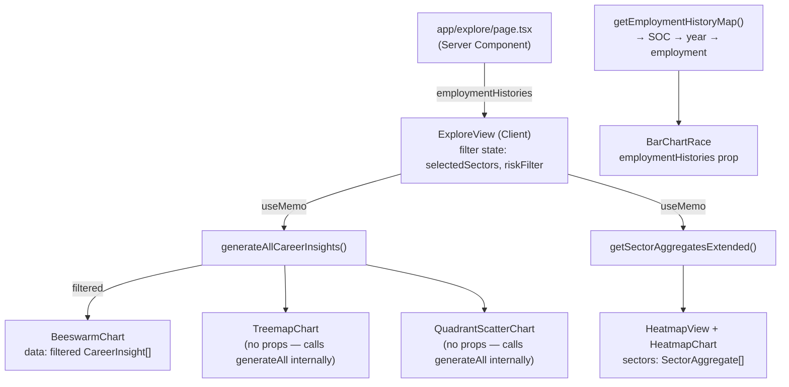

# Explore Page

> **Status:** Active
> **Owner:** Switch (Designer)
> **Route:** `/explore` → `app/explore/page.tsx` → `components/explore/ExploreView.tsx`
> **Related doc:** [Visualization System](./visualization-system.md)

---

## Purpose

The Explore page is the primary interactive data surface. It lets users interrogate AI-exposure data across ~756 occupations via five complementary chart sections, with filter controls for sector and risk band. Each section tells a different slice of the same story: *which jobs are most affected by AI, by how much, and how that's changing over time*.

### Non-goals

- Not a data management or authoring interface.
- Does not render static HTML — requires JavaScript (all charts are `"use client"`).
- Not responsible for individual career detail; those live under `/careers/[code]`.
- Does not perform any server-side data fetch after the initial `employmentHistories` prop is passed.

---

## Boundaries

| Layer | Scope |
|---|---|
| Page shell | `app/explore/page.tsx` — Server Component; calls `getEmploymentHistoryMap()` at build time and passes result to `ExploreView` |
| Layout | `app/explore/layout.tsx` — sets page `<Metadata>`; no extra UI |
| View orchestrator | `components/explore/ExploreView.tsx` — Client Component; owns filter state, renders the five sections |
| Charts | `components/charts/` — all chart components; see [Visualization System](./visualization-system.md) for full taxonomy |
| Heatmap section | `components/heatmap/HeatmapView.tsx` — rendered as the final sub-section of ExploreView |

ExploreView does **not** own routing; charts navigate to `/careers/[code]` on click.

---

## Component Taxonomy

| # | Section heading | Component | Library | What it encodes |
|---|---|---|---|---|
| 1 | Occupation AI Exposure Landscape | `BeeswarmChart` | D3 + force sim | Occupation dots: x = AI exposure %, size = employment, color = sector |
| 2 | Workforce Distribution by Sector | `TreemapChart` | D3 treemap | Sector → occupation hierarchy; area = employment, color = AI exposure |
| 3 | AI Exposure vs. Salary | `QuadrantScatterChart` | D3 scatter | x = AI exposure %, y = median salary (log), size = employment; 4 quadrants; zoomable |
| 4 | Employment Race | `BarChartRace` | D3 animated | Top-15 occupations by employment per year; animated over time with play/pause/scrub |
| 5 | Country × AI Readiness Heatmap | `HeatmapView` + `HeatmapChart` | D3 heatmap | 25 countries × 8 readiness metrics; color = normalized value |

---

## Data Flow

The `employmentHistories` map is the **only** prop crossing the server/client boundary; all other data is loaded client-side via `useMemo` calls over pre-bundled data modules.

---

## Filter State

ExploreView holds two React state values:

| State | Type | Default | Affects |
|---|---|---|---|
| `selectedSectors` | `string[]` | `[]` (all) | `BeeswarmChart` data |
| `riskFilter` | `string` | `"all"` | `BeeswarmChart` data |

Treemap, Quadrant, BarChartRace, and Heatmap are **not** affected by the filter controls — they always show the full dataset.

Filter controls include:
- `<select id="risk-filter">` — one of `all | Low | Medium | High | Very High`
- Sector multi-toggle chips — `<button aria-pressed>` per sector; active = violet fill

---

## Interaction & Animation Patterns

### BeeswarmChart
- D3 force simulation settles on mount; dots fade in with staggered `opacity` transition (max 400ms delay).
- Hover: dims all other dots (fill-opacity → 0.12), enlarges hovered dot (r × 1.6).
- Click: navigate to `/careers/[encodeURIComponent(occupationCode)]`.
- `prefers-reduced-motion`: simulation runs synchronously to settled state; no fade-in.

### TreemapChart
- Tiles fade in with staggered opacity (max 280ms).
- Click sector header → `focusSector` state set → re-renders zoomed into that sector.
- "Back" button resets `focusSector = null`.
- Click tile → navigate to `/careers/[code]`.
- `prefers-reduced-motion`: no entrance animation.

### QuadrantScatterChart
- Dots enter with back-out easing (r: 0 → final; max 180ms delay stagger).
- d3-zoom behavior: scroll to zoom (scale 0.4×–20×), drag to pan.
- "Reset Zoom" button appears when zoomed (`isZoomed` state).
- Hover: dims other dots; click → navigate to career.
- `prefers-reduced-motion`: no entrance animation; zoom still works.

### BarChartRace
- Play: auto-advances `yearIdx` every `ADVANCE_MS = 1200ms` via `setInterval`.
- Bar transitions: D3 `.transition().duration(700).ease(d3.easeCubicInOut)`.
- Year scrubber: `<input type="range">` — pauses playback, jumps to year.
- At end: Play button shows "Replay"; pressing it resets to year 0 and plays.
- Replay button: resets to year 0 and starts play.
- `prefers-reduced-motion`: Play/Pause button is disabled entirely; transitions use duration 0.

### HeatmapChart (inside HeatmapView)
- Cells fade in with staggered opacity (per-cell 6ms delay).
- Hover: dims all other cells (opacity → 0.25); hovered cell scales 1.06.
- `prefers-reduced-motion`: no entrance animation.

---

## AccessibleChart & Fallback Requirements

| Chart | Wrapping strategy | SR fallback |
|---|---|---|
| BeeswarmChart | `role="img" aria-label` on container div; `
` summary | `<ul className="sr-only">` — first 50 occupations as links to career pages |
| TreemapChart | `role="img" aria-label` on SVG + `<title>` element | `` prose summary with top 5 sectors and largest occupations |
| QuadrantScatterChart | `role="img" aria-label` on SVG | `<ul className="sr-only">` — all occupations as career links with exposure/salary data |
| BarChartRace | `role="img" aria-label` on SVG (updates with year) | `<table className="sr-only">` — rank/occupation/employment for the currently displayed year |
| HeatmapChart | `role="img" aria-label` + `<title>` on SVG | `` summary + `<table className="sr-only">` 25 countries × 8 metrics |

All SVGs used for decoration within `AccessibleChart` carry `aria-hidden="true"`.

---

## Keyboard / Screen-Reader / Reduced-Motion / Color Semantics

### Keyboard
- Filter `<select>` and sector `<button aria-pressed>` chips are fully keyboard-navigable.
- BarChartRace Play/Pause and Replay buttons are keyboard-focusable; scrubber is a native `<input type="range">`.
- Reset Zoom button (QuadrantScatterChart) is a visible button, keyboard-accessible.
- SR occupation lists in BeeswarmChart and QuadrantScatterChart contain `<a href>` links — full keyboard tab navigation to every career.
- TreemapChart back button is keyboard-accessible.

### Screen readers
- `aria-live="polite" aria-atomic="true"` on the BarChartRace year label ensures the current year is announced on every frame advance.
- Sector chips use `aria-pressed` for toggle state.
- HeatmapChart SR table uses `scope="col"` / `scope="row"` for proper navigation.

### Reduced motion
- All D3 entrance animations, bar-race transitions, and line-draw animations are gated on `window.matchMedia("(prefers-reduced-motion: reduce)")`.
- BarChartRace's Play button is disabled when reduced; users can still use the year scrubber.

### Color semantics
- Risk colors are defined in `lib/utils.ts → colorForRisk()` and in `app/globals.css` `@theme` tokens:
  - Low: `#22c55e` (green)
  - Medium: `#eab308` (yellow)
  - High: `#f97316` (orange)
  - Very High: `#ef4444` (red)
- Brand ramp (HeatmapChart, TreemapChart): deep indigo `#1e1b4b` → violet `#7c3aed` → cyan `#06b6d4` (high exposure = bright cyan).
- Sector palette (BeeswarmChart): 20 categorical colors — not semantic, purely distinguishing.
- Color is **never** the sole differentiator; all charts provide numeric labels, tooltips, or SR tables.

---

## Responsive Behavior

- All chart SVGs use `viewBox` with `className="w-full h-auto"` — they scale proportionally.
- Each chart section is wrapped in `overflow-x-auto` for narrow viewports.
- Tooltip positioning uses a `cw` (container width) guard: if `x > cw * 0.62`, the tooltip flips left of the cursor.
- Filter chips wrap with `flex-wrap gap-3`.
- BarChartRace SVG has `minHeight: 200`; BeeswarmChart `minHeight: 280`.
- HeatmapChart has `min-h-[600px]` — horizontal scroll expected on mobile.

---

## Performance & Bundle Strategy

- `employmentHistories` is fetched **at build time** by the Server Component and passed down; the full raw snapshot is not included in client JS.
- D3 and react-chartjs-2 are in the client bundle because all charts are `"use client"`.
- There is currently **no** `next/dynamic` lazy-loading on the Explore page — all five chart sections are eagerly imported. This is acceptable because ExploreView itself is the whole page; further splitting would yield marginal benefit.
- D3 effects clean up with `svg.selectAll("*").interrupt()` to prevent state leaks across HMR and route transitions.
- BeeswarmChart's force simulation is stopped on unmount via the `simRef`.

> **Gap:** Consider `next/dynamic` wrapping for HeatmapChart (heaviest SVG, 200+ cells) and BarChartRace (animation runtime) if LCP scores regress.

---

## Failure & Empty States

| Component | Condition | Behavior |
|---|---|---|
| BarChartRace | `frames.length === 0` (no employment history) | Renders `
` with i18n `"raceNoData"` message |
| TreemapChart | `treeData.children.length === 0` | D3 effect returns early; empty SVG rendered |
| QuadrantScatterChart | `data.length === 0` | D3 effect returns early; empty SVG |
| BeeswarmChart | `data.length === 0` | D3 effect returns early (no `draw()` call) |
| HeatmapChart | Missing country data | Individual cells show `noDataFill` (zinc-800/zinc-300) |

If a chart data source throws at build time, Next.js will surface a build error. Runtime failures in D3 effects are not caught — add error boundaries if resilience is needed.

---

## Security / Privacy

### Data Sources and Bundling

All data rendered by the Explore page is either pre-bundled at build time or passed as a build-time server prop — no Explore-specific component issues a runtime network request:

| Source | How loaded | Notes |
|---|---|---|
| `generateAllCareerInsights()` | Module-level `import` of `occupation-snapshot-slim.json`; memoized in-process | Bundled into client JS; no fetch |
| `getSectorAggregatesExtended()` | Derived from the same bundled snapshot | No fetch |
| `employmentHistories` | Read by the Server Component at **build time** via `getEmploymentHistoryMap()`; passed as a prop to `ExploreView` | Full `occupation-snapshot.json` never enters the client bundle |

`lib/snapshot.ts` explicitly notes that the full employment-history snapshot must not be imported from `"use client"` modules; the Server Component extracts only the `SOC → year → employment` map and passes it down. The full snapshot's wage histories do not reach the client.

### Filter State and PII Posture

`ExploreView` holds two transient React state values (`selectedSectors`, `riskFilter`). Both are:

- **Local only** — never written to `localStorage`, `sessionStorage`, URL query params, or cookies.
- **Derived solely from UI input** (select / button click), not from user identity or profile data.

No personally-identifiable information is collected, stored, or transmitted by any component on the Explore page. All rendered data is aggregated occupational statistics derived from public-domain labor sources (BLS OEWS, O\*NET).

### D3 / SVG Rendering and XSS

All five chart components on this page (BeeswarmChart, TreemapChart, QuadrantScatterChart, BarChartRace, HeatmapChart) use D3's imperative selection API to construct the SVG DOM — `.append("rect")`, `.attr("d", path)`, `.text(label)` — never via `innerHTML` or raw HTML string injection.

**`dangerouslySetInnerHTML` audit:** None of the five Explore-specific chart components use `dangerouslySetInnerHTML`. No such usage exists anywhere in `app/explore/` or `components/explore/`.

Tooltip content is composed from bundled occupation names and numeric values (exposure %, salary, employment) and held in a React `useState` object. The tooltip div is rendered as normal JSX — React's HTML-escaping pipeline applies.

### Internal Navigation Links

Click-to-navigate from chart dots and tiles uses `router.push('/careers/${encodeURIComponent(code)}')` (D3 mouse event handler) or `<a href={'/careers/${encodeURIComponent(code)}'}>`(screen-reader fallback lists). All target URLs are intra-app relative paths. `encodeURIComponent` ensures raw SOC code strings are URL-safe. No Explore-page component creates or renders a link to an external origin.

### Static-Export Threat Boundary

`next.config.ts` sets `output: "export"`. The Explore page is a **fully static artefact** — no Node.js server executes at request time. There is no API route, database, or server-side session associated with this page. The attack surface is limited to the static JS/CSS/HTML bundle delivered to the browser. HTTP security headers (CSP, HSTS, X-Frame-Options) are not set by the framework; they must be configured at the hosting layer (CDN or reverse proxy).

---

## Testing

- `tests/` directory contains Vitest/component tests.
- Filter state logic (sector toggle, risk select → filtered array) is the primary unit-test target.
- D3 render effects are not directly tested (imperative DOM mutations); test via visual regression or Playwright.
- BarChartRace play/pause state transitions can be unit-tested with React Testing Library + fake timers.

> **Gap:** No tests confirmed for ExploreView filter logic at time of writing.

---

## Extension Checklist

When adding a new chart section to ExploreView:

- [ ] Add a `<section aria-labelledby="…-heading">` wrapper.
- [ ] Supply either `AccessibleChart` wrapper **or** inline `role="img" aria-label` + `sr-only` table/list.
- [ ] Check `prefers-reduced-motion` inside the D3 effect.
- [ ] Return cleanup from the D3 `useEffect` (`svg.selectAll("*").interrupt()`).
- [ ] Add tooltip with smart left/right positioning using `cw` guard.
- [ ] Expose data via an SR fallback (table, list, or prose).
- [ ] Confirm `w-full h-auto` + `overflow-x-auto` wrapper for responsive layout.
- [ ] Use `colorForRisk()` from `lib/utils.ts` for any risk-band coloring.
- [ ] Use the brand ramp (`#1e1b4b → #7c3aed → #06b6d4`) for continuous sequential data.

---

## Key File References

| File | Role |
|---|---|
| `app/explore/page.tsx` | Server Component; provides `employmentHistories` |
| `app/explore/layout.tsx` | Metadata only |
| `components/explore/ExploreView.tsx` | Client orchestrator; filter state |
| `components/charts/BeeswarmChart.tsx` | Occupation beeswarm |
| `components/charts/TreemapChart.tsx` | Sector→occupation treemap |
| `components/charts/QuadrantScatterChart.tsx` | AI exposure × salary scatter |
| `components/charts/BarChartRace.tsx` | Animated employment race |
| `components/heatmap/HeatmapView.tsx` | Country heatmap section container |
| `components/charts/HeatmapChart.tsx` | D3 heatmap implementation |
| `app/globals.css` | Risk color tokens, brand ramp, glass utilities |
| `lib/utils.ts` | `colorForRisk()` helper |
| `lib/snapshot.ts` | `getEmploymentHistoryMap()` — source for BarChartRace |
| `lib/data.ts` | `generateAllCareerInsights()`, `getSectorAggregatesExtended()` |
