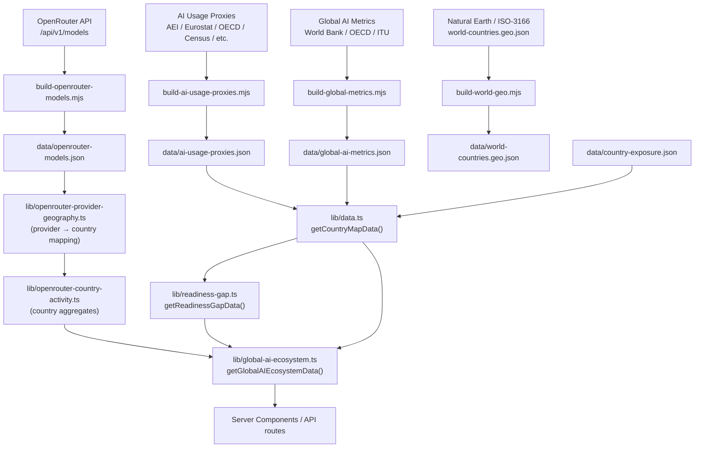

# Global AI Ecosystem

**Status:** Production
**Owner:** Tank (Backend / Data Dev)
**Last audited:** 2026-07-11

---

## Purpose

Documents the Global AI Ecosystem composite: OpenRouter model-catalog footprint (by provider geography), AI readiness scores, AI usage diffusion proxies, and the Readiness Gap quadrant analysis. This module powers the global comparison map and country-level adoption/readiness visualization.

### Non-Goals

- Does not cover AI-frontier compute trends — see [`docs/frontier.md`](./frontier.md).
- International occupation mix (ILOSTAT) — see [`docs/labor-market.md`](./labor-market.md).
- H-1B visa flows — see [`docs/visa.md`](./visa.md).

---

## Boundaries

| Dataset | Data File | Lib Module |
|---|---|---|
| Global AI Metrics (readiness + diffusion) | `data/global-ai-metrics.json` | (loaded via `lib/data.ts` `getCountryMapData`) |
| AI Usage Proxies | `data/ai-usage-proxies.json` | `lib/openrouter-country-activity.ts` (indirect) |
| OpenRouter Models Catalog | `data/openrouter-models.json` | `lib/openrouter-country-activity.ts`, `lib/openrouter-provider-geography.ts` |
| Country Exposure | `data/country-exposure.json` | `lib/data.ts` |
| World Countries (geo) | `data/world-countries.geo.json` | Client-side map rendering |
| Readiness Gap | Derived | `lib/readiness-gap.ts` |
| **Consumer GenAI Diffusion — Top Economies** | `data/global-ai-metrics.json` (diffusionTrend) | `lib/data.ts` `getTopDiffusionComparison` |
| Global AI Ecosystem | Derived composite | `lib/global-ai-ecosystem.ts` |

---

## Architecture

```
OpenRouter API (/api/v1/models?supported_parameters=tools)
    │
    ▼
build-openrouter-models.mjs ──► data/openrouter-models.json
    │
    ▼
lib/openrouter-provider-geography.ts   (provider → country mapping)
lib/openrouter-country-activity.ts     (country → model/endpoint counts)

Global AI Metrics CSV (World Bank, OECD, ITU, etc.)
    │
    ▼
build-global-metrics.mjs ──► data/global-ai-metrics.json
    │
    ▼
lib/data.ts getCountryMapData()
    │
    ▼
lib/readiness-gap.ts getReadinessGapData()
lib/global-ai-ecosystem.ts getGlobalAIEcosystemData()
```

---

## Mermaid Data-Flow Diagram



---

## Canonical Schemas / Types

### `GlobalAIEcosystemRow` (`lib/global-ai-ecosystem.ts`)

```typescript
export interface GlobalAIEcosystemRow {
  iso3: string;
  countryName: string;
  region: string;
  modelCount: number;           // distinct models from OpenRouter catalog
  endpointCount: number;        // serving endpoints on OpenRouter
  modelProviderCount: number;   // distinct model-family providers
  endpointProviderCount: number;
  diffusionPct: number | null;  // AI usage adoption % (proxy); from global-ai-metrics
  readinessScore: number | null;// composite 0–100; from global-ai-metrics
  readinessGap: number | null;  // adoptionPercentile − readinessPercentile; −100 to +100
  quadrant: GlobalAIEcosystemQuadrant;
  proxyCaveat: string;          // human-readable caveat for this row's data quality
}

export type GlobalAIEcosystemQuadrant =
  | "adoption-outpacing-readiness"   // gap > +15 percentile points
  | "latent-capacity"                // gap < −15 percentile points
  | "balanced-leader"                // ≥ 66th percentile for both
  | "balanced-watchlist"             // below 66th percentile, gap within ±15
  | "catalog-without-readiness"      // OpenRouter footprint but no readiness score
  | "readiness-without-catalog";     // readiness score but no OpenRouter footprint
```

### `ReadinessGapCountry` (`lib/readiness-gap.ts`)

```typescript
export interface ReadinessGapCountry {
  iso3: string;
  name: string;
  diffusionPct: number;           // AI adoption proxy (%)
  diffusionDelta: number | null;  // YoY change in diffusionPct
  aiReadiness: number;            // composite readiness score (0–100)
  readinessScore: number;         // same as aiReadiness (alias)
  adoptionPercentile: number;     // 0–100; rank among rankable countries
  readinessPercentile: number;
  gap: number;                    // adoptionPercentile − readinessPercentile
  quadrant: ReadinessGapQuadrant;
}
```

Quadrant assignment constants: `GAP_THRESHOLD = 15` percentile points; `BALANCED_LEADER_MIN_PERCENTILE = 66`.

### OpenRouter Country Activity (`lib/openrouter-country-activity.ts`)

```typescript
interface OpenRouterCountryActivityCountry {
  iso3: string;
  countryName: string;
  region: string;
  modelCount: number;
  endpointCount: number;
  modelProviderCount: number;
  endpointProviderCount: number;
}
```

---

## Joins / Crosswalks / Algorithms

### Readiness Gap Quadrant Assignment

1. Filter countries that have both `diffusionPct` and `aiReadiness` (not null).
2. Compute `adoptionPercentile` and `readinessPercentile` using rank among the same filtered set.
3. Compute `gap = round2(adoptionPercentile − readinessPercentile)`.
4. Assign quadrant:
   - `gap > GAP_THRESHOLD (15)` → `"adoption-outpacing-readiness"`
   - `gap < −GAP_THRESHOLD` → `"latent-capacity"`
   - Both percentiles ≥ 66 → `"balanced-leader"`
   - Otherwise → `"balanced-watchlist"`

Countries without readiness score but in OpenRouter catalog → `"catalog-without-readiness"`.
Countries with readiness score but no OpenRouter footprint → `"readiness-without-catalog"`.

### OpenRouter Provider Geography

`lib/openrouter-provider-geography.ts` maintains a static provider-slug → country-ISO3 mapping. Providers are identified by their OpenRouter slug (e.g. `openai`, `anthropic`, `google`). Provider geography is **inferred from known legal/operational headquarters**, not from server geography.

**Caveat:** OpenRouter catalog footprint is a **provider-identity proxy**, not a measure of usage or deployment geography. A model appearing under a US provider does not mean the model is used by or deployed for US users.

### Global AI Ecosystem Composite Join

```
iso3 ∈ union(OpenRouter countries, readiness-gap countries)
  → left-join OpenRouter catalog activity
  → left-join readiness gap
  → left-join countryNames (from geo/world map)
```

Rows are sorted: `modelCount DESC, readinessScore DESC, countryName ASC`.

### Units

| Field | Unit |
|---|---|
| `modelCount`, `endpointCount` | integer count |
| `diffusionPct` | percentage (0–100) |
| `readinessScore` | composite score (0–100) |
| `adoptionPercentile`, `readinessPercentile` | percentile (0–100) |
| `gap` | percentile points (−100 to +100) |

---

## Source Provenance / Licensing / Caveats

| Dataset | Source | License | Caveat |
|---|---|---|---|
| OpenRouter Models Catalog | OpenRouter API | Proprietary API; data is OpenRouter's own index | Model/endpoint counts; not usage data |
| Global AI Metrics (readiness) | Oxford Insights AI Readiness Index, ITU, OECD, World Bank | Mixed (CC BY, OECD open license, Public Domain) | Composite index; methodology varies by year |
| AI Usage Proxies | AEI, Eurostat, OECD, Census, CNNIC, QuestMobile, HuggingFace, GitHub, Stack Overflow, World Bank | Mixed (CC BY 4.0, OECD, Public Domain, Proprietary) | QuestMobile/CNNIC are proprietary/state-media; mark as approximate |
| World Countries GeoJSON | Natural Earth + ISO-3166 | Public Domain / CC BY-SA 4.0 (for ISO-3166 crosswalk portion) | CC BY-SA share-alike obligation on the ISO-3166 crosswalk piece |

See `data/COMPLIANCE.md` for full compliance matrix. In particular, AI usage proxies mix licensed sources; bulk-download must label/exclude the QuestMobile and CNNIC rows or display warnings (see COMPLIANCE.md §4 and §8).

---

## Build / Update Lifecycle

```
npm run build:openrouter-models  # → data/openrouter-models.json
npm run build:global-metrics     # → data/global-ai-metrics.json
npm run build:proxies            # → data/ai-usage-proxies.json (part of build:data)
npm run build:geo                # → data/world-countries.geo.json
```

The `global-ai-ecosystem` and `readiness-gap` computations are **fully derived at runtime** from the above committed artifacts. They do not have their own build scripts; they are pure TypeScript functions in `lib/`.

---

## Validation Invariants

- `build-openrouter-models.mjs` calls `validateOpenRouterModels()` from `scripts/lib/validate.mjs` before writing; asserts `meta.generatedAt`, minimum model count.
- `build-global-metrics.mjs` calls the appropriate validator; asserts minimum country count and `meta` block.
- Derived `ReadinessGapData` is validated at runtime: `rankableCountries` must not be empty, percentile computation requires at least 2 countries.

---

## Runtime Server / Client Boundary

| Module | Boundary | Reason |
|---|---|---|
| `lib/global-ai-ecosystem.ts` | Client-safe (no `import "server-only"`) | Pure function over already-loaded data |
| `lib/readiness-gap.ts` | Client-safe | Pure function |
| `lib/openrouter-country-activity.ts` | Client-safe | Thin typed wrapper |
| `lib/openrouter-provider-geography.ts` | Client-safe | Static mapping |
| `data/openrouter-models.json` | Loaded in lib; Client-safe at module level | — |
| `data/world-countries.geo.json` | Client-fetched via public URL | Large (fetched lazily); not bundled |

`world-countries.geo.json` is served from the `public/` directory and fetched by the client map component at runtime via `fetch("/world-countries.geo.json")`. The `NEXT_PUBLIC_BASE_PATH` env var ensures correct prefixing on GitHub Pages deployments.

---

## Failure / Degradation Behavior

- If OpenRouter API is unavailable during `build-openrouter-models.mjs`, the builder throws and exits non-zero. The committed file is not overwritten.
- If `readinessgap` has zero rankable countries (e.g. both `diffusionPct` and `aiReadiness` are null for all countries), `getReadinessGapData()` returns an empty `countries` array; the UI must handle this gracefully.
- Countries with no OpenRouter footprint AND no readiness score are excluded from the ecosystem composite; they appear only on the geo map if they have a geometry entry.
- Null `diffusionPct` or `readinessScore` fields in `GlobalAIEcosystemRow` are explicitly typed as `number | null` and must be handled in all chart/map renderers.

---

## Accessibility Implications

- Map choropleth must not use hue alone to encode quadrant. Use accessible color ramps with sufficient contrast, and provide a non-visual legend (ARIA `role="list"` with descriptions per quadrant).
- Tooltip data for each country should include country name, quadrant label (human-readable), and both adoption and readiness percentile values.
- Chart axes must have aria-label or equivalent text describing the metric and units.

---

## Performance

- `getGlobalAIEcosystemData()` and `getReadinessGapData()` compute on first call; no memoization — callers that call them repeatedly should memoize at the call site or in a Server Component.
- `data/world-countries.geo.json` is large (> 1 MB uncompressed); it is served as a static asset and fetched lazily by the map component, not bundled.
- `data/openrouter-models.json` is statically imported at build time; its size is bounded by the OpenRouter catalog size.

---

## Security / Secrets / Privacy

- No individual-level data. All metrics are country-level aggregates.
- OpenRouter API does not require authentication for the public models endpoint.
- No API keys required for `build-global-metrics.mjs` (public World Bank / OECD / ITU endpoints).
- `NEXT_PUBLIC_BASE_PATH` is a public env var; not a secret.

---

## Testing

- `npm run test:run` runs Vitest tests including `readiness-gap` quadrant-assignment unit tests.
- Smoke test (`npm run smoke`) verifies that `data/openrouter-models.json` and `data/global-ai-metrics.json` exist and are non-empty.

---

## Extension Points

- **Add a new country to the readiness ranking:** Ensure the country appears in `data/global-ai-metrics.json` with both `diffusionPct` and `aiReadiness` populated.
- **Change quadrant thresholds:** Update `GAP_THRESHOLD` and `BALANCED_LEADER_MIN_PERCENTILE` constants in `lib/readiness-gap.ts`.
- **Add a new provider to the geography mapping:** Add an entry to `lib/openrouter-provider-geography.ts`.
- **New global metric column:** Extend `CountryMapDatum` in `lib/data.ts` and the `build-global-metrics.mjs` builder.

---

## Key File References

| File | Role |
|---|---|
| `lib/global-ai-ecosystem.ts` | Composite join and quadrant logic |
| `lib/readiness-gap.ts` | Readiness gap computation |
| `lib/openrouter-country-activity.ts` | OpenRouter country aggregates |
| `lib/openrouter-provider-geography.ts` | Provider → country mapping |
| `lib/data.ts` | `getCountryMapData()`, `getTopDiffusionComparison()` — loads global-ai-metrics + country-exposure |
| `data/openrouter-models.json` | OpenRouter catalog snapshot |
| `data/global-ai-metrics.json` | Country readiness + diffusion (incl. `diffusionTrend` for all three AIEI periods) |
| `data/ai-usage-proxies.json` | Multi-source AI adoption proxies |
| `data/world-countries.geo.json` | GeoJSON for map rendering |
| `data/country-exposure.json` | Country-level AI exposure data |
| `components/global/DiffusionGrowthComparison.tsx` | Consumer GenAI Diffusion — Top Economies ranked by Q1 2026 absolute level with trend context |
| `scripts/build-openrouter-models.mjs` | OpenRouter catalog builder |
| `scripts/build-global-metrics.mjs` | Global metrics builder |
| `scripts/build-ai-usage-proxies.mjs` | Usage proxies builder |
| `scripts/build-world-geo.mjs` | GeoJSON builder |
| `data/COMPLIANCE.md` | License audit |

---

## Consumer GenAI Diffusion — Top Economies

**Section:** `/global#diffusion-growth-comparison`
**Source:** Microsoft AI Diffusion Report (MIT) — `data/global-ai-metrics.json` → `metrics.diffusionTrend`
**Helper:** `lib/data.ts` `getTopDiffusionComparison(limit = 10): DiffusionComparisonRow[]`

### What it shows

Top 10 economies ranked by Q1 2026 absolute level (share of working-age population using a generative AI product), with three survey periods for trend context: H1 2025, H2 2025, Q1 2026. This is **not** a fastest-growth ranking — economies are ranked by Q1 2026 absolute adoption level, not growth rate or acceleration. All rows have complete three-period data; rows with any missing period are excluded. Sorted descending by Q1 2026.

### DTO type

```typescript
export interface DiffusionComparisonRow {
  iso3: string;
  name: string;
  h1_2025: number;
  h2_2025: number;
  q1_2026: number;
}
```

### Claim guardrails

- Metric: % of working-age population using a generative AI product (behavior-based survey).
- **Ranking criterion: Q1 2026 absolute adoption level, not growth rate or fastest-growth.**
- **Usage ≠ capability, workplace adoption, productivity, or labor-market impact.**
- Short three-period window (H1 2025, H2 2025, Q1 2026); extrapolation from three points is unreliable.
- Western telemetry may undercount domestic AI apps (e.g. Doubao, Kimi in China).
- **Not merged** with Claude.ai usage index, Indeed job demand, Anthropic indices, or IMF metrics.

---

*Cross-links: [`docs/frontier.md`](./frontier.md) · [`docs/labor-market.md`](./labor-market.md) · [`docs/data-pipeline.md`](./data-pipeline.md)*
