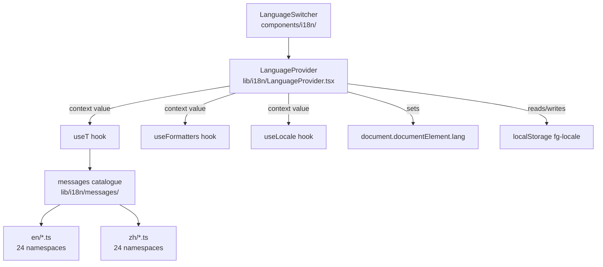

# Internationalisation (i18n)

**Status:** Active · **Owner:** Trinity (Lead)
**Last updated:** 2026-07-11

---

## Purpose

Provide locale-aware UI text, number/date formatting, and language selection for FutureGrid. Currently supports **English (`en`)** and **Simplified Chinese (`zh`)**.

**Non-goals:** URL-based locale routing; server-side locale negotiation; RTL layout support; translation of data values (occupation names, source metadata).

---

## Boundaries

| In scope | Out of scope |
|---|---|
| `lib/i18n/` — context, hooks, message catalogue | Data labels (SOC titles, sector names) |
| `components/i18n/LanguageSwitcher.tsx` | URL path segments (`/zh/...`) |
| `useT`, `useFormatters`, `useLocale` hooks | Server-side Accept-Language header |
| `localStorage` persistence | Cookie-based locale storage |
| `html[lang]` synchronisation | RTL support |

---

## Architecture



### `LanguageProvider` (`lib/i18n/LanguageProvider.tsx`)

- `"use client"` React context provider; wraps the entire app inside `ThemeProvider`.
- **SSR/SSG safe:** initial state is always `"en"` to match server render. A `useEffect` runs on mount to detect the real locale and call `setLocaleState`, preventing hydration mismatch.
- Locale detection order (client-side only):
  1. `localStorage.getItem("fg-locale")` — explicit user choice
  2. `navigator.language.toLowerCase().startsWith("zh")` — browser preference
  3. Default: `"en"`
- On locale change: updates state, writes `localStorage`, syncs `document.documentElement.lang`.

### `useT` (`lib/i18n/useT.ts`)

Signature: `useT(namespace: Namespace) → t(key, vars?) → string`

- Reads `locale` from `LanguageContext`.
- Looks up `messages[locale][namespace][key]`; falls back to `messages.en[namespace][key]`; falls back to the raw key string.
- Interpolation: `{variable}` patterns replaced via regex `\{(\w+)\}`.

### `useFormatters` (`lib/i18n/useFormatters.ts`)

Returns locale-aware helpers bound to the active locale:

| Helper | Locale mapping |
|---|---|
| `formatNumber(n, decimals?)` | `en-US` / `zh-CN` via `Intl.NumberFormat` |
| `formatCurrency(n)` | `en-US` / `zh-CN` |
| `formatPercent(n, decimals?)` | locale-independent |
| `formatDate(date, options?)` | `Intl.DateTimeFormat` with BCP-47 locale |

BCP-47 mapping: `en → "en-US"`, `zh → "zh-CN"`.

---

## Namespace Architecture

The message catalogue lives in `lib/i18n/messages/`. Each namespace is a TypeScript module exporting a plain `Record<string, string>`. The `index.ts` assembles the full `messages` object and exports it typed.

### 24 Namespaces

| Namespace | Page / Component |
|---|---|
| `common` | Shared strings (language switcher labels, generic UI) |
| `nav` | Sidebar navigation labels |
| `dashboard` | Home dashboard (`/`) |
| `careers` | Careers explorer (`/careers`, `/careers/[code]`) |
| `sectors` | Sectors overview (`/sectors`, `/sectors/[id]`) |
| `skills` | Skills explorer (`/skills`) |
| `global` | Global AI map (`/global`) |
| `checker` | Hero risk checker widget |
| `command` | Command palette (`CommandPalette`) |
| `sources` | Sources & citations (`/sources`) |
| `heatmap` | Heatmap component |
| `explore` | Explore view (`/explore`) |
| `report` | Report page (`/report`) |
| `analysis` | Analysis page (`/analysis`) |
| `keyfindings` | Key findings panel |
| `dataexport` | Data export panel (`DataExport`) |
| `charts` | Shared chart labels & ARIA strings |
| `pulse` | Pulse/signals views |
| `layoffs` | Layoffs data panel |
| `labor` | Labor page (`/labor`) |
| `frontier` | AI Frontier page (`/frontier`) |
| `error` | Error boundary strings |
| `methodology` | Methodology page (`/methodology`) |
| `visa` | Visa/H-1B page (`/visa`) |

### File Layout

```
lib/i18n/
├── LanguageProvider.tsx    ← context, detection, persistence
├── useT.ts                 ← namespace-scoped translator hook
├── useFormatters.ts        ← Intl-backed formatter hook
├── types.ts                ← Locale = "en" | "zh"
└── messages/
    ├── index.ts            ← assembles messages; exports Messages type
    ├── en/
    │   ├── common.ts
    │   ├── nav.ts
    │   └── … (24 files)
    └── zh/
        ├── common.ts
        ├── nav.ts
        └── … (24 files)
```

---

## Runtime / Build Lifecycle

1. **Build time:** All message files are statically imported in `messages/index.ts`. The full bilingual catalogue is bundled at build time — no runtime fetch.
2. **SSR/SSG render:** `LanguageProvider` initial state `"en"` — HTML is always rendered in English.
3. **Hydration:** `useEffect` fires → `detectInitialLocale()` → may call `setLocaleState("zh")` → React re-renders affected components in Chinese.
4. **User interaction:** `LanguageSwitcher` calls `setLocale(next)` → context updates → all `useT` consumers re-render synchronously.

---

## Contracts / Configuration

**`Locale` type** (`lib/i18n/types.ts`):
```ts
export type Locale = "en" | "zh";
```

**Messages type** (`lib/i18n/messages/index.ts`):
```ts
export type Messages = typeof messages;
// Messages["en"] is the full English catalogue
// keyof Messages["en"] is the Namespace union type used by useT
```

**localStorage key:** `"fg-locale"` — stores `"en"` or `"zh"`.

---

## Security / Privacy

- No locale data is transmitted to any server. Locale is stored in `localStorage` only.
- `"use client"` guard ensures `localStorage` is only accessed client-side.
- All `try/catch` around storage access to handle restricted browsing contexts.

---

## Accessibility

- `document.documentElement.lang` is kept in sync with the active locale. Screen readers use `lang` to select the correct voice/pronunciation.
- `LanguageSwitcher` button has `aria-label` describing the target language (e.g. "Switch to Chinese").
- `global-error.tsx` also sets `<html lang={locale}>` directly (no `LanguageProvider` available there).

---

## Performance

- Message catalogue is fully static — no network round-trips for translations.
- `messages/index.ts` is a single import; tree-shaking keeps only what is referenced.
- Locale re-render is shallow: only components consuming `useT` or `useFormatters` re-render; layout / data components are unaffected.

---

## Failure Handling

| Failure | Behaviour |
|---|---|
| Missing key in active locale | Falls back to English value for that key |
| Missing key in both locales | Returns the raw key string |
| `localStorage` unavailable | `try/catch`; locale defaults to `"en"` |
| `navigator` unavailable (SSR) | `try/catch`; locale defaults to `"en"` |

---

## Adding a New Locale Safely

1. Add the locale code to `lib/i18n/types.ts`:
   ```ts
   export type Locale = "en" | "zh" | "ja";
   ```
2. Create `lib/i18n/messages/ja/` with all 24 namespace files (copy from `en/` as baseline).
3. Register all 24 imports and add the `ja` key to `messages` in `lib/i18n/messages/index.ts`.
4. Update `detectInitialLocale()` in `LanguageProvider.tsx` to detect the new locale from `navigator.language`.
5. Update `LOCALE_MAP` in `useFormatters.ts` to map the code to a BCP-47 string (e.g. `ja: "ja-JP"`).
6. Update `LanguageSwitcher` to cycle through three locales (currently assumes binary toggle).
7. Run `npm run typecheck` to confirm no missing keys (TypeScript will enforce the `Messages` shape).
8. All 24 namespace files must be present and complete before merging — partial translations cause key-fallback to English silently.

---

## Adding a New Namespace

1. Create `lib/i18n/messages/en/{namespace}.ts` and `lib/i18n/messages/zh/{namespace}.ts`.
2. Import and register both in `lib/i18n/messages/index.ts`.
3. Use in a component: `const t = useT("{namespace}")`.
4. TypeScript will type-check that `{namespace}` is a valid `Namespace` key.

---

## Tests / Quality Gates

| Gate | File |
|---|---|
| i18n key parity | `tests/careers-i18n.test.ts` — verifies en/zh key alignment for careers namespace |
| Type safety | `npm run typecheck` — `Messages` type enforces namespace/key shape |

---

## Extension Points

- `useFormatters` can be extended with additional `Intl` helpers (e.g. `formatRelativeTime`).
- `LanguageProvider` detection logic can be extended to read `Accept-Language` from a server-injected `<meta>` tag for initial SSR locale without hydration flicker.
- The `"fg-locale"` key can be prefixed if multi-app cookie isolation is needed.

---

## Key File References

| File | Role |
|---|---|
| `lib/i18n/types.ts` | `Locale` type definition |
| `lib/i18n/LanguageProvider.tsx` | Context, detection, persistence |
| `lib/i18n/useT.ts` | Namespace-scoped translation hook |
| `lib/i18n/useFormatters.ts` | Locale-aware number/date formatters |
| `lib/i18n/messages/index.ts` | Catalogue assembly and `Messages` type |
| `lib/i18n/messages/en/` | English namespace files (24) |
| `lib/i18n/messages/zh/` | Chinese namespace files (24) |
| `components/i18n/LanguageSwitcher.tsx` | Language toggle UI |
| `tests/careers-i18n.test.ts` | i18n key-parity test |
