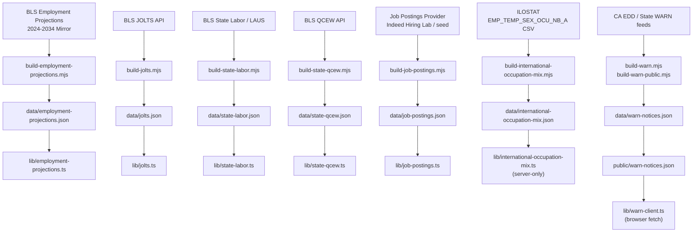

# Labor Market Data

**Status:** Production
**Owner:** Tank (Backend / Data Dev)
**Last audited:** 2026-07-18

---

## Purpose

Documents all U.S. labor-market datasets used in FutureGrid: BLS employment projections, OEWS wage/employment history, BLS JOLTS, state-level labor data, QCEW, WARN Act notices, job postings, and the ILOSTAT international occupation mix.

### Non-Goals

- Does not cover H-1B visa data — see [`docs/visa.md`](./visa.md).
- Does not cover AI-frontier compute trends — see [`docs/frontier.md`](./frontier.md).
- Global readiness/diffusion metrics — see [`docs/global.md`](./global.md).
- Occupation exposure model internals — see [`docs/occupation-data-model.md`](./occupation-data-model.md).

---

## Boundaries

| Dataset | Data File | Lib Module | Notes |
|---|---|---|---|
| BLS Employment Projections (EP) | `data/employment-projections.json` | `lib/employment-projections.ts` | 2024–2034 |
| BLS JOLTS | `data/jolts.json` | `lib/jolts.ts` | Monthly; hires, separations, quits |
| BLS State Labor | `data/state-labor.json` | `lib/state-labor.ts` | State unemployment + employment |
| QCEW (Quarterly Census of Employment & Wages) | `data/state-qcew.json` | `lib/state-qcew.ts` | Quarterly by state/sector |
| WARN Act Notices | `data/warn-notices.json` | `lib/warn-client.ts` / `lib/warn-types.ts` | Layoff notices; CA EDD + others (client fetches `public/warn-notices.json`) |
| Job Postings | `data/job-postings.json` | `lib/job-postings.ts` | Aggregated annuals by SOC |
| International Occupation Mix | `data/international-occupation-mix.json` | `lib/international-occupation-mix.ts` | ILOSTAT ISCO-08; server-only |
| Labor Opportunity | Derived | `lib/labor-opportunity.ts` | Derived from multiple sources |
| Talent Bottleneck | Derived | `lib/talent-bottleneck.ts` | Derived |
| Reskilling Bridge | Derived | `lib/reskilling-bridge.ts` | Derived |
| Wage Tier Polarization | Derived | `lib/wage-tier-polarization.ts` | Derived |

---

## Architecture

```
BLS EP API / Mirror
    │
    ▼
build-employment-projections.mjs ──► data/employment-projections.json
                                          │
                                          ▼
                                  lib/employment-projections.ts
                                  (server + client safe)

BLS JOLTS API
    │
    ▼
build-jolts.mjs ──► data/jolts.json ──► lib/jolts.ts

CA EDD (WARN)
    │
    ▼
build-warn.mjs ──► data/warn-notices.json (raw)
build-warn-public.mjs ──► public/warn-notices.json (public subset, privacy-filtered)
                                    │
                                    ▼
                            lib/warn-client.ts (browser fetch) / lib/warn-types.ts

ILOSTAT (EMP_TEMP_SEX_OCU_NB_A endpoint)
    │
    ▼
build-international-occupation-mix.mjs ──► data/international-occupation-mix.json
                                                │
                                                ▼
                                  lib/international-occupation-mix.ts
                                  (server-only, import "server-only")
```

---

## Mermaid Data-Flow Diagram



---

## Canonical Schemas / Types

### Employment Projections (`lib/employment-projections.ts`)

```typescript
interface EmploymentProjectionRow {
  socCode: string;
  title: string;
  sector: string;
  employment2024: number | null;      // thousands
  employment2034: number | null;      // thousands
  employmentChange: number | null;    // thousands
  employmentChangePct: number | null; // decimal fraction
  projectedOpenings: number | null;   // annual average
  aiExposure: number | null;          // 0–1
  automationRisk: "Low" | "Medium" | "High" | "Very High";
  automationProbability: number | null;
  brightOutlook: boolean;
  medianAnnualWage: number | null;    // USD
  entryLevelEducation: string | null;
  onTheJobTraining: string | null;
  sourceUrl: string | null;
}

interface EmploymentProjectionsDataset {
  meta: { generatedAt; asOf; source; version };
  coverage: {
    baseYear: 2024;
    projectionYear: 2034;
    windowYears: 10;
    primaryKey: "socCode";
    rows: number;
    ...
  };
  methodology: {
    provenanceDecision: string;
    accessMirror: string;
    mirrorRepository: string;
    joinStrategy: string;
    openingsStrategy: string;
    units: string;         // "employment in thousands; openings as annual average"
  };
  summary: EmploymentProjectionSummary;
  rows: EmploymentProjectionRow[];
}
```

### International Occupation Mix (`lib/international-occupation-mix.ts`)

```typescript
interface OccupationMixCountry {
  iso3: string;
  name: string;
  year: number;               // qualifying reference year
  iloSource: string;          // ILO source code
  observationStatuses: string[];
  noteIndicators: string[];
  totalEmployment: number;    // thousands (native ILO unit)
  groupCoverageRatio: number; // fraction of TOTAL covered by groups 1–9
  groups: Record<string, {    // keyed "1"–"9"
    label: string;
    employment: number;       // thousands
    share: number;            // 0–1, normalized to groups 1–9 sum
  }>;
}

interface OccupationMixDissimilarity {
  method: string;             // "Half-L1 (Bray-Curtis): D = 0.5 * sum(|share_i_A - share_i_B|)"
  note: string;               // "Descriptive only. No ranking implied."
  pairs: Record<string, number>; // "ISO3_ISO3" → 0–1 (alphabetical key)
}
```

**Slim client-safe variant** (`OccupationMixCountrySlim`) omits `totalEmployment`; exposes only `shares` and `labels`.

### WARN Act (`lib/warn-types.ts`)

```typescript
interface WarnNotice {
  company: string;
  county: string | null;
  city: string | null;
  employees: number;
  noticeDate: string | null;    // ISO "YYYY-MM-DD"
  effectiveDate: string | null; // ISO "YYYY-MM-DD"; scrubbed to null when implausible
  layoffType: string | null;
  state: string;                // 2-letter code, e.g. "CA"
  stateName: string;            // e.g. "California"
}
```

---

## Joins / Crosswalks / Algorithms

### International Occupation Mix — Gates

The `build-international-occupation-mix.mjs` pipeline applies **five sequential gates** per seed country:

1. Must have ISCO-08 data within **3 years** of the dataset's latest year (`WITHIN_YEARS = 3`).
2. **No imputed observations** — rows with `obs_status = "I"` are excluded. Break-in-series (`"B"`) is accepted.
3. **All 9 ISCO-08 major groups** (1–9) individually reported with positive values.
4. **Valid positive TOTAL** in the ILOSTAT `OCU_ISCO08_TOTAL` row.
5. **Group coverage ≥ 98%** — sum of groups 1–9 / TOTAL ≥ `MIN_COVERAGE_RATIO = 0.98`.

Countries are tried newest-year-first; first qualifying year wins. If fewer than 4 countries pass, the build fails loudly.

**Seed universe:** AUS, DEU, ESP, FRA, GBR, ITA, KOR, NLD, USA, CAN, JPN (CAN and JPN are explicit exclusion candidates at time of writing).

**No imputation:** The pipeline strictly excludes imputed data; if a country has imputed data in all qualifying years it is excluded entirely.

**Shares normalization:** Shares are normalized to the sum of groups 1–9 (not the ILOSTAT TOTAL), so they sum to 1.0. `groupCoverageRatio` is stored separately for data-quality traceability.

**Pairwise dissimilarity:** D = 0.5 × Σ|share_i_A − share_i_B| over ISCO-08 groups 1–9. Range 0–1; descriptive only; no ranking implied.

### Employment Projections — Join Strategy

BLS EP rows are joined to the occupation snapshot on SOC 2018 code. The SOC 2010→2018 crosswalk (`scripts/lib/soc-crosswalk.mjs`) is applied to any EP row carrying a 2010-vintage code before joining.

### WARN Effective-Date Plausibility (data-quality hardening)

`build-warn.mjs` runs `scrubImplausibleEffectiveDates()` before writing: an `effectiveDate` earlier than `MIN_PLAUSIBLE_WARN_DATE` (`2010-01-01`) or later than `MAX_PLAUSIBLE_WARN_EFFECTIVE_DATE` (current UTC year **+ 2**, Dec 31) is treated as a parsing/data-entry error and scrubbed to `null` rather than dropped. `validateWarnNotices()` then re-checks the committed notices against the same window and throws (build fails) if any out-of-range `effectiveDate` survives.

### Units

| Field | Unit |
|---|---|
| `employment*` (EP) | thousands |
| `employmentChangePct` | decimal fraction (0.05 = +5%) |
| `projectedOpenings` | average annual openings |
| `medianAnnualWage` | USD annual |
| `totalEmployment` (ILOSTAT) | thousands |
| `share` (ISCO-08) | 0–1 fraction |
| `dissimilarity` | 0–1 (Half-L1) |

---

## International Comparability Caveats

- ISCO-08 occupational classifications are broadly comparable across countries, but **national implementations vary** (aggregation level, reference population, seasonal adjustment).
- The FutureGrid pipeline uses **annual total-sex** data only. Gender-disaggregated or quarterly breakdowns are not included.
- **Year heterogeneity:** Countries may qualify on different reference years (within the 3-year window). Cross-country comparisons should note the reference year for each country.
- **No imputation guarantee:** The no-imputation gate means some countries are excluded even if their data quality is acceptable by other standards.
- **Dissimilarity is descriptive:** The Half-L1 measure describes structural difference in occupation mix; it does not imply that one mix is "better" or that a given country's mix causes any particular economic outcome.

---

## Source Provenance / Licensing / Caveats

| Dataset | Source | License | Caveat |
|---|---|---|---|
| BLS Employment Projections | BLS (bls.gov) | Public Domain (US Government) | Mirror via GitHub; 2024–2034 window |
| BLS JOLTS | BLS (bls.gov) | Public Domain | Monthly; ~2-month lag |
| BLS LAUS / State Labor | BLS (bls.gov) | Public Domain | — |
| BLS QCEW | BLS (bls.gov) | Public Domain | — |
| WARN Notices | CA EDD + state agencies | California Public Records Act | Privacy-filtered before committed |
| Job Postings | Indeed Hiring Lab | CC BY 4.0 | AI/GenAI share series |
| ILOSTAT (international mix) | ILO (ilostat.ilo.org) | CC BY 4.0 | Annual; total sex; ISCO-08 only |

See `data/COMPLIANCE.md` for full risk matrix.

---

## Build / Update Lifecycle

```
# Full labor-market rebuild (part of npm run build:data):
node scripts/build-employment-projections.mjs
node scripts/build-job-postings.mjs
node scripts/build-jolts.mjs
node scripts/build-state-labor.mjs
node scripts/build-state-qcew.mjs
node scripts/build-warn.mjs && node scripts/build-warn-public.mjs
node scripts/build-international-occupation-mix.mjs

# Individual scripts:
npm run build:employment-projections
npm run build:job-postings
npm run build:jolts
npm run build:state-labor
npm run build:state-qcew
npm run build:warn        # → raw warn-notices.json + public subset
npm run build:international-occupation-mix
```

All scripts are Node 20 ESM modules. They fetch live upstream data; run in a network-enabled CI environment. Committed artifacts in `data/` are the source of truth for the runtime build.

---

## Validation Invariants

`scripts/lib/validate.mjs` provides dataset-specific validators called by each builder **before** `writeFileSync`:

- `validateInternationalOccupationMix()` — checks `meta.generatedAt`, required top-level keys, ≥ 1 included country, each country has 9 groups with `share` summing to ≈1.0 (within 0.005), dissimilarity pairs are finite 0–1.
- `validateEmploymentProjections()` — minimum row count, `meta` block present, rows have `socCode` and numeric employment values.
- `validateWarnNotices()` — ≥ 10,000 notices, ≥ 50 coverage states, required live states present, and every `effectiveDate` within the `2010-01-01 .. current-UTC-year + 2` plausibility window (throws otherwise).
- `assertLiveStates()` — WARN and state-labor builders assert a required set of state codes is present.
- `assertMinRows()` — a fixed per-dataset row-count floor (each threshold set at roughly 80 % of the committed count).
- `assertProvenance()` — `generatedAt` present at top-level or in `meta`.

Builders fail with non-zero exit and a descriptive error before writing anything degenerate.

---

## Runtime Server / Client Boundary

| Module | Boundary | Reason |
|---|---|---|
| `lib/international-occupation-mix.ts` | **Server-only** (`import "server-only"`, compiler-enforced) | Contains raw employment totals; payload size; no PII but large |
| `lib/employment-projections.ts` | Client-safe | Slim typed wrapper |
| `lib/job-postings.ts` | Client-safe | — |
| `lib/jolts.ts` | Client-safe | — |
| `lib/warn-client.ts` | Client-safe | Fetches `public/warn-notices.json` at browser runtime via `fetch()`; memoized promise. This is the sole runtime consumer of WARN data — `data/warn-notices.json` is read only by `build-warn-public.mjs` (fs) to emit the privacy-filtered public copy. Static export has no API runtime — there is no API route for WARN data. |
| `lib/state-labor.ts` | Client-safe | — |
| `lib/state-qcew.ts` | Client-safe | — |

Client components receive only the slim `OccupationMixSlim` shape (no raw employment totals) via Server Component props.

---

## Failure / Degradation Behavior

- If ILOSTAT endpoint returns HTTP error or empty body, `build-international-occupation-mix.mjs` throws and exits non-zero without writing. The committed file is unchanged.
- If fewer than 4 countries pass the ILOSTAT gates, the build fails loudly (`MIN_INCLUDED = 4`).
- If BLS EP mirror is unavailable, the builder falls back to the last committed file and logs a warning.
- Individual `null` employment or growth values propagate through to the UI; components must render gracefully.

---

## Accessibility Implications

- Country-comparison charts using occupation mix data must not rely solely on color to distinguish ISCO-08 groups — use distinct patterns or labels.
- Maps showing country coverage should include a non-visual legend (ARIA described-by) listing excluded countries and their exclusion reasons.

---

## Performance

- `data/international-occupation-mix.json` is imported once at server startup (or SSG time); the `_data` module-level const is reused across all requests.
- `getOccupationMixSlim()` iterates the `included` array once; O(n) where n is the number of included countries (≤ 11 at this time).
- `getOccupationMixDissimilarityForCountry()` iterates `included` once; sorts O(n log n).

---

## Security / Secrets / Privacy

- WARN Act data is privacy-filtered in `build-warn-public.mjs` before the public artifact is committed. The raw file is gitignored.
- No individual-level data in any labor dataset.
- All BLS/ILOSTAT fetches are unauthenticated public endpoints; no API keys required.

---

## Testing

- `npm run test:run` runs Vitest tests including `employment-projections` and `international-occupation-mix` structural tests.
- The validate-before-write pattern means structural regressions surface at build time, not at runtime.
- Smoke test: `npm run smoke` checks that all expected data files exist and are non-empty.

---

## Extension Points

- **Add a new country to the ILOSTAT seed universe:** Append the ISO3 code and name to `SEED_COUNTRIES` / `COUNTRY_NAMES` in `scripts/build-international-occupation-mix.mjs`. The gates will determine include/exclude automatically.
- **Change the coverage window:** Update `WITHIN_YEARS` constant.
- **Add a new labor dataset:** Create `scripts/build-<name>.mjs`, add a `build:<name>` npm script, import the result in a new `lib/<name>.ts` module.

---

## Key File References

| File | Role |
|---|---|
| `lib/employment-projections.ts` | EP typed loader and selectors |
| `lib/international-occupation-mix.ts` | ILOSTAT typed loader (server-only) |
| `lib/job-postings.ts` | Job postings loader |
| `lib/jolts.ts` | JOLTS loader |
| `lib/state-labor.ts` | State labor loader |
| `lib/state-qcew.ts` | QCEW loader |
| `lib/warn-client.ts` / `lib/warn-types.ts` | WARN notices client loader + types |
| `data/employment-projections.json` | EP committed artifact |
| `data/international-occupation-mix.json` | ILOSTAT committed artifact |
| `data/jolts.json` | JOLTS artifact |
| `data/warn-notices.json` | WARN artifact |
| `scripts/build-employment-projections.mjs` | EP builder |
| `scripts/build-international-occupation-mix.mjs` | ILOSTAT builder |
| `scripts/build-jolts.mjs` | JOLTS builder |
| `scripts/build-warn.mjs` | WARN (raw) builder |
| `scripts/build-warn-public.mjs` | WARN (public) builder |
| `scripts/lib/soc-crosswalk.mjs` | SOC 2010→2018 crosswalk |
| `scripts/lib/validate.mjs` | Validate-before-write helpers |
| `data/COMPLIANCE.md` | License and redistribution audit |

---

*Cross-links: [`docs/occupation-data-model.md`](./occupation-data-model.md) · [`docs/visa.md`](./visa.md) · [`docs/data-pipeline.md`](./data-pipeline.md) · [`docs/global.md`](./global.md)*
