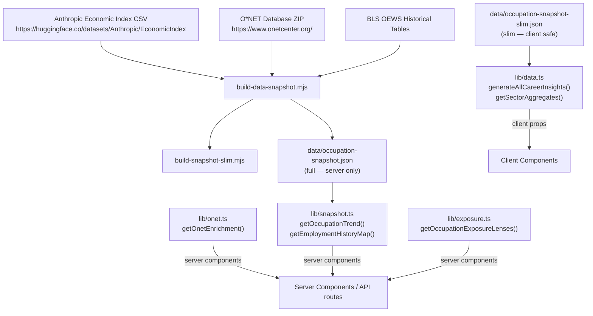

# Occupation Data Model

**Status:** Production
**Owner:** Tank (Backend / Data Dev)
**Last audited:** 2026-07-11

---

## Purpose

Defines the canonical occupation record that powers the FutureGrid career-insights UI, search, comparison, and filtering features. All occupation-level automation, salary, employment, outlook, and skills data flows through the `occupation-snapshot.json` / `occupation-snapshot-slim.json` pair.

### Non-Goals

- Does not document the international occupation mix (ISCO-08) — see [`docs/labor-market.md`](./labor-market.md).
- Does not document global readiness/diffusion metrics — see [`docs/global.md`](./global.md).
- Does not cover AI-frontier model records — see [`docs/frontier.md`](./frontier.md).

---

## Boundaries

| Layer | File / Module | Who uses it |
|---|---|---|
| Full snapshot (with history) | `data/occupation-snapshot.json` | Server components only (`lib/snapshot.ts`) |
| Slim snapshot (no history) | `data/occupation-snapshot-slim.json` | Client-safe; `lib/data.ts`, `lib/h1b.ts` |
| OEWS enrichment (O\*NET) | `data/onet-enrichment.json` | Server components only (`lib/onet.ts`) |
| Exposure lenses | `data/aioe-exposure.json`, `data/automation-baseline.json`, `data/llm-exposure.json` | `lib/exposure.ts` (server) |
| Occupational requirements | `data/occupational-requirements.json` | `lib/occupational-requirements.ts` |

---

## Architecture

```
Anthropic Economic Index (CSV)
          │
          ▼
  build-data-snapshot.mjs
    • Fetch AEI CSV + O*NET ZIP
    • Join on SOC code
    • Compute growthRate from OEWS history
    • Build employmentHistory / wageHistory maps
          │
          ├──► data/occupation-snapshot.json   (full; includes history)
          │
          └──► build-snapshot-slim.mjs
                      │
                      ▼
               data/occupation-snapshot-slim.json
               (strips employmentHistory/wageHistory)
```

---

## Mermaid Data-Flow Diagram



---

## Canonical Schemas / Types

### `SnapshotRow` (full — `lib/snapshot.ts`)

```typescript
type SnapshotRow = {
  socCode: string;           // SOC 2018 code, e.g. "15-1252"
  title: string;
  sector: string;
  aiExposure: number;        // 0–1; AEI task-level composite
  automationRisk: "Low" | "Medium" | "High" | "Very High";
  automationProbability: number;  // 0–1; Frey & Osborne baseline
  medianSalary: number;      // USD annual; BLS OEWS
  employment: number | null; // thousands; BLS OEWS
  projectedOpenings: number | null; // from BLS EP table
  growthRate: number | null; // decimal fraction; derived from OEWS history or EP
  growthWindow?: { fromYear: number; toYear: number } | null;
  jobZone: number;           // O*NET Job Zone 1–5
  brightOutlook: boolean;
  outlook: "Bright" | "Average";
  skills: string[];
  employmentHistory?: Record<string, number>; // year → employment (thousands)
  wageHistory?: Record<string, number>;       // year → median annual USD
};
```

### `CareerInsight` (public API — `lib/data.ts`)

```typescript
export interface CareerInsight {
  occupationCode: string;
  occupationName: string;
  automationRisk: "Low" | "Medium" | "High" | "Very High";
  automationProbability: number;
  growthRate: number | null;
  growthWindow?: { fromYear: number; toYear: number } | null;
  medianSalary: number;           // USD annual
  totalEmployment: number | null; // thousands
  projectedOpenings: number | null;
  outlook: "Bright" | "Average";
  sectorName: string;
  skills: string[];
  employmentHistory: null;  // always null in client-facing shape
  wageHistory: null;        // always null in client-facing shape
}
```

### `OnetEnrichmentOccupation` (`lib/onet.ts`)

```typescript
interface OnetEnrichmentOccupation {
  occupationCode: string;    // SOC 2018
  onetCode: string;          // O*NET code (e.g. "15-1252.00")
  title: string;
  description: string;
  sampleTitles: string[];
  jobZone: { code: number; title: string } | null;
  tasks: { id: string; title: string }[];
  detailedWorkActivities: { id: string; title: string }[];
  skills: { id: string; name: string; description: string }[];
  technologySkills: { name: string; category: string; hot: boolean; inDemand: boolean }[];
  relatedOccupations: { code: string; onetCode: string; title: string; brightOutlook: boolean }[];
}
```

### `OccExposureLenses` (`lib/exposure.ts`)

```typescript
export interface OccExposureLenses {
  code: string;
  name: string;
  sector: string;
  usage: number | null;      // AEI composite %; 0–100
  capability: number | null; // LLM capability score %; 0–100
  ability: number | null;    // AIOE ability-based score %; 0–100
  automation: number | null; // Frey & Osborne probability %; 0–100
  consensus: number | null;  // avg(usage, capability, ability)
  gap: number | null;        // capability − usage (headroom)
}
```

---

## Joins / Crosswalks / Algorithms

| Step | Description |
|---|---|
| **SOC vintage crosswalk** | `scripts/lib/soc-crosswalk.mjs` downloads BLS `soc_2010_to_2018_crosswalk.xlsx` (via Wayback identity mirror) and maps 2010 → 2018 SOC codes before any aggregation. Cache lives in `.cache/soc-crosswalk/`. |
| **AEI join** | Anthropic Economic Index rows are keyed on 2018 SOC codes and joined left-inner to the O\*NET occupation universe. |
| **growthRate derivation** | If BLS EP table provides a rate, that wins. Otherwise `growthRate` is derived from OEWS employment history as CAGR over the longest available consecutive window; `growthWindow` records the years used. |
| **Automation risk buckets** | `automationProbability` (0–1) is bucketed: <25% → Low, 25–50% → Medium, 50–75% → High, ≥75% → Very High. |
| **Consensus exposure** | `consensus = avg(usage, capability, ability)` where each term is in 0–100 %. `gap = capability − usage`. |
| **Slim derivation** | `build-snapshot-slim.mjs` strips `employmentHistory` and `wageHistory` from every row, halving the JSON payload. |

### Units

| Field | Unit |
|---|---|
| `aiExposure`, `automationProbability` | 0–1 fraction |
| `medianSalary` | USD annual |
| `employment` | thousands of workers |
| `growthRate` | decimal fraction (0.05 = +5%) |
| `usage`, `capability`, `ability`, `automation`, `consensus` | percentage points (0–100) |

---

## Source Provenance / Licensing / Caveats

| Source | License | Caveat |
|---|---|---|
| Anthropic Economic Index | Research access; usage-restricted | Not for redistribution; primary AI-exposure metric |
| BLS OEWS (wages, employment) | Public Domain (US Government) | Annual vintage; ~6–12 month lag |
| O\*NET Database | CC BY 4.0 | Snapshot from O\*NET 28.3 |
| Frey & Osborne (2013) | No explicit license (academic) | Secondary comparison baseline only; do **not** include in public bulk-download |
| AIOE (Felten et al. 2021) | No explicit open license | Citation required; do not bulk-redistribute |
| LLM capability scores | Internal computation | Derived; not a redistributable raw dataset |

See `data/COMPLIANCE.md` for full compliance matrix and redistribution risk levels.

---

## Build / Update Lifecycle

```
npm run build:data
  → (sub-step) node scripts/build-data-snapshot.mjs
      Fetches AEI CSV + O*NET ZIP, joins, writes occupation-snapshot.json
  → (sub-step) node scripts/build-snapshot-slim.mjs
      Reads occupation-snapshot.json, strips history, writes occupation-snapshot-slim.json
  → (sub-step) node scripts/build-provenance.mjs
      Stamps provenance.json with generatedAt / asOf for every data/*.json
```

**Prerequisites:** Node 20 LTS, network access to HuggingFace and onetcenter.org; `NEXT_PUBLIC_*` env vars are loaded via `@next/env`.
**Frequency:** Run before each release cycle or whenever upstream datasets are updated.

---

## Validation Invariants

`scripts/lib/validate.mjs` → `validateOccupationSnapshot()` is called by the snapshot builder before `writeFileSync`. It enforces:

- Minimum row count (≥ 80 % of current committed count — catches degenerate fetches).
- `meta.generatedAt` present.
- Each row has `socCode`, `title`, `aiExposure`.
- No `aiExposure` outside 0–1.

---

## Runtime Server / Client Boundary

| Module | Boundary |
|---|---|
| `lib/data.ts` | Client-safe — no `import "server-only"` guard; safe to import from client components |
| `lib/snapshot.ts` | Convention server-only (no import guard) — sole importer of the full snapshot with heavy history maps; do not import from `"use client"` components |
| `lib/onet.ts` | Convention server-only (no import guard) — `onet-enrichment.json` is ~4 MB; do not import from `"use client"` components |
| `lib/exposure.ts` | Convention server-only (no import guard) — reads 3 large JSON exposure datasets; do not import from `"use client"` components |
| `lib/occupational-requirements.ts` | Convention server-only (no import guard) — occupational requirements dataset; do not import from `"use client"` components |

> **Note on enforcement:** None of the modules above carry a compiler-enforced `import "server-only"` guard. The boundary is maintained by convention — each module is the sole importer of its large dataset and must not be imported in client components. The only module in this codebase with a compiler-enforced guard is `lib/international-occupation-mix.ts` (see [`docs/labor-market.md`](./labor-market.md)).

Slim data reaches the client through serializable props passed from Server Components.

---

## Failure / Degradation Behavior

- If the AEI endpoint is unavailable, `build-data-snapshot.mjs` throws and exits non-zero; the committed snapshot file is not overwritten.
- If the O\*NET ZIP download fails, the builder falls back to a cached `.data-cache/onet/` copy.
- `generateAllCareerInsights()` is memoized — a single parse failure would surface at module load, not at runtime per call.
- Missing `employment` or `growthRate` values are represented as `null` throughout; the UI must handle null gracefully.

---

## Accessibility Implications

The career-insights page renders data tables and charts derived from this model. Aria labels for charts must include occupation name, sector, and the relevant metric. Color cannot be the sole differentiator for `automationRisk` levels.

---

## Performance

- `occupation-snapshot-slim.json` is imported statically by Next.js at build time; it is **not** loaded at request time.
- `generateAllCareerInsights()` memoizes on first call; subsequent calls return `[...cache]` (shallow clone).
- `onet-enrichment.json` (~4 MB) is loaded server-side only and per-occupation lookup is O(1) via the `occupations` record map.

---

## Security / Secrets / Privacy

- No PII in occupation data. All data is aggregate/statistical.
- Snapshot build requires no API keys (AEI CSVs are public HuggingFace datasets).
- `NEXT_PUBLIC_*` env vars are loaded by `@next/env` but contain only build-time configuration (base paths), not secrets.

---

## Testing

- `tests/` — Vitest unit tests cover `generateAllCareerInsights()`, `getSectorAggregates()`, and the exposure-lenses computation.
- Run: `npm run test:run`
- Snapshot structural validation is enforced at build time by `validateOccupationSnapshot()`.

---

## Extension Points

- **Add a new exposure source:** Add a new `bySoc: Record<string, number>` JSON file under `data/`, load it in `lib/exposure.ts`, and extend `OccExposureLenses`.
- **Add a new occupation field:** Extend `SnapshotRow` and `CareerInsight`; update `build-data-snapshot.mjs` to populate the field; update `build-snapshot-slim.mjs` if the field should appear in the slim variant.
- **New aggregation:** Add a pure function to `lib/data.ts` — keep it side-effect-free.

---

## Key File References

| File | Role |
|---|---|
| `lib/data.ts` | Public API: `generateAllCareerInsights`, `getSectorAggregates`, `getHighlights` |
| `lib/snapshot.ts` | Server-only: full snapshot with OEWS history |
| `lib/exposure.ts` | Multi-lens AI exposure computation |
| `lib/onet.ts` | O\*NET enrichment lookup |
| `lib/occupational-requirements.ts` | Occupational requirements data |
| `data/occupation-snapshot.json` | Full snapshot (committed build artifact) |
| `data/occupation-snapshot-slim.json` | Slim snapshot (committed build artifact) |
| `data/onet-enrichment.json` | O\*NET enrichment (~4 MB) |
| `data/aioe-exposure.json` | AIOE per-SOC scores |
| `data/automation-baseline.json` | Frey & Osborne per-SOC probabilities |
| `data/llm-exposure.json` | LLM capability exposure per-SOC |
| `scripts/build-data-snapshot.mjs` | Primary snapshot builder |
| `scripts/build-snapshot-slim.mjs` | Slim variant builder |
| `scripts/build-onet-enrichment.mjs` | O\*NET enrichment builder |
| `scripts/lib/soc-crosswalk.mjs` | SOC 2010→2018 crosswalk loader |
| `scripts/lib/validate.mjs` | Shared validate-before-write helpers |
| `scripts/lib/meta.mjs` | `buildMeta` / `deriveMeta` provenance helpers |

---

*Cross-links: [`docs/labor-market.md`](./labor-market.md) · [`docs/data-pipeline.md`](./data-pipeline.md) · [`docs/visa.md`](./visa.md)*
