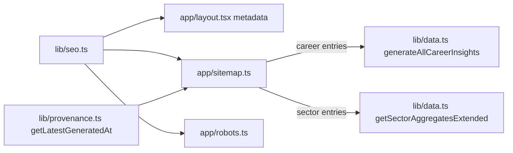
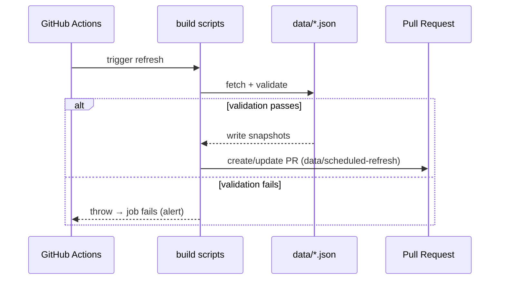

# Platform

**Status:** Active · **Owner:** Trinity (Lead)
**Last updated:** 2026-07-11

---

## Purpose

Provide the full-stack foundation for FutureGrid: static-export build, GitHub Pages deployment, root provider tree, metadata/SEO, analytics integration, CI/quality gates, error boundaries, and shared configuration surfaces.

**Non-goals:** Application-level feature logic; i18n message content; data sourcing pipelines.

---

## Boundaries

| In scope | Out of scope |
|---|---|
| Next.js config, output mode, basePath | Data fetching scripts |
| Root layout, provider composition | Page-level UI components |
| GA integration, analytics consent | A/B testing or ad networks |
| CI workflows, deploy workflow | Data refresh scheduling |
| `robots.ts`, `sitemap.ts` | SEO content copy |
| Error boundaries (`error.tsx`, `global-error.tsx`) | Route-level error handling |

---

## Architecture

FutureGrid is a **Next.js 16 static export** (`output: "export"`). All pages are pre-rendered to HTML at build time and served as static files — there is no Node.js server at runtime.

### Root Provider Tree

```
<html lang="en" suppressHydrationWarning>
  <body>
    <ThemeProvider>           ← next-themes; dark default, system detection
      <LanguageProvider>      ← custom client context; en/zh; localStorage-backed
        <GoogleAnalytics />   ← conditional on NEXT_PUBLIC_GA_ID; afterInteractive
        <a#skip-link />       ← sr-only keyboard skip to #main
        <GridBackground />    ← decorative canvas grid (aria-hidden)
        <Sidebar />           ← fixed nav; ml-60 on lg+
        <main id="main">      ← landmark; children render here
          {children}
          <footer />
        </main>
      </LanguageProvider>
    </ThemeProvider>
  </body>
</html>
```

### Islands / Client Components

Because output is `"export"`, every interactive component must be a Client Component (`"use client"`). Server Components handle build-time data loading (e.g. `app/page.tsx` calls `generateAllCareerInsights()` synchronously from JSON). Client components hydrate on the browser.

```mermaid
flowchart TD
    subgraph Build["Build time (Node.js)"]
        SC[Server Component<br/>page.tsx / layout.tsx]
        DATA[JSON data files<br/>data/*.json]
        SC -->|imports| DATA
    end
    subgraph Browser["Runtime (browser)"]
        HTML[Hydrated HTML]
        CC["Client Component<br/>(\"use client\")"]
        THEME[ThemeProvider]
        LANG[LanguageProvider]
        GA[GoogleAnalytics]
    end
    Build -->|next build → out/| HTML
    HTML --> CC
    HTML --> THEME
    HTML --> LANG
    HTML --> GA
```

---

## Configuration

### `next.config.ts`

| Variable | Purpose |
|---|---|
| `GITHUB_PAGES=true` | Enables GitHub Pages mode |
| `GITHUB_PAGES_BASE_PATH` | Sets `basePath` and `NEXT_PUBLIC_BASE_PATH` (e.g. `/FutureGrid`) |

```ts
output: "export"          // static HTML/CSS/JS only
basePath: <from env>      // sub-path for GitHub Pages deployments
trailingSlash: true       // GitHub Pages needs .html URLs to resolve
NEXT_PUBLIC_BASE_PATH     // exposed client-side for asset URL construction
```

Without `GITHUB_PAGES=true`, `basePath` is `undefined` and `trailingSlash` is `false` — suitable for custom domain deployments.

### `lib/seo.ts`

```ts
BASE_URL  = "https://futuregrid.genisisiq.com"   // canonical origin
BASE_PATH = process.env.NEXT_PUBLIC_BASE_PATH    // "" on custom domain
SITE_URL  = BASE_URL + BASE_PATH                 // absolute root for sitemap
```

### Root `metadata` (`app/layout.tsx`)

Exports a `Metadata` object with:
- `metadataBase`: canonical origin from `BASE_URL`
- `title.template`: `"%s · FutureGrid"` for page titles
- OpenGraph + Twitter `summary_large_image` card
- OG image: `{BASE_PATH}/og.png` (1200×630, built by `scripts/build-og-image.mjs`)

---

## SEO Pipeline



- `sitemap.ts`: exports static routes + dynamic career/sector entries; `lastModified` from provenance registry.
- `robots.ts`: `Allow: /`; points to `{SITE_URL}/sitemap.xml`.
- Both set `export const dynamic = "force-static"`.

---

## Analytics & Consent

`GoogleAnalytics` (`components/analytics/GoogleAnalytics.tsx`):

- **Loads only** when `NEXT_PUBLIC_GA_ID` is set at build time.
- Scripts use `strategy="afterInteractive"` — load after hydration, not blocking.
- SPA page-view tracking fires on `pathname` + `searchParams` changes via `useEffect`, **skipping the initial render** (GA fires the `config` call at script load for the first page).
- **Consent gap:** there is currently no cookie-consent gate. GA fires unconditionally when the env var is present. If a consent mechanism is added, it must wrap the `gtag('config', …)` call and the `<Script>` elements.

---

## CI / Deploy / Refresh Workflows

### CI (`.github/workflows/ci.yml`)

Triggers: `push` and `pull_request` to `main`.

```
npm run lint → npm run test:run → npm run build → npm run check:bundle → npm run check:a11y → npm run smoke
```

Quality gates run in order; any failure blocks merge.

### Deploy (`.github/workflows/deploy-pages.yml`)

Triggers: `push` to `main`, `workflow_dispatch`.

```
checkout → setup-node@v6 (node-version: 22) → configure-pages → npm ci
  → npm run build [GITHUB_PAGES=true]
  → touch out/.nojekyll
  → upload-pages-artifact
  → deploy-pages
```

The `prebuild` hook runs `npm run build:downloads` before `next build`, ensuring the downloads manifest is fresh.

### Data Refresh (`.github/workflows/refresh-data.yml`)

Triggers: weekly Monday 06:00 UTC, `workflow_dispatch`.

```
npm run build:warn → build:state-labor → build:state-qcew → build:jolts
  → build:data → build:snapshot-slim → build:warn-public → build:provenance
  → create-pull-request (branch: data/scheduled-refresh)
```

Sanity gates are embedded in each build script; a bad upstream fetch throws and fails the job (the failure is the alert).



---

## Runtime / Build / Deploy Lifecycle

| Phase | What happens |
|---|---|
| `prebuild` | `build:downloads` — assembles public downloads manifest |
| `next build` | RSC pass: Server Components import JSON data; Client Components compiled |
| `out/` | Static HTML per route, `_next/` assets, `sitemap.xml`, `robots.txt` |
| `out/.nojekyll` | Disables Jekyll so `_next/` directories are served by GitHub Pages |
| Deploy | `actions/deploy-pages@v5` uploads artifact to Pages CDN |

---

## Error Boundaries

### `app/error.tsx` (route-level)

- `"use client"` with access to `LanguageProvider` via `useT("error")`.
- Shows localized heading, body, optional `error.digest` for support.
- Retry: prefers `unstable_retry` (Next 16 streaming retry), falls back to `reset`.

### `app/global-error.tsx` (root-level)

- `"use client"` — **renders outside the root layout**, owns `<html><body>`.
- Cannot import `globals.css` or use `LanguageProvider`; reads locale from `localStorage` / `document.documentElement.lang` directly.
- Inline styles only; bilingual inline dictionary (en/zh).
- Renders brand-gradient FG mark + retry button + go-home link.

---

## Security / Privacy

- No server-side secrets at runtime (static export).
- `NEXT_PUBLIC_GA_ID` is embedded in the static bundle; do not set if analytics consent is not in place.
- `GOOGLE_SHEETS_API_KEY` is used only by the data-refresh CI job — never committed.
- All external data links open with `rel="noopener noreferrer"`.

---

## Accessibility

- Skip-to-main link: `<a href="#main">` with `.sr-only` / `.focus:not-sr-only` pattern; `focus-visible` outline in violet.
- `<main id="main">` landmark; `<footer aria-label="Site credit">`.
- `suppressHydrationWarning` on `<html>` prevents theme-class hydration mismatch noise.
- `ThemeProvider` uses `disableTransitionOnChange` to avoid FOUC on theme switch.

---

## Performance

- `output: "export"` — zero Node.js cold-start; fully static CDN-served.
- Geist fonts loaded via `next/font/google` with `subsets: ["latin"]` — optimized subset download, no FOUT.
- Google Analytics: `afterInteractive` strategy; does not block FCP.
- `GridBackground`: decorative canvas element, `aria-hidden`, renders outside the main content flow.
- Bundle-size budget enforced by `check:bundle` in CI (`scripts/check-bundle-size.mjs`).

---

## Failure Handling

| Failure | Behaviour |
|---|---|
| Route render throws | `app/error.tsx` shows localized retry UI |
| Root layout throws | `app/global-error.tsx` renders inline-only recovery page |
| Missing `NEXT_PUBLIC_GA_ID` | `GoogleAnalytics` returns `null`; no error |
| Data refresh bad upstream | Build script throws; CI job fails; PR not opened |
| GitHub Pages `_next/` missing | `.nojekyll` prevents Jekyll from stripping `_next/` dirs |

---

## Tests / Quality Gates

| Gate | Command | What it checks |
|---|---|---|
| Lint | `npm run lint` | ESLint with `eslint-config-next` |
| Type check | `npm run typecheck` | `tsc --noEmit` |
| Unit tests | `npm run test:run` | Vitest; `tests/` directory |
| Bundle budget | `npm run check:bundle` | `scripts/check-bundle-size.mjs` |
| Accessibility | `npm run check:a11y` | axe-core (`scripts/a11y-test.mjs`) |
| Smoke test | `npm run smoke` | Headless Chrome against `out/` |

---

## Extension Points

- **Adding a new env var:** add to `.env.example`; if client-side, prefix `NEXT_PUBLIC_`; document in this file.
- **Adding a new page route:** create `app/{route}/page.tsx`; add to `sitemap.ts`; add i18n namespace if needed.
- **Changing base deployment URL:** update `lib/seo.ts` `BASE_URL`.
- **Adding a second analytics provider:** add to `app/layout.tsx` alongside `GoogleAnalytics`; wrap in consent gate.

---

## Key File References

| File | Role |
|---|---|
| `next.config.ts` | Build output, basePath, env vars |
| `app/layout.tsx` | Root layout, provider tree, root metadata |
| `lib/seo.ts` | Canonical URL constants |
| `app/sitemap.ts` | XML sitemap generator |
| `app/robots.ts` | robots.txt generator |
| `app/error.tsx` | Route error boundary |
| `app/global-error.tsx` | Root error boundary |
| `components/analytics/GoogleAnalytics.tsx` | GA4 integration |
| `components/theme/ThemeProvider.tsx` | next-themes wrapper |
| `components/ui/GridBackground.tsx` | Decorative canvas grid |
| `.github/workflows/ci.yml` | CI pipeline |
| `.github/workflows/deploy-pages.yml` | GitHub Pages deploy |
| `.github/workflows/refresh-data.yml` | Weekly data refresh |
| `scripts/build-og-image.mjs` | OG image generation |
| `scripts/check-bundle-size.mjs` | Bundle budget gate |
| `scripts/a11y-test.mjs` | axe accessibility gate |
| `scripts/smoke-test.mjs` | Smoke test runner |
