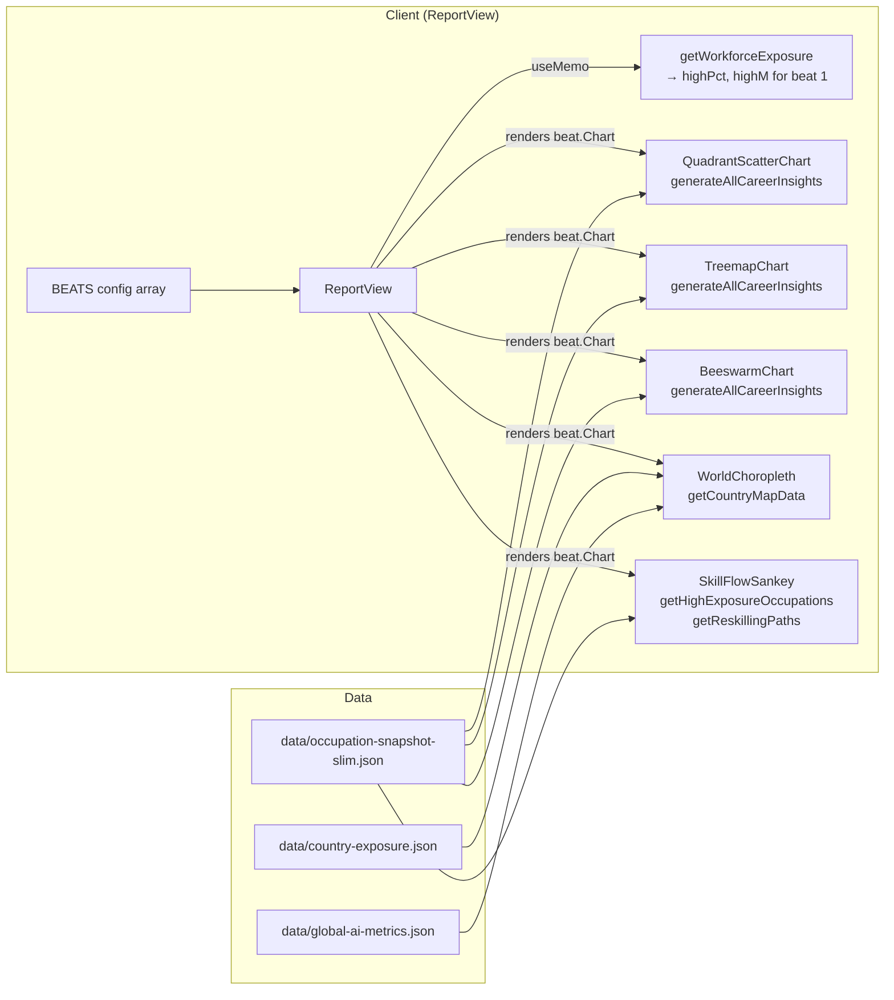
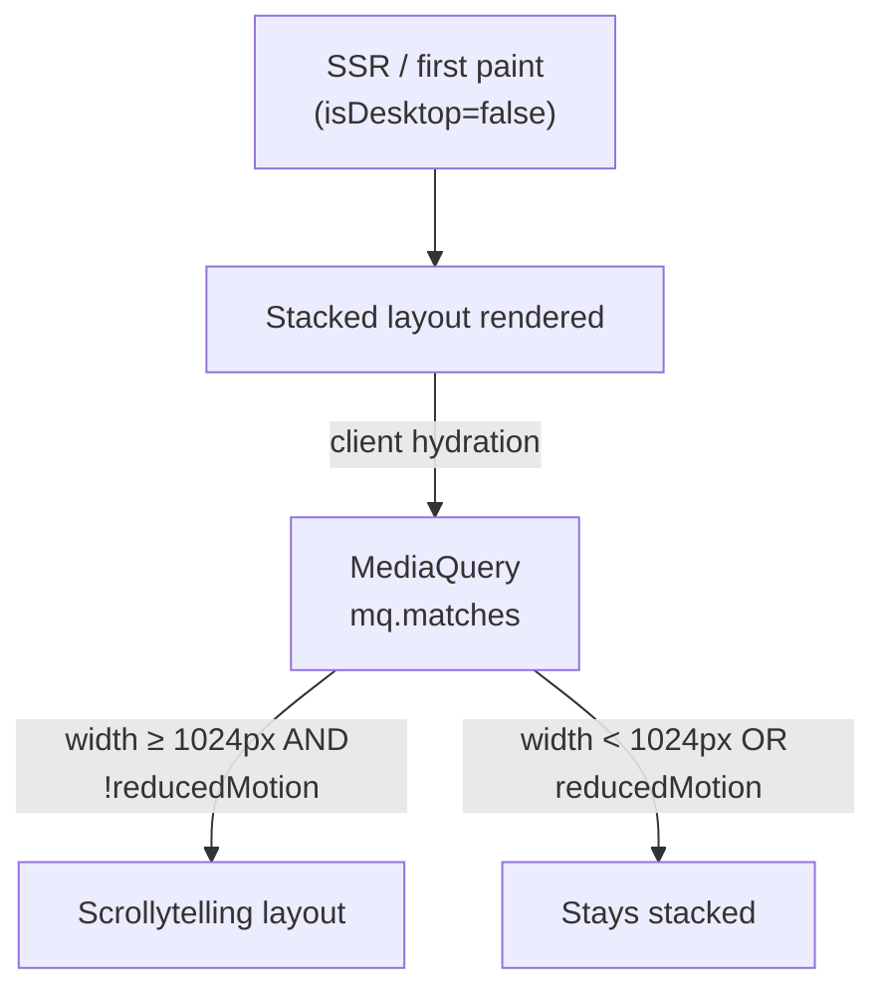

# Report (The Future of Work)

**Status:** Live — origin/main
**Owner:** Neo (Frontend Dev)
**Route:** `/report`

---

## Purpose

The Report is a scrollytelling narrative that guides the reader through five sequential "story beats" — each pairing a chart with a prose explanation. It presents the same underlying occupation-exposure data as the [dashboard](./dashboard.md) and [careers](./careers.md) pages, but in a driven narrative format designed for reading start-to-finish rather than exploration.

Story beats (in order):

| Beat | Title | Chart |
|---|---|---|
| 1 | Headline Exposure | `QuadrantScatterChart` — occupation by exposure × salary |
| 2 | Where the Jobs Are | `TreemapChart` — sector employment × avg exposure |
| 3 | The Exposure Swarm | `BeeswarmChart` — one circle per occupation, exposure × employment size |
| 4 | The Global Picture | `WorldChoropleth` — country choropleth of weighted AI exposure |
| 5 | The Path Forward | `SkillFlowSankey` — reskilling pathways from high-exposure origins |

**Non-goals:** The report does not allow filtering, comparison, or user-driven data queries. It is a read-only, opinionated narrative walkthrough. Deep-dive interactivity is in the [analysis](./analysis.md) and [careers](./careers.md) pages.

---

## Route / Component Boundary

```
app/report/layout.tsx          ← Static SEO metadata (RSC shell)
app/report/page.tsx            ← Thin RSC; renders <ReportView />
  └─ components/report/ReportView.tsx   ← "use client" (entire report)
       ├─ components/charts/QuadrantScatterChart.tsx
       ├─ components/charts/TreemapChart.tsx
       ├─ components/charts/BeeswarmChartStandalone (local wrapper)
       │    └─ components/charts/BeeswarmChart.tsx
       ├─ components/charts/WorldChoropleth.tsx
       └─ components/charts/SkillFlowSankey.tsx
```

`app/report/page.tsx` is a trivially thin RSC — it only renders `<ReportView />` with no props. All data and state live inside `ReportView`.

---

## Architecture & Server/Client Split

| Layer | Runs where | Responsibility |
|---|---|---|
| `app/report/layout.tsx` | Server | SEO metadata (title, description, OG, Twitter, i18n locales) |
| `app/report/page.tsx` | Server | Renders `<ReportView />` (no props) |
| `ReportView` | Client (`"use client"`) | Layout mode detection, IntersectionObserver, beat state, chart rendering |
| Chart components | Client | D3 / Chart.js visualisations; no further data fetching |

**Note:** All chart components in `ReportView` call their own data helpers (`generateAllCareerInsights`, `getWorkforceExposure`, `getReskillingPaths`, etc.) directly from the client. These helpers import from `data/*.json` files, which are bundled into the client chunk. The `occupation-snapshot-slim.json` is therefore in the browser bundle for this page.

---

## Data Flow



---

## Primary Types / Contracts

### Beat config (internal to `ReportView`)

```ts
interface Beat {
  id: string;
  titleKey: string;      // i18n key in "report" namespace
  subheadKey: string;
  bodyKey: string;
  Chart: React.ComponentType;  // no props; fetches own data
}

const BEATS: Beat[] = [
  { id: "exposure",    Chart: QuadrantScatterChart },
  { id: "sectors",     Chart: TreemapChart },
  { id: "swarm",       Chart: BeeswarmChartStandalone },
  { id: "global",      Chart: WorldChoropleth },
  { id: "pathforward", Chart: SkillFlowSankey },
];
```

### `BeeswarmChartStandalone` (local wrapper in `ReportView`)

A module-local wrapper that calls `generateAllCareerInsights()` inside `useMemo` and passes the result to `<BeeswarmChart data={data} />`. This allows `BeeswarmChart` to have a required `data` prop while the `Beat.Chart` contract requires zero props.

### Beat 1 stat injection

`beatBody(beat, index)` interpolates `highPct` and `highM` into the `beat1Body` key only (index 0). Other beats receive `t(beat.bodyKey)` without interpolation.

---

## Algorithms / Derived Metrics

All numeric values rendered in beat text are derived from `getWorkforceExposure()`:

| Value | Derivation |
|---|---|
| `highPct` | `(exposure.highExposureShare × 100).toFixed(1)` |
| `highM` | `(exposure.highExposureWorkforce / 1_000_000).toFixed(1)` |

These are the only computed values injected into prose. All chart computation is internal to each chart component.

> **Descriptive only.** `highPct` and `highM` reflect the static occupation-snapshot data at build time.

---

## Layout Modes: Scrollytelling vs. Stacked

`ReportView` detects two conditions on the client to choose a layout mode:

| Condition | Layout |
|---|---|
| `reducedMotion === true` OR `isDesktop === false` (< 1024 px) | **Stacked layout** — all 5 beats rendered vertically, each chart in its own visible box |
| `reducedMotion === false` AND `isDesktop === true` | **Scrollytelling layout** — 2-column: left sticky chart stage (55% width), right scrolling narrative (45%) |

Both modes are determined after client mount (using `MediaQueryList`) via `useEffect`. On SSR and first paint, `isDesktop === false` → stacked layout. Once the client hydrates and `isDesktop` resolves to `true`, the layout switches to scrollytelling on desktop. This prevents charts from being mounted in a `display:none` container (which causes D3/Sankey zero-width crashes).



---

## Scrollytelling Mechanics

In scrollytelling mode:

1. **IntersectionObserver** watches each `<section>` step ref with `rootMargin: "-30% 0px -30% 0px"` — triggers when a step enters the middle third of the viewport.
2. When a step intersects, `setActiveIndex(i)` updates the active beat.
3. The left sticky panel renders `BEATS.map(…)` with opacity-transition: active chart → `opacity-100`; others → `opacity-0 absolute pointer-events-none`.
4. To avoid remount flash, charts at `|i − activeIndex| ≤ 1` (current + adjacent) are rendered; distant beats are unmounted.
5. The right column narrative dims non-active beats to `opacity-40` with `hover:opacity-70`.
6. Step pill navigation (5 dot buttons above the chart panel) calls `scrollToStep(i)` which uses `scrollIntoView({ behavior: "smooth", block: "center" })`.

---

## State & Interaction Model

| State | Type | Initial | Updates on |
|---|---|---|---|
| `reducedMotion` | `boolean` | `false` | `MediaQueryListEvent` for `prefers-reduced-motion` |
| `isDesktop` | `boolean` | `false` | `MediaQueryListEvent` for `(min-width: 1024px)` |
| `activeIndex` | `number` | `0` | IntersectionObserver (scroll); step pill button click |

No URL state, no user-configurable filters.

---

## i18n

All strings go through `useT("report")`:

| Namespace | Files |
|---|---|
| `report` | `lib/i18n/messages/en/report.ts`, `lib/i18n/messages/zh/report.ts` |

Notable keys: `pageTitle`, `pageSubhead`, `beat1Title` … `beat5Title`, `beat1Body` … `beat5Body` (with `{highPct}` / `{highM}` interpolation in beat1), `stepOf`, `scrollPrompt`, `jumpToStep`, `reducedMotionNote`, `chartAriaLabel`, `stepAriaLabel`.

The `app/report/layout.tsx` metadata includes `openGraph.alternateLocale: ["zh_CN"]`.

---

## Accessibility

- **`prefers-reduced-motion`:** When `reducedMotion === true`, IntersectionObserver is not attached and `isDesktop` scroll-switch does not activate. All 5 beats render as a vertical stack; a note (`t("reducedMotionNote")`) informs the user.
- **Sticky chart panel:** `aria-live="polite" aria-atomic="true"` — screen readers announce when the active chart changes.
- **Step pills:** Each pill is a `<button>` with `aria-current="step"` when active and `aria-label={t("jumpToStep", { n })}`.
- **Beat sections:** Each `<section>` has `aria-label={t("stepAriaLabel", { n, title })}`.
- **Hidden charts in scrollytelling mode:** `aria-hidden={i !== activeIndex}` on each beat region — screen readers skip inactive chart panels.
- **D3 / SVG charts:** `QuadrantScatterChart`, `BeeswarmChart`, `SkillFlowSankey`, `WorldChoropleth` each use `<svg>` with appropriate `aria-label` attributes and keyboard-navigable tooltips where applicable.
- Stacked layout ensures every chart is in a visible, measurable container — avoids D3 zero-width crashes and ensures all content is visible to users who disable JS or navigate without scroll.

---

## Performance / Bundle Strategy

- `ReportView` imports five chart components statically; they are all included in the same client chunk. There are no dynamic imports on this page.
- Each chart calls `generateAllCareerInsights()` or `getCountryMapData()` which are module-level cached singletons — the data is computed once per page load even if multiple charts call the same helper.
- D3 (full library) is imported by `QuadrantScatterChart`, `BeeswarmChart`, `SkillFlowSankey`, `WorldChoropleth` — this adds significant client weight. D3 is already in the shared chunk due to other pages; no incremental cost specifically from the report page.
- `d3-sankey` is imported only in `SkillFlowSankey`; it is not in the shared chunk.
- In scrollytelling mode, only the active chart + one adjacent chart are mounted — reduces unnecessary D3 layout work for off-screen charts.
- SSR output of the stacked layout means all content is available without JavaScript (progressive enhancement for non-JS environments).

---

## Error / Empty / Loading Behaviour

| Scenario | Behaviour |
|---|---|
| D3 chart renders in zero-width container | Prevented by the `isDesktop` guard — stacked layout used on first paint |
| `getWorkforceExposure()` returns zero employment | `highPct` renders as "0.0%", `highM` as "0.0" — no crash |
| Chart data helper throws | Unhandled; would propagate to the `app/error.tsx` boundary |
| `SkillFlowSankey` has no reskilling paths | Renders empty Sankey (no links); chart component handles this gracefully with empty-state text |
| Reduced-motion user | Stacked layout with `reducedMotionNote` shown; full content visible without scrolling |
| Mobile user | Stacked layout (< 1024 px breakpoint) with full content visible |

No loading skeleton — first paint renders the stacked layout immediately.

---

## Security / Privacy

- No PII collected or rendered.
- No external data fetched at runtime; all chart data from bundled JSON files.
- `WorldChoropleth` renders `data/world-countries.geo.json` — a static GeoJSON file; no external map tile requests.

---

## Testing / Quality Gates

- `npm run build` validates TypeScript and produces a static HTML pre-render of `/report`.
- The `BeeswarmChartStandalone` wrapper ensures the `Beat.Chart` zero-props contract is satisfied at compile time.
- Manual testing: reduced-motion simulation, mobile viewport, keyboard navigation of step pills.
- Vitest: `lib/data.ts` helpers called by chart components are tested; chart rendering is not unit-tested.

---

## Extension Points

- **New beat:** Add a new entry to the `BEATS` array with a `Chart` component and corresponding i18n keys; the layout and IntersectionObserver wiring handle the rest automatically.
- **Pass server-resolved props to charts:** Move data resolution from chart-internal `useMemo` calls to `app/report/page.tsx` RSC and pass as props to `ReportView`, reducing client bundle size.
- **Lazy-load distant beats:** Replace `Math.abs(i - activeIndex) <= 1` with a dynamic import strategy to defer chart code for beats not yet in view.
- **URL-anchored beats:** Sync `activeIndex` with a hash parameter to allow deep-linking to a specific beat.

---

## Key File References

| File | Purpose |
|---|---|
| `app/report/page.tsx` | Thin RSC entry |
| `app/report/layout.tsx` | SEO metadata, OG, alternate locales |
| `components/report/ReportView.tsx` | Full scrollytelling orchestrator |
| `components/charts/QuadrantScatterChart.tsx` | Beat 1 — exposure × salary scatter |
| `components/charts/TreemapChart.tsx` | Beat 2 — sector treemap |
| `components/charts/BeeswarmChart.tsx` | Beat 3 — occupation beeswarm |
| `components/charts/WorldChoropleth.tsx` | Beat 4 — country choropleth |
| `components/charts/SkillFlowSankey.tsx` | Beat 5 — reskilling Sankey |
| `lib/data.ts` | `generateAllCareerInsights`, `getWorkforceExposure`, `getHighExposureOccupations`, `getReskillingPaths` |
| `lib/i18n/messages/en/report.ts` | English narrative strings |
| `lib/i18n/messages/zh/report.ts` | Chinese narrative strings |
| `data/occupation-snapshot-slim.json` | Occupation data (bundled client-side) |
| `data/country-exposure.json` | Country AI exposure for choropleth |
| `data/world-countries.geo.json` | GeoJSON for choropleth basemap |

---

**Cross-links:** See [dashboard.md](./dashboard.md) for the headline KPI view, [careers.md](./careers.md) for per-occupation deep-dives, [analysis.md](./analysis.md) for multi-methodology evidence comparison.
