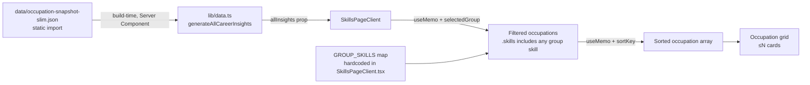
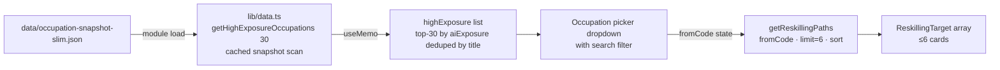
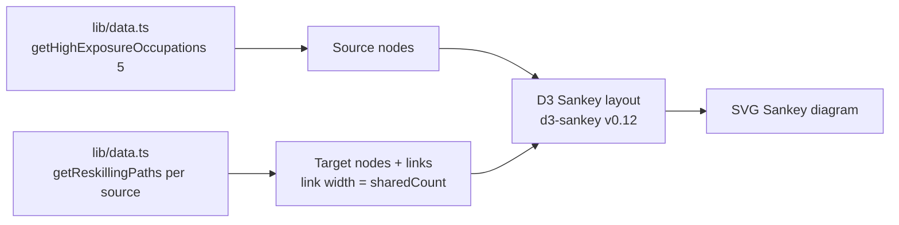

# Skills

**Status:** Live — origin/main
**Last audited:** 2026-07-18
**Owner:** Switch (Designer)
**Routes:** `/skills` (single page, no sub-routes)

---

## Purpose

The Skills section lets users explore which skill groups are associated with high- vs. low-AI-exposure occupations and find realistic reskilling pathways from high-exposure starting roles to lower-exposure alternatives. It has three functional areas on one page:

1. **Skill-group browser** — five curated skill groups (Technical, Cognitive, Interpersonal, Administrative, Management), each mapped to specific O*NET skill names; shows occupations that carry those skills, sortable by AI exposure, salary, or projected openings.
2. **Visualisation** — `SkillFlowSankey` (flow diagram from high-exposure roles to resilient career destinations via shared skills).
3. **Reskilling Pathways Explorer (`ReskillExplorer`)** — interactive picker of a high-exposure "source" occupation; returns up to 6 target occupations scored on transferable skills, safety gain, pay delta, and retraining effort.

All data is purely **descriptive**: the skill overlap and transition scores reflect static O*NET skill profiles and measured AI-exposure figures. They are not labour-market forecasts or career counselling.

### Non-goals

- No personalisation or saved state.
- No server-side data fetching at request time.
- No course-or-training-provider integration; the reskilling bridge shows skill *gaps* but does not link to learning resources.
- No skill-proficiency levels; skills are modelled as binary presence/absence (occupation has skill or not).
- No cross-occupation skill comparison beyond the occupation selected in ReskillExplorer.

---

## Boundaries

```
app/skills/layout.tsx               ← RSC shell — static SEO metadata only
app/skills/page.tsx                 ← Server Component — calls getReskillingBridgeData()
                                       and generateAllCareerInsights(); passes both
                                       (bridgeData + allInsights) to SkillsPageClient

components/skills/SkillsPageClient.tsx  ← "use client" — group browser, sort state,
                                           occupation filtering, grid rendering, mounts charts
components/skills/ReskillExplorer.tsx   ← "use client" — Reskilling Pathways Explorer sub-component
components/skills/ReskillingBridge.tsx  ← "use client" — Reskilling Bridge; receives
                                           ReskillingBridgeData prop from the server page
components/charts/SkillFlowSankey.tsx       ← "use client" — D3 Sankey diagram
```

`app/skills/page.tsx` is a Server Component. It calls `getReskillingBridgeData()` (server-only) and `generateAllCareerInsights()`, then passes both results (`bridgeData` + `allInsights`) to `SkillsPageClient`, which mounts `ReskillingBridge`, `ReskillExplorer`, and the `SkillFlowSankey` chart. No server-heavy imports are allowed in `SkillsPageClient` or its children.

---

## Architecture

### Server / client split

| File | Runs where | Responsibility |
|---|---|---|
| `app/skills/layout.tsx` | Build-time RSC | Static `<Metadata>` (title, OG, Twitter) |
| `app/skills/page.tsx` | Build-time RSC | Calls `getReskillingBridgeData()` (server-only) and `generateAllCareerInsights()`; passes `bridgeData` (`ReskillingBridgeData`) + `allInsights` (`CareerInsight[]`) props to `SkillsPageClient` |
| `components/skills/SkillsPageClient.tsx` | Browser only | Receives `bridgeData` + `allInsights` props; owns the group state, sort state, occupation filtering, grid rendering; hosts the `GROUPS` / `GROUP_SKILLS` taxonomy; mounts charts and `ReskillingBridge` / `ReskillExplorer` |
| `components/skills/ReskillExplorer.tsx` | Browser only | Occupation picker, path computation via `getReskillingPaths`, transition cards |
| `components/skills/ReskillingBridge.tsx` | Browser only | Origin list (scored bottleneck roles), destination cards with shared-skill chips, sort controls, H-1B filing caveat, projected-openings caveat |
| `SkillFlowSankey` | Browser only | D3 Sankey flow diagram |

No route uses `generateStaticParams`; `/skills` is a single statically-exported page with no dynamic segments.

### Data flow — skill-group browser



### Data flow — ReskillExplorer



### Data flow — ReskillingBridge

`lib/reskilling-bridge.ts` is a **server-only** module. The Server Component resolves it once at build time and passes the value as a prop.

```mermaid
flowchart LR
    H1B[lib/h1b.ts\nH-1B pressure scores] -->|server-only| RB[lib/reskilling-bridge.ts\ngetReskillingBridgeData]
    PROJ[lib/employment-projections.ts\ngetEmploymentProjectionBySoc] --> RB
    DATA[lib/data.ts\ngetReskillingPaths] --> RB
    RB -->|ReskillingBridgeData prop| SC[app/skills/page.tsx\nServer Component]
    SC -->|prop| CL[components/skills/SkillsPageClient.tsx\n"use client"]
    CL -->|data prop| BR[components/skills/ReskillingBridge.tsx\n"use client"]
    BR --> O[Origin list\nhigh-bottleneck roles ranked by score]
    BR --> D[Destination cards\nshared skills · exposure drop · salary delta · openings]
```

### Data flow — SkillFlowSankey



### Skill-group taxonomy (hardcoded in `SkillsPageClient.tsx`)

```ts
const GROUPS = ["Technical", "Cognitive", "Interpersonal", "Administrative", "Management"];

const GROUP_SKILLS: Record<string, string[]> = {
  Technical:      ["Programming", "Systems Analysis", "Complex Problem Solving",
                   "Mathematics", "Quality Control"],
  Cognitive:      ["Critical Thinking", "Active Learning", "Judgment and Decision Making",
                   "Creativity", "Monitoring"],
  Interpersonal:  ["Active Listening", "Speaking", "Persuasion",
                   "Service Orientation", "Social Perceptiveness"],
  Administrative: ["Reading Comprehension", "Writing", "Coordination",
                   "Time Management", "Management of Material Resources"],
  Management:     ["Management of Personnel", "Negotiation", "Instructing",
                   "Learning Strategies", "Systems Evaluation"],
};
```

These labels match O*NET skill names verbatim as stored in the snapshot's `skills` array. An occupation qualifies for a group if any of its skills overlap with the group's list.

### Reskilling path algorithm (`getReskillingPaths`, lib/data.ts)

```
Input: fromCode (SOC), limit (default 6), sort (default "score")

1. Resolve source row from snapshot.
2. Collect target candidates: rows where
     automationRisk ∈ {"Low", "Medium"}
     AND aiExposure < source.aiExposure
     AND sharedSkills.length >= 1
     AND title not duplicate of already-seen candidate titles.

3. For each candidate compute:
   sharedSkills   = target.skills ∩ source.skills
   missingSkills  = target.skills \ source.skills
   overlapScore   = sharedSkills.length / source.skills.length   (0–1)
   salaryDelta    = target.medianSalary − source.medianSalary    (USD)
   exposureDropPts= (source.aiExposure − target.aiExposure) × 100  (pp)
   jobZoneDelta   = target.jobZone − source.jobZone               (O*NET 1–5)
   growthRate     = target.histGrowthRate ?? target.growthRate

4. transitionScore = round(
     0.35 × clamp01(overlapScore)
   + 0.25 × clamp01(exposureDropFrac)       // (source−target)/source
   + 0.15 × clamp01(0.5 + salaryDeltaFrac)  // capped at ±50%
   + 0.15 × health                          // 0.6×(Bright?1:0.5) + 0.4×growthBonus
   + 0.10 × ease                            // 1 − clamp01(max(0,jobZoneDelta)/4)
   × 100)

5. Sort by chosen ReskillSort key; return first `limit` entries.
```

**Sort modes (`ReskillSort`):**

| Key | Primary sort | Tie-break |
|---|---|---|
| `score` | `transitionScore` desc | `overlapScore` desc |
| `overlap` | `sharedCount` desc | `medianSalary` desc |
| `pay` | `salaryDelta` desc | — |
| `safety` | `exposureDropPts` desc | — |
| `growth` | `growthRate` desc (nulls last) | — |

---

## Contracts / Types / Config

### `ReskillingTarget` (lib/data.ts)

```ts
export interface ReskillingTarget {
  occupationCode:    string;
  occupationName:    string;
  sectorName:        string;
  automationRisk:    "Low" | "Medium" | "High" | "Very High";
  aiExposure:        number;          // 0–1
  medianSalary:      number;          // USD
  outlook:           "Bright" | "Average";
  sharedSkills:      string[];        // skills transferable from source
  sharedCount:       number;
  overlapScore:      number;          // sharedCount / source.skills.length (0–1)
  missingSkills:     string[];        // target skills not in source
  salaryDelta:       number;          // target − source (USD, can be negative)
  exposureDropPts:   number;          // percentage-point reduction in AI exposure
  jobZone:           number;          // 1–5 O*NET education/experience tier
  jobZoneDelta:      number;          // target − source (≤0 = less retraining needed)
  growthRate:        number | null;   // annualised % (histGrowthRate preferred)
  projectedOpenings: number | null;
  totalEmployment:   number | null;
  transitionScore:   number;          // 0–100 composite
}
```

### `ReskillSort` (lib/data.ts)

```ts
export type ReskillSort = "score" | "overlap" | "pay" | "safety" | "growth";
```

### High-exposure picker (`getHighExposureOccupations`)

```ts
getHighExposureOccupations(limit = 30):
  { occupationCode, occupationName, aiExposure, sectorName }[]
```

Returns up to `limit` records sorted by `aiExposure` desc with duplicate titles removed. Default starting occupation is the first of `["Data Entry", "Customer Service", "Telemarket"]` found in the list; falls back to `highExposure[0]`.

### Sort keys (SkillsPageClient.tsx)

```ts
type SkillSortKey = "risk-desc" | "risk-asc" | "salary" | "openings";
```

### i18n namespace

All user-visible strings via `useT("skills")`. See `lib/i18n/messages/en/skills.ts` and `lib/i18n/messages/zh/skills.ts` for the full key catalogue.

---

## Runtime / Build Lifecycle

| Phase | What happens |
|---|---|
| `npm run build:data` | `scripts/build-snapshot.mjs` writes `data/occupation-snapshot-slim.json`; `skills` array per occupation populated from O*NET crosswalk |
| `next build` | `app/skills/layout.tsx` emits static metadata; one HTML shell emitted to `out/skills/index.html` |
| Browser hydration | `page.tsx`, `ReskillExplorer`, charts all hydrate; `generateAllCareerInsights()` runs in the browser; module-level caches warm on first call |
| User interaction | Group tab or sort button clicks update React state; `useMemo` re-filters/re-sorts in memory; no network requests |

---

## Source Provenance / Caveats

| Field | Source | Vintage | Caveats |
|---|---|---|---|
| `skills[]` per occupation | O*NET crosswalk via snapshot build | 2024 | Binary presence only; no proficiency level. Skill names are O*NET "Skills" elements. See [occupation-data-model.md](./occupation-data-model.md). |
| `aiExposure` / `automationProbability` | Anthropic Economic Index | 2025 | Task-level exposure indicator — not a displacement forecast. |
| `jobZone` | O*NET | 2024 | Education/experience tier 1–5. Used as a retraining-effort proxy in `jobZoneDelta`. |
| `medianSalary` | BLS OEWS | 2024 | USD annual median. |
| `growthRate` / `histGrowthRate` | BLS OEWS history | 2022–2024 | Annualised; derived from 2-year employment history when BLS projections are unavailable. |
| `outlook` | O*NET Bright Outlook | 2024 | Binary; see O*NET methodology for definition of Bright Outlook. |

**Descriptive vs. predictive:** `transitionScore` is a composite heuristic that ranks transitions by how well skills overlap and how much AI exposure would decrease. It is an informational ranking tool, not a labour-market recommendation or guarantee of career success.

---

## Security / Privacy

- No user data is collected or stored; occupation selection in `ReskillExplorer` is ephemeral local React state.
- No API calls at runtime; all data is static JSON bundled at build time.
- The Sankey chart uses `useRouter().push()` to navigate to `/careers/[code]` on node click — standard Next.js client-side navigation, no external redirect.
- No PII is involved.

---

## Accessibility

- All skill-group tab buttons carry `aria-pressed={selectedGroup === group}`; sort buttons carry `aria-pressed={sortKey === key}`.
- `ReskillExplorer` picker button has `aria-haspopup="listbox"` and `aria-expanded`; the dropdown is a `role="listbox"` with `role="option"` + `aria-selected` per item.
- Dropdown closes on Escape key and on outside click.
- `ReskillExplorer` section has `aria-labelledby="reskill-heading"`.
- `SkillFlowSankey` SVG nodes have `<title>` text; the chart is keyboard-navigable via Tab to individual node/link groups.
- Occupation grid cards are `<Link>` elements with `focus:ring-2 focus:ring-violet-500`.
- The empty-state ("No occupations found") is plain text rendered in the DOM.
- The Sankey chart's `useRouter` navigation from SVG nodes satisfies WCAG 2.4.3 focus order by restoring focus to the document after navigation.

---

## Performance

- `generateAllCareerInsights()` is cached in module scope after first call; subsequent calls are O(1) array copy.
- `getHighExposureOccupations(30)` scans the snapshot once, dedupes by title, and returns 30 entries; result is not separately cached (called inside `useMemo` in `ReskillExplorer`).
- `getReskillingPaths` scans the full snapshot on every call (O(n)). With the default `limit=6`, this is fast enough for interactive use (~900 occupations), but it is not memoised at the library level. `ReskillExplorer` wraps it in `useMemo([fromCode, sort])` to avoid re-running on unrelated renders.
- `SkillFlowSankey` calls `getReskillingPaths` for each of the 5 source occupations (5 × O(n)); this is done in `useMemo` on mount.
- The slim snapshot JSON is ~350 KB before gzip and is bundled into the primary client chunk (shared with `/careers`, `/sectors`).

---

## Failure / Empty Behaviour

| Scenario | Behaviour |
|---|---|
| No occupations match selected skill group | Grid empty state: "No occupations found for this skill group." |
| `fromCode` resolves to an occupation with no valid targets | `ReskillExplorer` renders "No reskilling paths found for this occupation." |
| `fromCode` is empty string (snapshot is empty) | `targets` is `[]`; no cards rendered, no crash |
| `SkillFlowSankey` source occupations have 0 paths | Sankey renders with 0 links; SVG is empty but no exception |
| Snapshot JSON missing at build | `next build` fails on import; CI catches it |

---

## Tests / Quality Gates

| Test file | What it covers |
|---|---|
| `tests/reskilling-bridge.test.ts` | `getReskillingBridgeData`: deterministic origins/destinations; bottleneck scores desc; SOC join with `getReskillingPaths`; openings from `getEmploymentProjectionBySoc`; skills capped at display limit; immutability; methodology caveats cover H-1B, projected-openings, descriptive-only |
| `tests/skills-page-architecture.test.ts` | `lib/reskilling-bridge.ts` has `import "server-only"`; `SkillsPageClient` does not import server-heavy modules or raw JSON; `app/skills/page.tsx` is a Server Component |
| `tests/components/ReskillingBridge.test.tsx` | Renders origin list and destinations; selecting origin updates display; keyboard navigation; null `annualOpenings` handled; H-1B and projected-openings caveats surfaced; career links valid; accessible semantics; guards that the skills page no longer imports or renders `SkillTransitionChart` |
| `tests/components/ReskillExplorer.test.tsx` | 13 tests: heading render, default occupation, `aria-haspopup`/`aria-expanded`, dropdown open/close, search filter, empty search state, default paths rendered, shared-skill chips, occupation selection, Escape key, career-link `href` format |
| `tests/components/SkillFlowSankey.test.tsx` | Renders without crash, contains SVG |
| `tests/data.test.ts` | `getSearchIndex` contains items of type `"skill"` |

**Remaining gaps:**
- `getReskillingPaths` and `getHighExposureOccupations` have no direct unit tests; they are exercised only indirectly through `ReskillExplorer` render tests.
- The `transitionScore` formula is not unit-tested independently.
- `app/skills/page.tsx` skill-group filtering and sort interactions are not integration-tested.

---

## Extension Points

- **Add a new skill group:** Add a key to `GROUPS`, `GROUP_SKILLS`, and `GROUP_DESCRIPTIONS` in `SkillsPageClient.tsx`; add the label and description to both i18n catalogues.
- **Show skill-group match counts:** `GROUP_SKILLS[group]` is available; add a count badge to each tab.
- **Increase ReskillExplorer pool:** Change the `limit` argument to `getHighExposureOccupations` or `getReskillingPaths`; no other changes needed.
- **Expose all paths (no limit):** Add a "Show more" button that calls `getReskillingPaths(fromCode, Infinity, sort)`.
- **Persist selected occupation across navigation:** Move `fromCode` state to URL query params via `useSearchParams`.
- **Add proficiency-level data:** Requires a schema change to the snapshot's `skills` field from `string[]` to `{ name: string; level: number }[]`.
- **Further reduce the client payload:** `allInsights` is already resolved in the Server Component and passed to `SkillsPageClient` as a prop; the remaining lib helper calls inside `ReskillExplorer` / `SkillFlowSankey` (`getHighExposureOccupations`, `getReskillingPaths`) could likewise be lifted to the RSC boundary and passed down.

---

## Key References

| Resource | Location |
|---|---|
| Reskilling Bridge helper | [`lib/reskilling-bridge.ts`](../lib/reskilling-bridge.ts) — `getReskillingBridgeData` (server-only) |
| Reskilling path functions | [`lib/data.ts`](../lib/data.ts) — `getReskillingPaths`, `getHighExposureOccupations`, `computeTransitionScore` |
| ReskillingBridge component | [`components/skills/ReskillingBridge.tsx`](../components/skills/ReskillingBridge.tsx) |
| Occupation snapshot schema | [`docs/occupation-data-model.md`](./occupation-data-model.md) |
| Chart components | [`docs/visualization-system.md`](./visualization-system.md) |
| Data sources & provenance | [`docs/transparency.md`](./transparency.md) |
| i18n namespace | `lib/i18n/messages/en/skills.ts`, `lib/i18n/messages/zh/skills.ts` |
| ReskillExplorer component | `components/skills/ReskillExplorer.tsx` |
| Skills page client island | `components/skills/SkillsPageClient.tsx` — group/sort state, taxonomy, chart mounts |
| Sankey chart | `components/charts/SkillFlowSankey.tsx` |
| Careers detail (occupation rows) | [`docs/careers.md`](./careers.md) |
