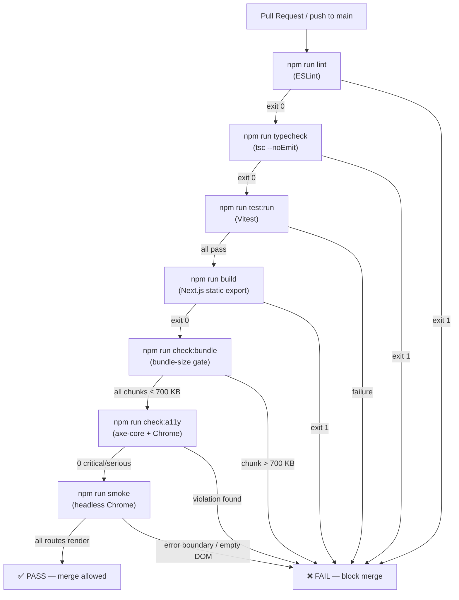

# FutureGrid — Testing Guide

**Status:** Living document
**Owner:** Mouse (Tester) — @huangyingting
**Last updated:** 2026-07-11
**Applies to:** `main` branch and all feature branches that target it

---

## 1. Purpose and Non-Goals

### Purpose
- Document every quality-gate that stands between a code change and `main`
- Give contributors a clear mental model of *what* each layer catches and *what it misses*
- Enable confident triage: when CI turns red, this guide tells you which layer failed and why

### Non-Goals
- This document does not define *which features* to build
- It does not replace inline code comments in test files
- It does not cover the data-build pipeline (`npm run build:data` and friends) — those are integration scripts, not part of the automated test suite

---

## 2. Test Architecture Overview

FutureGrid uses a **four-layer quality pyramid**:

```
             ┌──────────────────────────────┐
             │  Browser smoke test (Chrome) │  ← catches runtime D3/ResizeObserver crashes
             ├──────────────────────────────┤
             │  Bundle-size gate            │  ← catches accidental chunk bloat
             ├──────────────────────────────┤
             │  Accessibility audit (axe)   │  ← catches critical/serious WCAG violations
             ├──────────────────────────────┤
             │  Unit + component tests      │  ← Vitest/jsdom — data, logic, component mounts
             └──────────────────────────────┘
```

All four layers run in CI on every push/PR to `main` (see §9 CI Ordering).

> **Key lesson (Batch 7):** jsdom mocks `ResizeObserver` to a no-op, so D3 chart layout code (which executes inside `ResizeObserver` callbacks) never runs in Vitest. A chart that throws in a real browser can pass 100+ Vitest tests cleanly. The headless-Chrome smoke test exists specifically to catch this class of regression.

---

## 3. Quality-Gate Flow



---

## 4. Vitest Configuration and Environment

### Config file: `vitest.config.ts`

```ts
export default defineConfig({
  plugins: [react()],           // @vitejs/plugin-react — JSX transform
  resolve: {
    alias: { "@": path.resolve(__dirname, ".") },  // mirrors tsconfig paths
  },
  test: {
    environment: "node",        // default; jsdom overridden per-file (see below)
    setupFiles: ["tests/setup.ts"],
    globals: true,              // describe / it / expect without imports
  },
});
```

### Environment override
Tests that render React components declare a per-file override:

```ts
// @vitest-environment jsdom
```

Place this comment on **line 1** of any `.test.tsx` file or any `.test.ts` file that touches the DOM. Pure data/logic tests run in `node` (faster, no DOM overhead).

### Path alias
`@/` resolves to the repo root. Example: `import RiskGauge from "@/components/ui/RiskGauge"`.
This matches the `paths` entry in `tsconfig.json`.

### Setup file: `tests/setup.ts`
Runs before every test. Provides:

| Global stub | Why it exists |
|---|---|
| `IntersectionObserver` | Fires `isIntersecting: true` immediately so scroll-triggered animations (e.g. `RiskGauge`) activate |
| `ResizeObserver` | No-op stub — D3 charts that run layout inside this observer are **not** exercised by Vitest |
| `matchMedia` | Returns `matches: false` — reduced-motion and dark-mode checks get a stable default |
| `Element.prototype.scrollIntoView` | jsdom omits this; avoids crashes in components that call it |
| `@testing-library/jest-dom/vitest` | Extends `expect` with DOM matchers (`toBeInTheDocument`, `toHaveAttribute`, etc.) |

---

## 5. Unit Test Conventions

Unit tests live in `tests/*.test.ts` (no `.tsx`; no DOM).

### Naming
- File: `<module-name>.test.ts` — mirrors the source file name under `lib/`
- `describe` block: function name, e.g. `describe("generateAllCareerInsights", ...)`
- `it` string: plain English describing the specific invariant, e.g. `"returns 756 occupations"`

### What belongs here
- Pure function logic (`lib/analysis.ts`, `lib/utils.ts`, `lib/data.ts`, etc.)
- Data-contract invariants: field presence, range checks, enum membership
- Math helpers: `linearRegression`, `pearson`, `computeResiliencyScore`
- Search logic: `searchInsights`, `getSearchIndex`

### What does NOT belong here
- Anything that imports `next/navigation`, `next-themes`, or Chart.js — those go in component tests
- Rendering assertions — use component tests

---

## 6. Component Test Conventions

Component tests live in `tests/components/*.test.tsx`.

### Per-file header pattern
```ts
// @vitest-environment jsdom
import { describe, it, expect, vi } from "vitest";
import { render, screen } from "@testing-library/react";
```

### Mock placement
Declare `vi.mock(...)` calls **before** the subject import. Vitest hoists `vi.mock` automatically, but placing them early avoids confusing ordering issues.

```ts
vi.mock("next/navigation", () => ({
  useRouter: () => ({ push: vi.fn(), replace: vi.fn(), prefetch: vi.fn() }),
}));

vi.mock("next-themes", () => ({
  useTheme: () => ({ resolvedTheme: "dark" }),
}));

// ← import subject AFTER mocks
import MyComponent from "@/components/MyComponent";
```

### Standard mocks required by most component tests

| Module | Reason |
|---|---|
| `next/navigation` | `useRouter` crashes in jsdom without a Router provider |
| `next-themes` | `useTheme` returns `undefined` without `ThemeProvider` |
| Chart.js `<Bar>` / `<Line>` | Canvas API absent in jsdom; mock to `<canvas>` stub if needed |
| Heavy child components | Stub to `() => <div>stub</div>` to isolate the component under test |

### Interaction testing
Use `@testing-library/user-event` for keyboard/pointer interactions:

```ts
const user = userEvent.setup({ advanceTimers: vi.advanceTimersByTime });
// ...
await user.type(input, "software");
await user.keyboard("{Escape}");
```

When the component uses `setTimeout` internally, call `vi.useFakeTimers()` in `beforeEach` and `vi.useRealTimers()` in `afterEach`. Flush pending timers with `vi.runAllTimers()` inside `act(...)`.

---

## 7. Fixture Conventions

Raw parser fixtures live in `tests/fixtures/`.

```
tests/fixtures/
└── warn/          ← state-level WARN notice files in real parser formats
    ├── ga.csv     ← CSV adapter (Georgia)
    ├── in.html    ← HTML adapter (Indiana)
    ├── ky.csv
    ├── md.html
    ├── nc.csv
    ├── oh.csv
    ├── or.json
    ├── pa.html
    ├── tn.csv
    ├── va.csv
    └── wi.json
```

**Rules:**
- Fixtures are real samples from upstream sources, trimmed to the minimum required to exercise the parser
- Tests that use fixtures must work offline (no network calls)
- When a parser is updated, update or add a fixture in the same commit (test-discipline rule)
- Do not commit fixture files > ~50 KB; trim to 20–30 representative rows

---

## 8. Data-Builder and Architecture Assertions

### Data-builder pattern
Several tests assert invariants about the *generated* data files (committed JSON). The canonical example is `tests/data.test.ts`:

```ts
const insights = generateAllCareerInsights();
it("returns 756 occupations", () => {
  expect(insights).toHaveLength(756);
});
```

This is a **count assertion tied to disk reality**. Per the test-discipline rule:
> When adding occupations, features, or counted resources, update the test assertion array in the same commit.

### Architecture assertions
`tests/data-schema.test.ts` validates committed JSON files against their schema validators from `scripts/lib/validate.mjs`. Each `describe` block has:
1. A positive case — the committed file **must** pass
2. At least one negative case — degenerate input **must** throw

`tests/source-coverage.test.ts` asserts that every dataset in `data/provenance.json` has a matching entry in `data/sources.json` or an explicit exemption. This enforces the "no invisible data" contract.

### Snapshot-stability assertions
`tests/snapshot.test.ts` asserts exact employment/wage histories for known SOC codes against `data/oews-history.json`. If the committed snapshot changes, these tests catch it immediately — prevent silent data regressions.

### Merged feature data-contract tests

Five test suites were added alongside the features they protect. Each follows the same data-contract pattern (universe size, determinism, bounds, immutability, methodology metadata):

| Test file | Lib module | What it covers |
|---|---|---|
| `tests/evidence-convergence.test.ts` | `lib/evidence.ts` — `getEvidenceConvergence()` | Item derivation from stack conclusions; id/title/status/confidence/href preserved; summary counts lifted unchanged; fresh copy per call |
| `tests/exposure-outcome.test.ts` | `lib/exposure-outcome.ts` | All SOC entries present; gap = capability − usage; bounds over non-null values; correlation coefficients in [−1, 1]; immutability |
| `tests/international-occupation-mix.test.ts` | `lib/international-occupation-mix.ts` | Data-file integrity + schema; server-only guard; component wiring; EN/ZH i18n parity; provenance/sources registry entries |
| `tests/reskilling-bridge.test.ts` | `lib/reskilling-bridge.ts` | Deterministic origins/destinations; SOC join with `getReskillingPaths`; bottleneck/transition score ordering; openings from `getEmploymentProjectionBySoc`; skills capped at display limit; immutability; methodology caveats |
| `tests/wage-tier-polarization.test.ts` | `lib/wage-tier-polarization.ts` | 755 included / 1 excluded; tier count; band cells always present; share sums to 1; wage-ordered tiers; weighted and unweighted means finite; immutability |

### Architecture / module-boundary tests

Four architecture suites assert the server/client split and prevent server-only modules from leaking into client bundles. They pass source-text pattern matching against the files they guard, not import graph analysis, so they are fast and run in the `node` environment.

| Test file | What it gates |
|---|---|
| `tests/analysis-architecture.test.ts` | `lib/exposure-outcome.ts` carries `import "server-only"`; `InsightsView` does not runtime-import it; `ExposureOutcomeMatrix` has `"use client"` and receives data via props |
| `tests/sectors-i18n.test.ts` | EN and ZH `sectors` namespaces have identical sorted key sets; no empty values in either locale |
| `tests/sectors-page-architecture.test.ts` | `lib/wage-tier-polarization.ts` carries `import "server-only"`; `WageTierPolarizationLens` has `"use client"` and does not runtime-import the server module |
| `tests/skills-page-architecture.test.ts` | `lib/reskilling-bridge.ts` carries `import "server-only"`; `SkillsPageClient` does not import server-heavy data modules or raw JSON |

Component-level spec tests for the corresponding new UI islands live in `tests/components/EvidenceConvergenceStrip.test.tsx`, `tests/components/ExposureOutcomeMatrix.test.tsx`, `tests/components/ReskillingBridge.test.tsx`, and `tests/components/WageTierPolarizationLens.test.tsx`.

---

## 9. Accessibility Checks

### In-test (unit layer): `tests/components/ChartA11y.test.tsx`
Asserts the ARIA contract of every chart component:
- Charts wrapped in `<figure aria-label="...">` with a non-empty label
- `<figcaption class="sr-only">` containing a prose summary and a data table
- `<svg aria-hidden="true">` inside figures (visual only; role is on the figure)
- `PredictiveChart`: `<svg role="img" aria-label="...">` pattern
- `SkillTransitionChart`: keyboard-focusable scroll region with `tabindex="0"`

### In-test: `RiskGauge`
Every risk band (Low / Medium / High / Very High) has a corresponding `aria-label` on the SVG element. Tested with boundary values (0, 5, 35, 55, 75, 100).

### Integration layer: `npm run check:a11y`
- Requires `npm run build` first (reads `out/`)
- Launches headless Chrome with remote debugging (CDP), injects `axe-core`, runs `axe.run()`
- Pages audited: `/`, `/careers`, `/global`, `/labor`, `/visa`, `/frontier`, `/analysis`, `/sectors`
- **Gate:** zero `critical` and zero `serious` violations
- `color-contrast` rule is **excluded** from the axe run (pending design-system palette update — tracked follow-up)
- Gracefully exits 0 if no Chrome binary is found (set `CHROME_BIN` env var to override)

---

## 10. Bundle-Size Gate

Script: `scripts/check-bundle-size.mjs`
Command: `npm run check:bundle`
Requires: `npm run build` (reads `out/_next/static/chunks/`)

| Metric | Value |
|---|---|
| Budget per chunk | **700 KB** |
| Reference largest chunk (post-#47) | ~503 KB |
| Headroom | ~40% |

The script prints a table of the top-10 chunks by size, then fails with exit 1 if any single chunk exceeds the budget.

**Bundle hygiene rule (enforced by decisions):**
- Large route-specific snapshots (e.g. `jolts.json` ~1.1 MB, `warn-notices.json` ~0.5 MB) must **not** be imported in `lib/data.ts`. They must be route-scoped to avoid bundling on every page.
- World geometry (`world-countries.geo.json`, ~412 KB) is fetched as a static asset at runtime, not bundled.

---

## 11. Smoke Test

Script: `scripts/smoke-test.mjs`
Command: `npm run smoke`
Requires: `npm run build` (reads `out/`) + a Chrome binary

### What it does
1. Starts a static file server on port 8137 (override: `SMOKE_PORT`)
2. Loads each route in headless Chrome with `--dump-dom` and a virtual-time budget of 10 s (override: `SMOKE_BUDGET_MS`)
3. Fails if:
   - Chrome produces no DOM output
   - The DOM contains error-boundary markers (`/Something went wrong/i`, `/unexpected error disrupted/i`)
   - The DOM is suspiciously short (< 2000 bytes)

### Routes covered
`/`, `/careers`, `/sectors`, `/skills`, `/explore`, `/report`, `/analysis`, `/labor`, `/global`, `/sources`

### Why it exists
jsdom mocks `ResizeObserver` to a no-op. D3 charts that compute layout inside a `ResizeObserver` callback never execute in Vitest. A chart can crash in production while Vitest stays green. This test catches that class of bug.

### Graceful skip
If no Chrome binary is detected (`google-chrome`, `google-chrome-stable`, `chromium`, `chromium-browser`, or `CHROME_BIN`), the script exits 0 with a warning. CI on GitHub Actions uses the pre-installed system Chrome.

---

## 12. CI Ordering and Local Command Matrix

### CI pipeline (`.github/workflows/ci.yml`)
Sequential — each step depends on the prior:

```
npm ci
  → npm run lint           (ESLint, 0 violations required)
  → npm run test:run       (Vitest, all tests must pass)
  → npm run build          (Next.js static export, exit 0 required)
  → npm run check:bundle   (all chunks ≤ 700 KB)
  → npm run check:a11y     (0 critical/serious axe violations)
  → npm run smoke          (all routes render without error boundary)
```

`typecheck` (`tsc --noEmit`) is available locally but **not** in the current CI pipeline — run it locally before opening a PR.

### Local command matrix

| Command | What it checks | Requires build? | Chrome required? |
|---|---|---|---|
| `npm run lint` | ESLint rules across all source files | No | No |
| `npm run typecheck` | TypeScript strict mode, no emit | No | No |
| `npm run test` | Vitest watch mode (development) | No | No |
| `npm run test:run` | Vitest one-shot, exit code (CI mode) | No | No |
| `npm run build` | Next.js static export to `out/` | — | No |
| `npm run check:bundle` | Per-chunk size ≤ 700 KB | **Yes** | No |
| `npm run check:a11y` | axe critical/serious violations | **Yes** | **Yes** |
| `npm run smoke` | All routes render in real browser | **Yes** | **Yes** |

**Recommended local pre-PR sequence:**
```bash
npm run lint && npm run typecheck && npm run test:run && npm run build && npm run check:bundle
```
Add `npm run check:a11y && npm run smoke` before any PR that touches chart rendering or a new route.

---

## 13. Deterministic and Offline Strategy

### Determinism
- `generateAllCareerInsights()` uses FNV-1a hashing (not `Math.random()`) to assign deterministic employment counts — SSR hydration never mismatches. Tests assert exact counts.
- `getOccupationTrend()` returns exact employment/wage arrays; `snapshot.test.ts` asserts specific numeric values to catch silent data regressions.
- Market-signal windows (`check:bundle`, stock data) are anchored to public AI-era milestones — not wall-clock time — to remain stable across re-runs.
- `SkillTransitionChart` bar widths are explicitly accepted as non-deterministic (pre-existing; illustrative chart).

### Offline safety
All Vitest tests run fully offline:
- No network calls in `tests/`
- Fixtures in `tests/fixtures/warn/` provide real parser samples without live fetches
- `data/*.json` files are committed; validators read from disk
- `next/navigation` and external UI libraries are mocked

The browser-dependent tests (`check:a11y`, `smoke`) require Chrome but no internet access — they serve the committed `out/` directory locally.

---

## 14. Debugging and Failure Triage

### `npm run test:run` fails

| Symptom | Likely cause | Fix |
|---|---|---|
| `expect(insights).toHaveLength(756)` fails | Occupation count changed in data | Update the count assertion |
| `Cannot find module "@/..."` | Alias not resolving | Check `vitest.config.ts` resolve alias |
| Component crashes in jsdom | Missing `vi.mock("next/navigation", ...)` | Add mock before import |
| Timer-related flake | `setTimeout` in component not flushed | Use `vi.useFakeTimers()` + `vi.runAllTimers()` |
| D3 assertion fails | `ResizeObserver` never fires → layout never runs | Expected; test DOM structure, not layout output |

### `npm run build` fails

Run `npm run typecheck` first — TypeScript errors surface faster. Build failures after typecheck passes are usually module resolution or `next.config.ts` issues.

### `npm run check:bundle` fails

Identify the oversized chunk name from the output table. Common causes:
- A new JSON import in `lib/data.ts` that should be route-scoped
- A new dependency with large transitive bundle

### `npm run check:a11y` fails

The script prints the violation id, description, and first failing node. Check:
1. Is the element missing an `aria-label` or `role`?
2. Is the violation in a mocked-out component that was previously not rendered?
3. `color-contrast` violations are excluded from the gate — if one appears, it is a new rule not yet excluded.

### `npm run smoke` fails

1. Check that `out/` is present and recent (`npm run build`)
2. Run with `SMOKE_BUDGET_MS=20000` if timing out on a slow machine
3. If the error boundary fires on a chart page, suspect a D3 crash behind `ResizeObserver` — add a render regression test to `tests/components/`

### Transient flake
A single flake in CI (D3/jsdom under CPU contention) was observed once. A clean re-run resolves it. If it recurs more than once in a session, investigate D3 selection ordering.

---

## 15. Coverage Gaps

The following areas have **no automated test coverage** and represent known risk:

| Gap | Risk level | Notes |
|---|---|---|
| D3 chart layout output | **High** | jsdom + mocked `ResizeObserver` means D3 never runs layout in Vitest; only the smoke test catches crashes |
| `color-contrast` a11y | Medium | Excluded from axe gate pending design-system palette update |
| Dynamic `[code]` and `[id]` routes | Medium | Smoke test covers the list-page shell; individual career/sector detail pages are not loaded |
| `prebuild` data scripts | Medium | `npm run build:data` and all `scripts/build-*.mjs` scripts have no unit tests |
| Mobile viewport rendering | Medium | Smoke test uses a 1280×900 desktop viewport only |
| Reduced-motion / dark-mode paths | Low–Medium | `matchMedia` stubbed to `matches: false`; dark mode via `resolvedTheme: "dark"` mock |
| `typecheck` in CI | Low | `tsc --noEmit` is not in the CI pipeline; runs locally only |
| i18n (ZH locale) components | Low | `careers-i18n.test.ts` and `I18nZh.test.tsx` exist but do not cover all translated strings |

---

## 16. Test Requirements by Change Class

| Change class | Required tests |
|---|---|
| New utility function in `lib/` | Unit tests in `tests/<module>.test.ts` covering happy path + edge cases |
| New server-only `lib/` module (`import "server-only"`) | Unit tests as above; add an architecture test in `tests/<feature>-architecture.test.ts` asserting the `import "server-only"` guard and that client components do not runtime-import the module |
| Changed public API / function signature | Update all callers' tests in the **same commit** (test-discipline rule) |
| New React component | Component test in `tests/components/<Component>.test.tsx`; mock heavy children and external navigation |
| New chart component | Component mount test + `ChartA11y`-style accessibility assertions; add route to smoke test if it's a new page |
| New data JSON file | Schema validator in `scripts/lib/validate.mjs` + positive/negative test in `tests/data-schema.test.ts`; add to `source-coverage.test.ts` if it has a provenance entry |
| Added occupation / counted resource | Update count assertions in `tests/data.test.ts` in the **same commit** |
| New route / page | Add route to `scripts/smoke-test.mjs` ROUTES array + `scripts/a11y-test.mjs` ROUTES array |
| Bundle size increase | Run `npm run build && npm run check:bundle`; justify if approaching 700 KB limit |
| CSS / theme change | Run `npm run check:a11y` locally; verify contrast rationale or extend exclusion list |

---

## 17. Extension Points

- **Add a new test environment:** Override `// @vitest-environment jsdom` at file level; add globals to `tests/setup.ts` if a new browser API needs stubbing
- **Add a new fixture format:** Create `tests/fixtures/<domain>/` and document it in §7
- **Raise/lower bundle budget:** Edit `MAX_CHUNK_BYTES` in `scripts/check-bundle-size.mjs`
- **Add smoke routes:** Add to the `ROUTES` array in `scripts/smoke-test.mjs`
- **Add a11y pages:** Add to the `ROUTES` array in `scripts/a11y-test.mjs`
- **Enable `color-contrast` axe rule:** Remove `{ rules: { "color-contrast": { enabled: false } } }` from `AXE_OPTIONS` in `scripts/a11y-test.mjs` once the design-system palette is updated
- **Enable typecheck in CI:** Add `npm run typecheck` as a step in `.github/workflows/ci.yml` before `npm run test:run`

---

## 18. Key File References

| File | Role |
|---|---|
| `vitest.config.ts` | Vitest configuration: environment, alias, setup files |
| `tests/setup.ts` | Global browser-API stubs (IntersectionObserver, ResizeObserver, matchMedia) |
| `tests/*.test.ts` | Unit tests: data layer, analysis math, schema validation, source coverage, feature data contracts, server/client boundary assertions |
| `tests/components/*.test.tsx` | Component tests: render, interaction, accessibility |
| `tests/fixtures/warn/` | Parser fixture files for offline WARN-adapter tests |
| `scripts/smoke-test.mjs` | Headless-Chrome smoke test (no Playwright dependency) |
| `scripts/check-bundle-size.mjs` | Bundle-size gate (700 KB/chunk budget) |
| `scripts/a11y-test.mjs` | axe-core accessibility audit via Chrome CDP |
| `scripts/lib/validate.mjs` | Per-dataset schema validators used by `tests/data-schema.test.ts` |
| `.github/workflows/ci.yml` | CI pipeline definition |
| `tsconfig.json` | TypeScript config; defines `@/*` path alias and strict mode |
| `eslint.config.mjs` | ESLint configuration (flat config format, ESLint 9) |

---

## 19. Known Gaps Summary (actionable)

1. **D3 layout coverage** — Add render regression tests for every chart component that uses `ResizeObserver`-driven layout; assert D3 selectors (`.bar-fill`, `.tm-rect`, `.bee-dot`, etc.) are populated after mount
2. **typecheck in CI** — Add `npm run typecheck` step to `ci.yml` before `npm run test:run`
3. **Dynamic route smoke coverage** — Extend smoke test to load at least one `/careers/[code]` and one `/sectors/[name]` URL
4. **Mobile viewport smoke** — Add a second smoke pass at 375×812 (mobile) once `SMOKE_BUDGET_MS` budget allows
5. **color-contrast gate** — Resolve palette debt and re-enable the axe `color-contrast` rule
6. **Data-build script tests** — Add deterministic fixture tests for at least the high-frequency adapters (CA WARN, BLS OEWS) so CI does not solely depend on live builds for data validation
