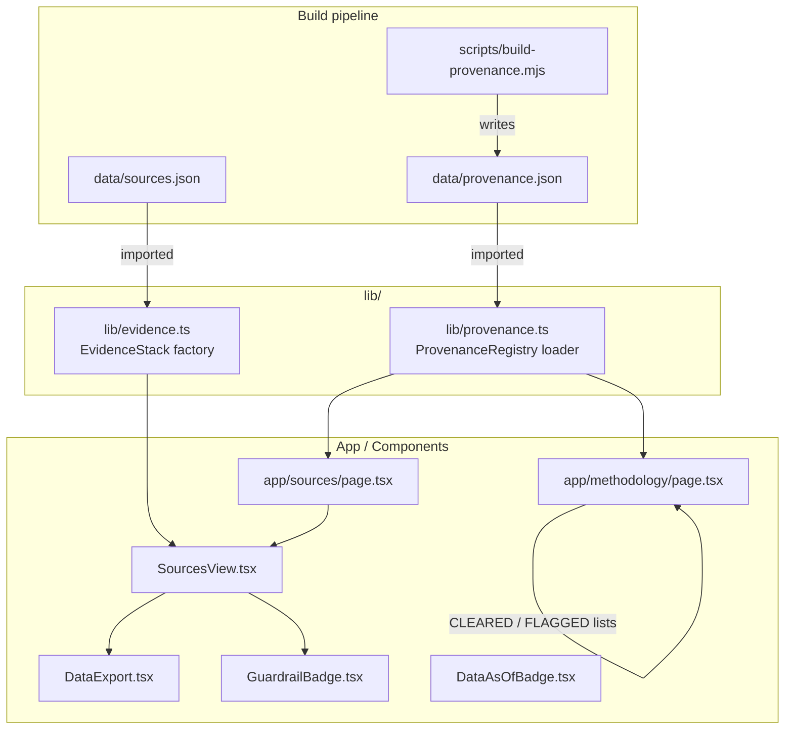
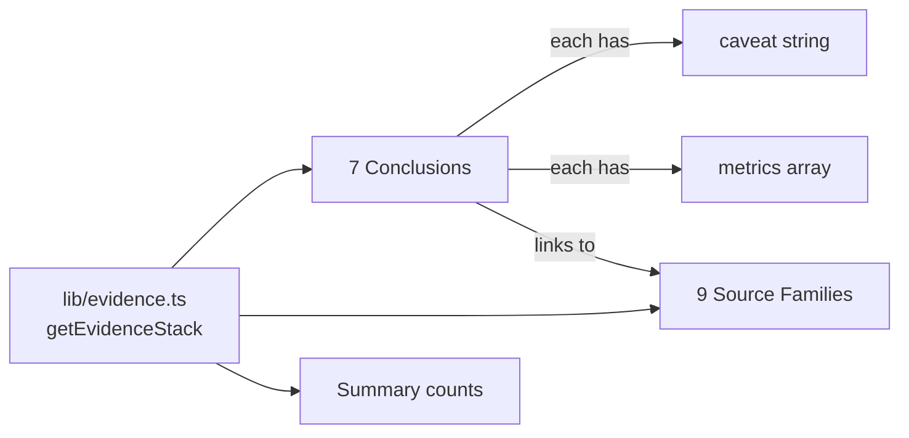

# Transparency

**Status:** Active · **Owner:** Trinity (Lead)
**Last updated:** 2026-07-11

---

## Purpose

Make every data claim in FutureGrid auditable: record where each dataset came from, when it was last refreshed, what its license allows, and what caveats bound its interpretation. Surface that information in the UI via provenance badges, guardrail indicators, and a full source catalogue at `/sources`.

**Non-goals:** Hosting raw upstream datasets; providing legal advice on data licensing; generating new analytical findings.

---

## Boundaries

| In scope | Out of scope |
|---|---|
| `lib/provenance.ts` — provenance registry loader | Upstream data collection (scripts) |
| `lib/evidence.ts` — evidence stack & conclusions | Chart rendering logic |
| `data/provenance.json` — registry file | ETL pipeline internals |
| `data/sources.json` — source catalogue | Data analysis methodology |
| `components/sources/SourcesView.tsx` | Marketing copy |
| `components/sources/DataExport.tsx` | Actual data hosting (S3, etc.) |
| `components/ui/GuardrailBadge.tsx` | Route navigation |
| `app/sources/page.tsx`, `app/methodology/page.tsx` | |

---

## Architecture



---

## Sources

### `data/sources.json`

Central source catalogue built by data-pipeline scripts. Shape:
```json
{
  "generatedAt": "<ISO-8601>",
  "sources": [ { "name", "publisher", "year", "url", "license", "usedFor" } ]
}
```

Consumed by `lib/evidence.ts` (to count sources for the `source-metadata` family) and by `app/sources/page.tsx` via `lib/data.ts getDataSources()`.

Sources are split into two display categories in `SourcesView`:
- **Primary sources:** `usedFor` does not include the word "context"
- **Context / validation citations:** `usedFor` includes "context"

---

## Provenance

### `data/provenance.json`

Written by `scripts/build-provenance.mjs`. Tracks when each dataset file was generated and what period it covers.

Schema (`lib/provenance.ts`):
```ts
interface DatasetProvenance {
  id: string;           // e.g. "warn-notices"
  file: string;         // e.g. "data/warn-notices.json"
  generatedAt: string;  // ISO-8601 timestamp of file creation
  asOf: string | null;  // period described, e.g. "2025" or ISO date
  source: ProvenanceSource | string | null;
  version: string;      // meta-contract version
  rows: number | null;  // record count when row-oriented
}
```

### `lib/provenance.ts` API

| Export | Purpose |
|---|---|
| `datasets` | All dataset entries in registry order |
| `registryGeneratedAt` | When the registry itself was generated |
| `getDatasetProvenance(id)` | Lookup single dataset by id |
| `getDataAsOf(id)` | `asOf` for a dataset, or `null` |
| `getDataGeneratedAt(id)` | `generatedAt` for a dataset, or `null` |
| `getLatestAsOf()` | Lexicographic max `asOf` across all datasets |
| `getLatestGeneratedAt()` | Most-recent `generatedAt` across all datasets |

`getLatestGeneratedAt()` feeds the sitemap `lastModified` field.

---

## Compliance & Exports

### Cleared Downloads (`app/methodology/page.tsx` → `CLEARED`)

Datasets with a verified open license that may be offered for download:

| Dataset | License |
|---|---|
| Occupation Snapshot (full + slim) | CC-BY 4.0 |
| O*NET Enrichment | CC BY 4.0 |
| State Labor & WARN Pressure | Public Domain |
| State QCEW Employment | Public Domain |
| BLS Employment Projections | Public Domain |
| Occupational Requirements Seed | Public Domain concepts + CC-BY 4.0 derived |
| WARN Notices (public) | Public Records |
| AI Demand Index | CC BY 4.0 |
| Country AI Exposure | CC-BY 4.0 |
| JOLTS | Public Domain |
| AI Frontier (Epoch AI) | MIT |
| H-1B Certified-LCA Trends | Public Domain |
| Job Postings Trend Seed | CC BY 4.0 + Public Domain |
| LLM Occupation Exposure | MIT |

### Flagged / Restricted Downloads (`FLAGGED`)

These datasets **must not be offered for download**; a reason is shown instead:

| Dataset | Reason |
|---|---|
| Market AI Signals | Yahoo Finance ToS — redistribution prohibited |
| AI Layoffs (Challenger) | Proprietary — redistribution requires permission |
| AI Company Stock Signals | Descriptive-only; not redistribution-cleared |
| Global AI Metrics (IMF) | Non-commercial redistribution terms |
| AI Usage Proxies | QuestMobile terms — rows not cleared |
| OpenRouter Model Catalog | Bulk redistribution gated on ToS review |
| AIOE Exposure (Felten et al.) | No explicit open license |
| Automation Baseline (Frey & Osborne) | No open license |

### `DataExport` (`components/sources/DataExport.tsx`)

Client-side export of three datasets as JSON or CSV, triggered by user action:

| Dataset key | Contents |
|---|---|
| `occupations` | All `CareerInsight` rows (756 SOC occupations) |
| `countries` | All `CountryMapDatum` rows (AI exposure by country) |
| `sources` | Full source catalogue |

Downloads are constructed entirely in-browser via `Blob` + `URL.createObjectURL`; no server is involved. Files are named `futuregrid-{key}-2025.{ext}`.

---

## Evidence / Caveat Taxonomy

`lib/evidence.ts` defines the **Evidence Stack** — a curated set of cross-dataset conclusions with explicit agreement signals and caveats.

### Evidence Status Types

| Status | Meaning |
|---|---|
| `"agreement"` | Multiple source families converge on the same direction |
| `"mixed"` | Source families point in different directions |
| `"coverage-gap"` | Conclusion is limited by partial coverage |
| `"watch"` | Signal is present but too early or too indirect to confirm |

### Evidence Confidence Levels

| Confidence | Meaning |
|---|---|
| `"high"` | Strong signal, broad coverage, reliable methods |
| `"medium"` | Reasonable signal with known limitations |
| `"low"` | Directional only; significant uncertainty |

### Source Families

Evidence conclusions are linked to source families — not individual datasets. This decouples the conclusion from the underlying data vintage.

| Family ID | Datasets covered |
|---|---|
| `occupation-outcomes` | Occupation snapshot, OEWS, O*NET, Anthropic |
| `exposure-lenses` | Usage, LLM, AIOE, automation baseline |
| `ai-demand-layoffs` | Indeed AI demand, Challenger AI cuts |
| `jolts` | BLS JOLTS |
| `labor-stress` | WARN + LAUS + QCEW |
| `market-proxy` | Sector ETF signals |
| `global-ai` | Country exposure, diffusion, readiness, proxies |
| `skills-reskilling` | O*NET skill overlap, Bright Outlook |
| `source-metadata` | Source catalogue (count, dates) |

### Conclusions (7 curated)

| ID | Status | Confidence |
|---|---|---|
| `ai-exposure-broad-concentrated` | agreement | high |
| `exposure-outcomes-mixed` | mixed | medium |
| `capability-usage-lenses-differ` | mixed | high |
| `labor-stress-localized-coverage-sensitive` | coverage-gap | medium |
| `market-signal-descriptive-proxy` | watch | low |
| `global-adoption-differs-by-metric-country` | mixed | high |
| `skills-reskilling-action-oriented-not-assured` | watch | medium |

Each conclusion carries: `title`, `finding`, `confidence`, `status`, `sourceFamilies[]`, `metrics[]`, `caveat`, `recommendedViewHref`, `links[]`.



---

## Attribution

All cleared-download datasets carry an attribution string surfaced in the Methodology page. Examples:

- Occupation Snapshot: *"Anthropic Economic Index + BLS OEWS. Derived dataset — cite FutureGrid and upstream sources."*
- O*NET Enrichment: *"O*NET 28.3, National Center for O*NET Development."*
- AI Frontier: *"Epoch AI — AI Training Compute dataset."*

The `GuardrailBadge` component visually signals the epistemic status of any displayed value:

| Kind | Label | Meaning |
|---|---|---|
| `observed` | Observed | Provider or public-record observations |
| `proxy` | Proxy | Proxy / seed-derived signal; directional use only |
| `restricted` | Restricted | Source terms restrict redistribution |
| `descriptive` | Descriptive-only | Context only; not causal/predictive |

`inferGuardrailBadgeKind(text)` applies regex heuristics to infer the badge from source metadata text.

---

## Runtime / Build / Deploy Lifecycle

| Phase | Action |
|---|---|
| Data refresh (CI weekly) | `build:provenance` writes `data/provenance.json` |
| `next build` | `lib/provenance.ts` and `lib/evidence.ts` import JSON statically |
| Browser | `SourcesView`, `DataExport`, `GuardrailBadge` render from bundled data |

There are no runtime API calls for provenance or source data — all are bundled at build time.

---

## Security / Privacy

- No user data is collected in the export flow; downloads are generated client-side from bundled data.
- Restricted datasets are never bundled raw in the `public/` directory; only compliance-cleared files are offered.
- Guardrail badges are rendered with `aria-label` containing both label and description — no tooltip-only information hiding.

---

## Accessibility

- `SourcesView` source cards use `<article>` with `<h3>` headings.
- License badge links (`href="https://creativecommons.org/..."`) open in new tab with `rel="noopener noreferrer"`.
- `DataExport` buttons have `aria-label` with dataset name and format; `aria-busy` during download; live region `aria-live="polite"` announces completion to screen readers.
- Methodology note uses `role="note"` with `aria-label`.

---

## Performance

- Source and provenance data are bundled JSON — no runtime fetch.
- `DataExport` generates CSV/JSON synchronously in the browser; for the ~750-row occupations dataset this is fast (<10 ms).

---

## Failure Handling

| Failure | Behaviour |
|---|---|
| `data/provenance.json` missing | TypeScript import error at build time |
| Dataset not in provenance registry | `getDatasetProvenance(id)` returns `undefined`; `getDataAsOf` returns `null` |
| `sources.json` has 0 sources | `sourceCount` = 0; evidence stack renders with "0 cataloged source records" |
| Download blob API unavailable | `URL.createObjectURL` throws; no try/catch — consider adding for robustness |

---

## Tests / Quality Gates

| Gate | File | What it checks |
|---|---|---|
| Source coverage | `tests/source-coverage.test.ts` | Source catalogue completeness |
| Data schema | `tests/data-schema.test.ts` | Shape of data files |
| Provenance | Built in each `build:*` script | Sanity-gates on row counts / required fields |

---

## Extension Points

- **New dataset:** Add build script, update `build-provenance.mjs`, add entry to `CLEARED` or `FLAGGED` in `app/methodology/page.tsx`.
- **New evidence conclusion:** Add to `CONCLUSIONS` array in `lib/evidence.ts`; link appropriate `sourceFamilies`.
- **New guardrail kind:** Add to `GUARDRAIL_BADGES` record and update `inferGuardrailBadgeKind` regex.
- **New source family:** Add to `SOURCE_FAMILIES` in `lib/evidence.ts`; update `EvidenceSourceFamilyId` union.

---

## Key File References

| File | Role |
|---|---|
| `lib/provenance.ts` | Provenance registry loader and API |
| `lib/evidence.ts` | Evidence stack, conclusions, source families |
| `data/provenance.json` | Generated provenance registry |
| `data/sources.json` | Source catalogue |
| `app/sources/page.tsx` | Sources page (server component) |
| `app/methodology/page.tsx` | Methodology + compliance-cleared downloads |
| `components/sources/SourcesView.tsx` | Sources UI |
| `components/sources/DataExport.tsx` | Client-side data export |
| `components/ui/GuardrailBadge.tsx` | Epistemic status badge |
| `components/ui/DataAsOfBadge.tsx` | Dataset freshness indicator |
| `scripts/build-provenance.mjs` | Provenance registry builder |
