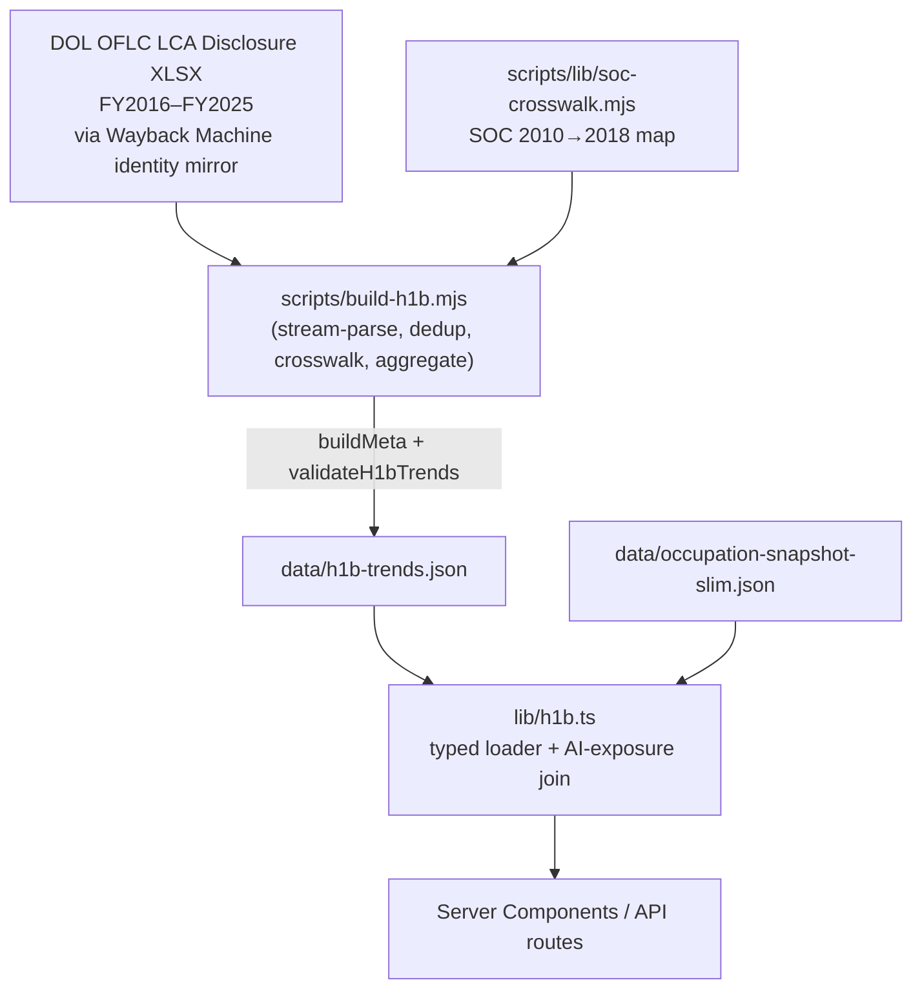

# H-1B Visa / LCA Trends

**Status:** Production
**Owner:** Tank (Backend / Data Dev)
**Last audited:** 2026-07-18

---

## Purpose

Documents the H-1B Labor Condition Application (LCA) trends dataset: certified LCA volume by fiscal year, occupation, employer, and state; wage percentiles; CAGR; and the AI-exposure-tier join. Powers the "Work Visa Job Trends" feature.

### ⚠️ Critical Distinction

**These are certified H-1B LCAs (Labor Condition Applications) — employer filings required as a step in the H-1B sponsorship process. They are NOT visa approvals, cap-subject approvals, or actual visa issuances.** The provenance note in `data/h1b-trends.json` carries this disclaimer.

### Non-Goals

- Does not cover domestic employment projections — see [`docs/labor-market.md`](./labor-market.md).
- Does not cover occupation exposure model — see [`docs/occupation-data-model.md`](./occupation-data-model.md).
- Does not cover immigration approval rates, H-1B cap lotteries, or USCIS data.

---

## Boundaries

| Artifact | File | Module |
|---|---|---|
| H-1B LCA trends | `data/h1b-trends.json` | `lib/h1b.ts` |
| Build script | `scripts/build-h1b.mjs` | — |
| SOC crosswalk | `scripts/lib/soc-crosswalk.mjs` | — |
| Talent Bottleneck Lens (derived, no dedicated data file) | — (4-source SOC join at build time) | `lib/talent-bottleneck.ts` + `components/visa/TalentBottleneckLens.tsx` |

> **Ownership note:** the Talent Bottleneck Lens is a derived signal rendered on `/visa`; this doc is its authoritative home. `docs/labor-market.md` carries only a one-line boundary reference to `lib/talent-bottleneck.ts`.

---

## Architecture

```
DOL OFLC LCA Disclosure XLSX files
  FY2020–FY2025: 4 per-quarter workbooks per fiscal year
  FY2016–FY2019: 1 annual workbook per fiscal year
  (via Wayback Machine identity mirror — dol.gov edge 403s non-browser clients)
    │
    ▼
scripts/build-h1b.mjs
  • Stream-parse workbooks with ExcelJS WorkbookReader (never load full workbook)
  • Map columns by header NAME (case-insensitive) — tolerates schema drift
  • For FY2020+: de-duplicate by CASE_NUMBER across all 4 quarters before counting
  • Apply SOC 2010→2018 crosswalk (scripts/lib/soc-crosswalk.mjs)
  • Aggregate: by-year headline rows, by-occupation, top-employers, by-state
  • Compute CAGR per occupation
  • Compute wage percentiles (p25, p50, p75) per year / per occupation (≥5000 total)
  • buildMeta() → meta block
  • validateH1bTrends() → fail before write if degenerate
  • writeFileSync → data/h1b-trends.json
    │
    ▼
lib/h1b.ts
  • Typed loader
  • AI-exposure tier join (left-join to occupation-snapshot-slim on socCode)
  • Selectors: getExposureTierAggregation(), getTopOccupationsByLatestYear(), etc.
```

---

## Mermaid Data-Flow Diagram



---

## Canonical Schemas / Types

### `H1bTrends` — top-level dataset

```typescript
interface H1bTrends {
  meta: H1bMeta;         // generatedAt, asOf, source, version, note (LCAs ≠ approvals)
  coverage: H1bCoverage; // fiscalYears, incompleteFiscalYears, aggregation, socVintage
  byYear: H1bYearRow[];  // headline stats per fiscal year
  occupations: H1bOccupation[];
  topEmployers: H1bEmployer[];
  byState: H1bState[];
}
```

### `H1bYearRow` — annual headline

```typescript
export interface H1bYearRow {
  fiscalYear: number;
  certifiedLcas: number;           // distinct CASE_NUMBERs with CASE_STATUS = "Certified"
  certifiedWithdrawnLcas: number;
  totalWorkerPositions: number;    // sum of TOTAL_WORKERS across certified rows
  distinctEmployers: number;
  medianWageAnnual: number;        // annualized offered wage (p50), USD
  p25WageAnnual: number;
  p75WageAnnual: number;
}
```

### `H1bOccupation` — per-occupation record

```typescript
export interface H1bOccupation {
  socCode: string;                  // SOC 2018 (after crosswalk)
  socTitle: string;
  countByYear: Record<string, number>; // fiscal year → certified LCA count
  totalCount: number;               // sum across all fiscal years
  medianWageAnnualLatest: number;   // median wage in latest fiscal year, USD
  cagr: number;                     // CAGR as decimal fraction (0.0572 = +5.72%)
  wageByYear?: Record<string, number | null>; // only for occupations with ≥ 5,000 total filings
  medianWageByYear?: Record<string, number | null>; // alias for wageByYear
}
```

### `H1bCoverage`

```typescript
export interface H1bCoverage {
  fiscalYears: number[];
  skippedFiscalYears?: number[];
  incompleteFiscalYears: number[];   // years with < 4 quarters of data
  source: string;
  aggregation: string;               // "Distinct CASE_NUMBERs for FY2020+; annual files FY2016–FY2019"
  socVintage?: string;               // "SOC 2018 (crosswalk applied from SOC 2010 for FY2016–FY2019)"
  socCrosswalkApplied?: boolean;
}
```

### `ExposureTierAggregation` — AI-exposure join

```typescript
export interface ExposureTierAggregation {
  years: number[];
  tiers: ExposureTierSeries[];       // Low / Medium / High / Very High / Unclassified
  matchedOccupations: number;
  totalOccupations: number;
  occupationMatchRate: number;       // fraction 0–1
  volumeMatchRate: number;           // fraction 0–1 (by certified-LCA volume)
}
```

---

## Joins / Crosswalks / Algorithms

### SOC 2010 → 2018 Crosswalk

DOL disclosure files for FY2016–FY2019 use SOC 2010 codes. `scripts/lib/soc-crosswalk.mjs` fetches the BLS `soc_2010_to_2018_crosswalk.xlsx` (via Wayback Machine identity mirror), parses it with ExcelJS, and produces:

- `map: Map<soc2010, soc2018>` — primary (first) 2018 target.
- `multi: Map<soc2010, Set<soc2018>>` — all 2018 targets (for split occupations).
- `soc2018Title: Map<soc2018, string>` — canonical 2018 SOC titles.

The builder normalizes all SOC codes to 2018 vintage before aggregating.

### Deduplication (FY2020+)

The DOL quarterly files are **per-quarter non-cumulative**. A single LCA that spans two quarters appears in both files with the same `CASE_NUMBER`. The builder deduplicates by `CASE_NUMBER` across all four quarters before counting certified LCAs. FY2016–FY2019 use annual files which are already deduplicated.

### CAGR Computation

```
CAGR = (v_last / v_first)^(1 / (n - 1)) - 1
```

where `v_first` is the certified count in the earliest fiscal year and `v_last` in the latest, and `n` is the number of years. Only occupations with non-zero volume in the first year are included.

### AI-Exposure Tier Join (`lib/h1b.ts`)

`getExposureTierAggregation()` left-joins each H-1B occupation's `socCode` against `data/occupation-snapshot-slim.json` exposure rows. Join key: `socCode` (SOC 2018). Unmatched occupations land in the `"Unclassified"` tier. The join is **descriptive only** — it shows which visa-sponsored roles fall into which AI-exposure tier; it is **not causal**.

### Units

| Field | Unit |
|---|---|
| `certifiedLcas`, `totalWorkerPositions` | integer count |
| `medianWageAnnual`, `p25WageAnnual`, `p75WageAnnual` | USD annual |
| `wageByYear` values | USD annual; null if < 50 filings in that year |
| `cagr` | decimal fraction (0.05 = +5% CAGR) |
| `occupationMatchRate`, `volumeMatchRate` | fraction 0–1 |

---

## Talent Bottleneck Lens

A **descriptive, modeled signal** rendered on `/visa` (below the LCA-trend charts). It is **not a prediction and not proof of a labor shortage or causality** — it is a transparent weighted ranking of joined public signals. The whole lens lives in `lib/talent-bottleneck.ts` (pure, no data file of its own) and is displayed by `components/visa/TalentBottleneckLens.tsx`.

### Selector

```typescript
// lib/talent-bottleneck.ts
export function getTalentBottleneckData(
  options: TalentBottleneckOptions = {}, // { limit?: number } — cap on returned rows
): TalentBottleneckData;

export interface TalentBottleneckData {
  datasetBadgeIds: string[];               // ["h1b-trends","employment-projections","job-postings","occupation-snapshot"]
  methodology: TalentBottleneckMethodology;
  summary: TalentBottleneckSummary;
  rows: TalentBottleneckRow[];             // ranked desc by score
}
```

### Inputs (4-source SOC join)

The lens builds the **union of all SOC codes** present across four existing loaders and left-joins each per-SOC signal (missing sources are simply absent for that row):

| Signal | Source loader | Fields consumed |
|---|---|---|
| H-1B LCAs | `getOccupationsSorted()` (`lib/h1b.ts`) | `countByYear[latestFY]` → `latestLcas`, `totalCount`, `cagr` |
| Employment projections | `getEmploymentProjectionData()` (`lib/employment-projections.ts`) | `projectedOpenings`, `employmentChangePct`, `medianAnnualWage`, `aiExposure`, `automationRisk` |
| Job postings | `getJobPostingsData()` (`lib/job-postings.ts`) | `latestAnnualPostings` → `latestPostings`, `sourceStatus` |
| Occupation snapshot | `generateAllCareerInsights()` (`lib/data.ts`) | `aiExposure`, `automationRisk`, `medianSalary` |

`medianWageAnnual` is chosen by priority H-1B → employment-projections → occupation-snapshot (first positive value wins); `medianWageAnnualSource` records which one was used. `h1bTrend` is derived from `h1bCagr`: `rising` if > 0.005, `falling` if < −0.005, else `flat`.

### Row schema (`TalentBottleneckRow`)

```typescript
export interface TalentBottleneckRow {
  rank: number;                  // 1-based, after sort
  score: number;                 // 0–100 (see scoring)
  socCode: string;
  title: string;
  sector: string | null;
  latestLcas: number | null;
  totalLcas: number | null;
  h1bCagr: number | null;        // decimal fraction; 0.0572 = +5.72%
  h1bTrend: "rising" | "falling" | "flat" | null;
  medianWageAnnual: number | null;
  medianWageAnnualSource: "h1b" | "employment-projections" | "occupation-snapshot" | null;
  projectedOpenings: number | null;
  employmentChangePct: number | null;
  latestPostings: number | null;
  aiExposure: number | null;     // 0–1
  automationRisk: "Low" | "Medium" | "High" | "Very High" | null;
  scoreComponents: TalentBottleneckScoreComponents; // per-signal normalized contribution
  sourceFlags: TalentBottleneckSourceFlags;         // which sources matched this SOC
}
```

`TalentBottleneckSummary` reports aggregate context: `occupationsTracked`, `rowsReturned`, `latestH1bFiscalYear`, `latestJobPostingYear`, `jobPostingsMode`, `projectionWindow`, per-source `matched` counts, `scoreRange`, `scoreWeights`, and `topRows` (top 10).

### Scoring

`score` (rounded to a 0–100 scale) is a **fixed weighted average** of per-signal normalized components:

| Component | Weight | Normalization |
|---|---|---|
| `latestLcas` | 0.22 | log vs in-dataset max |
| `projectedOpenings` | 0.24 | log vs in-dataset max |
| `totalLcas` | 0.12 | log vs in-dataset max |
| `latestPostings` | 0.12 | log vs in-dataset max |
| `h1bCagr` | 0.10 | linear vs positive in-dataset max |
| `employmentChangePct` | 0.10 | linear vs positive in-dataset max |
| `aiExposure` | 0.10 | already bounded 0–1 |

Counts are log-normalized against the in-dataset maximum; positive rates are linearly normalized against the positive in-dataset maximum; AI exposure is used directly. **Missing signals contribute zero and are not reweighted.** Ties break by `latestLcas`, `totalLcas`, `projectedOpenings`, `latestPostings`, then title / SOC.

### Component behavior (`TalentBottleneckLens.tsx`)

`app/visa/page.tsx` calls `getTalentBottleneckData()` server-side and passes the result to `VisaTrendsView` (`talentBottleneck` prop), which renders `<TalentBottleneckLens data={…} />`. The lens shows KPI summary cards, a bubble scatter (x = `aiExposure`, y = `projectedOpenings`, bubble radius ∝ `latestLcas`), and a ranked table of the top 12 rows.

### RAI framing / caveats (from `methodology.caveats` — preserve)

- Certified H-1B **LCAs are employer filings, not visa approvals**.
- The score is **not proof of a shortage or causality** — it is a descriptive ranking of joined signals.
- Job postings are **proxy/seed-derived** where applicable (`summary.jobPostingsMode` discloses the mode).
- The lens is intentionally **separate from `/analysis` and infers no causal effects**.

### Runtime boundary

`lib/talent-bottleneck.ts` has **no `import "server-only"` guard** but transitively imports large server-side loaders (H-1B, employment projections, job postings, occupation snapshot). It is invoked once in the `/visa` Server Component at build time and its serializable result is passed as props; do not import it from `"use client"` components.

---

## Source Provenance / Licensing / Caveats

| Source | License | Caveat |
|---|---|---|
| DOL OFLC LCA Disclosure Data | Public Domain (US Government) | LCAs ≠ visa approvals or cap-subject H-1Bs |
| BLS SOC 2010→2018 Crosswalk | Public Domain (US Government) | Fetched via Wayback identity mirror |

**Caveats stamped in `meta.note`:**

- Counts are certified H-1B LCAs, not visa approvals.
- Counts are comparable across FY2016–FY2025: quarterly files are summed by distinct `CASE_NUMBER` for FY2020+; annual files back to FY2016–FY2019.
- Incomplete fiscal years (e.g. the current year) are listed in `coverage.incompleteFiscalYears` and should be labeled as provisional in the UI.
- Wage values in `wageByYear` are suppressed (null) for years with < 50 filings.

---

## Build / Update Lifecycle

```bash
npm run build:h1b
# → node scripts/build-h1b.mjs

# Environment override:
H1B_YEARS=2020-2025 npm run build:h1b   # build only specified range

# Cache:
# Raw XLSX workbooks are cached in .cache/h1b/ (gitignored)
# Re-runs reuse cached files; pass --force to re-download
```

**Large workbooks:** DOL disclosure files are 55–92 MB per year. The builder uses ExcelJS `WorkbookReader` for streaming parse — never loads a full workbook into memory. Total cache can reach ~500 MB for FY2016–FY2025.

**Prerequisite:** Node 20 LTS, network access to web.archive.org (Wayback Machine), npm package `exceljs`.

---

## Validation Invariants

`validateH1bTrends()` from `scripts/lib/validate.mjs` is called before `writeFileSync`:

- `meta.generatedAt` + `meta.source` present.
- `coverage.fiscalYears` must exactly match the fiscal years present in `byYear`, and `byYear` must be sorted ascending by `fiscalYear` (minimum 4 years).
- Each `byYear` row carries `certifiedLcas ≥ 200,000` (a plausibility floor against a broken/empty parse).
- `occupations` array minimum row count — a fixed floor of **50 rows** (`assertMinRows(data.occupations, 50)`).
- `topEmployers` ≥ `minEmployers` (default **50**).
- `byState` minimum row count — a fixed floor of **20 rows** (`assertMinRows(data.byState, 20)`); each state carries a well-formed `wageByYear` map and a `topOccupations` array.
- Each occupation SOC code is normalized to the `NN-NNNN` (SOC 2018) form.

(Note: the `assertLiveStates()` helper enforces a *required* set of state codes for the WARN and state-labor datasets, **not** for `h1b-trends` — H-1B state coverage is a plain row-count floor.)

---

## Runtime Server / Client Boundary

| Module | Boundary | Reason |
|---|---|---|
| `lib/h1b.ts` | **Client-safe** (no `import "server-only"`) | `h1b-trends.json` is a medium-size static import |
| `data/h1b-trends.json` | Statically bundled | ~few MB; occupation list may be large |

Because `lib/h1b.ts` is client-safe, it can be consumed by client components. However, `getExposureTierAggregation()` loads and joins `occupation-snapshot-slim.json` at module level. Do not call it in tight render loops; compute once and pass results as props.

---

## Failure / Degradation Behavior

- If any DOL XLSX download fails after retries, the builder logs the error and skips that fiscal year (continues with others).
- If the SOC crosswalk download fails, the builder falls back to the last cached crosswalk file. If no cache exists, the builder exits non-zero.
- Individual `null` wage values (`wageByYear`) indicate < 50 filings in that year; the UI must suppress or annotate these points.
- Missing `wageByYear` on an occupation (not undefined, not present at all) means the occupation had < 5,000 total filings; the UI should omit wage-trajectory charts for these occupations.
- Incomplete fiscal years in `coverage.incompleteFiscalYears` should be visually marked as provisional.

---

## Accessibility Implications

- Employer and occupation tables must include `<caption>` and `<th scope>` attributes.
- Fiscal-year trend charts must have accessible axis labels. The term "LCAs" should be explained in a tooltip or footnote (not all users know it stands for "Labor Condition Applications").
- Color encoding for AI-exposure tiers must not be the sole differentiator; use labeled data points or pattern fills.

---

## Performance

- `lib/h1b.ts` statically imports `data/h1b-trends.json` and `data/occupation-snapshot-slim.json` at module load; both are parsed once.
- `getExposureTierAggregation()` builds a `Map` lookup from the snapshot and iterates occupations once — O(n). The result is not memoized; compute once per Server Component render and pass as a prop.
- `getOccupationsSorted()` returns a sorted copy on each call; memoize at the call site if called repeatedly.

---

## Security / Secrets / Privacy

- No individual-level data. All H-1B data is employer-filed aggregate records (no worker names, SSNs, or personal identifiers committed).
- No API keys required for DOL OFLC sources (all public Wayback machine URLs).
- DOL workbooks are cached in `.cache/h1b/` which is gitignored.

---

## Testing

- `npm run test:run` runs Vitest tests covering `getExposureTierAggregation()` join correctness and `getMeta()` structure.
- Smoke test (`npm run smoke`) verifies `data/h1b-trends.json` exists and is non-empty.
- Validate-before-write ensures structural regression is caught at build time.

---

## Extension Points

- **Add new fiscal years:** Append to `FULL_TARGET` in `scripts/build-h1b.mjs` and add the corresponding DOL URL entries to the year-URL map.
- **Add a new per-occupation field:** Extend `H1bOccupation` interface in `lib/h1b.ts` and populate in the builder's occupation aggregation loop.
- **Add a new exposure-join dimension:** Extend `ExposureTierSeries` and `getExposureTierAggregation()` in `lib/h1b.ts`.

---

## Key File References

| File | Role |
|---|---|
| `lib/h1b.ts` | Typed loader, AI-exposure join, selectors |
| `lib/talent-bottleneck.ts` | Talent Bottleneck Lens: 4-source SOC join + weighted score (`getTalentBottleneckData()`) |
| `components/visa/TalentBottleneckLens.tsx` | Renders the Talent Bottleneck KPIs, scatter, and ranked table on `/visa` |
| `data/h1b-trends.json` | Committed artifact |
| `scripts/build-h1b.mjs` | Fetch (Wayback), stream-parse, aggregate, write |
| `scripts/lib/soc-crosswalk.mjs` | SOC 2010→2018 crosswalk |
| `scripts/lib/validate.mjs` | `validateH1bTrends()` |
| `scripts/lib/meta.mjs` | `buildMeta()` — provenance stamp |
| `data/occupation-snapshot-slim.json` | Joined at runtime for exposure-tier aggregation |

---

*Cross-links: [`docs/labor-market.md`](./labor-market.md) · [`docs/occupation-data-model.md`](./occupation-data-model.md) · [`docs/data-pipeline.md`](./data-pipeline.md)*
